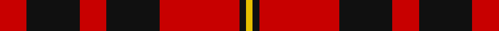
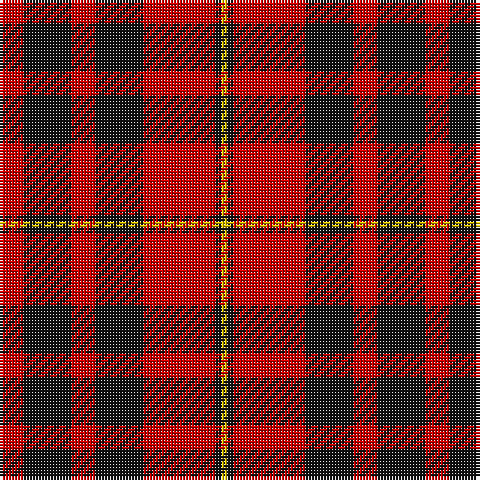

**Bands:** [RKRKRKY](/stripes/rkrkrky/) · **Stripes:** [R K R K R K LY](/stripes/stripes7/) R K R K R K LY

This was sourced from tartans-authority.  It is a [7 band tartan](/bands/bands7/).

Original link http://www.tartansauthority.com/tartan-ferret/display/1608/

## Variants

Other setts woven to the same stripe pattern.

- [MacDonald of Ardnamurchan (Clan?)](/setts/s7/r4k8r4k8r12k1ly2~x4/)
- [MacIain](/setts/s7/r4k8r4k8r12k1ly2~x2/)

## Thread count
R/8 K16 R8 K16 R24 K2 Y/2

## Palette
Each colour and its ΔE from the base-6 reference it is a variant of.

| Colour | Shade | Base | ΔE (OKLab) |
|---|---|---|---|
| K | <code style="background-color:#101010;">#101010</code> `#101010` | K <code style="background-color:#000000;">#000000</code> | 0.17 |
| R | <code style="background-color:#C80000;">#C80000</code> `#C80000` | R <code style="background-color:#CC0000;">#CC0000</code> | 0.01 |
| Y | <code style="background-color:#E8C000;">#E8C000</code> `#E8C000` | Y <code style="background-color:#F2BF00;">#F2BF00</code> | 0.02 |

# Sample pattern

## Nearest tartans

The nearest existing variants by ΔTartan distance.

1. [MacDonald of Ardnamurchan (Clan?)](/setts/s7/r4k8r4k8r12k1ly2~x4/) — ΔT 0.35
1. [MacQueen](/setts/s6/k2r6k2r6k12ly1~x4/) — ΔT 0.76
1. [Swanstrom (Personal)](/setts/s6/k8r1k8r11ly1r1~x4/) — ΔT 0.76
1. [Brodie (Clan)](/setts/s6/k2r16k8ly1k8r2~x4/) — ΔT 0.87
1. [Munro (Black and Red)](/setts/s5/k18r4k18r32w3~x2/) — ΔT 0.90
1. [bodog.com Corporate Tartan Tartan Number: 6889. Earliest known date: 2006 Corporate brand name and colours, red, black and silver grey used to support brand identification. Company owner and executive is Scottish. First tartan to be name after a web site and first ever tartan for Costa Rica. See products available Copyright © Blair Urquhart, Comrie, 2015](/setts/s8/k25r25k10lb3k10r25k25r3~x2/) — ΔT 0.98
1. [Erskine (Paton)](/setts/s6/k31r4k47r47k4r31~x2/) — ΔT 0.98
1. [Brodie (Clan)](/setts/s6/k3r15k11ly2k4r3~x2/) — ΔT 0.99
1. [MacIain](/setts/s7/r4k8r4k8r12k1ly2~x2/) — ΔT 1.06
1. [Haig & Haig Whisky](/setts/s8/r26k18r7k4ly4~x2/) — ΔT 1.06

## Neighbour map

Every grey dot is one of 14299 variants placed by the first two principal components of the ΔTartan feature space (44% of its variance). Red is this tartan; blue dots are its nearest — click one to open its page.

<svg viewBox="0 0 640 380" role="img" style="max-width:100%;height:auto;border:1px solid #e0e0e0;border-radius:4px;display:block" xmlns="http://www.w3.org/2000/svg"><image href="/nn/cloud.v1.png" width="640" height="380"/><a href="/setts/s7/r4k8r4k8r12k1ly2~x4/"><circle cx="306.0" cy="215.4" r="4" fill="#3465a4"><title>MacDonald of Ardnamurchan (Clan?)</title></circle></a><a href="/setts/s6/k2r6k2r6k12ly1~x4/"><circle cx="342.4" cy="216.7" r="4" fill="#3465a4"><title>MacQueen</title></circle></a><a href="/setts/s6/k8r1k8r11ly1r1~x4/"><circle cx="336.5" cy="214.7" r="4" fill="#3465a4"><title>Swanstrom (Personal)</title></circle></a><a href="/setts/s6/k2r16k8ly1k8r2~x4/"><circle cx="341.2" cy="198.6" r="4" fill="#3465a4"><title>Brodie (Clan)</title></circle></a><a href="/setts/s5/k18r4k18r32w3~x2/"><circle cx="301.7" cy="227.1" r="4" fill="#3465a4"><title>Munro (Black and Red)</title></circle></a><a href="/setts/s8/k25r25k10lb3k10r25k25r3~x2/"><circle cx="314.5" cy="236.1" r="4" fill="#3465a4"><title>bodog.com Corporate Tartan Tartan Number: 6889. Earliest known date: 2006 Corporate brand name and colours, red, black and silver grey used to support brand identification. Company owner and executive is Scottish. First tartan to be name after a web site and first ever tartan for Costa Rica. See products available Copyright © Blair Urquhart, Comrie, 2015</title></circle></a><a href="/setts/s6/k31r4k47r47k4r31~x2/"><circle cx="338.6" cy="239.7" r="4" fill="#3465a4"><title>Erskine (Paton)</title></circle></a><a href="/setts/s6/k3r15k11ly2k4r3~x2/"><circle cx="287.9" cy="227.7" r="4" fill="#3465a4"><title>Brodie (Clan)</title></circle></a><a href="/setts/s7/r4k8r4k8r12k1ly2~x2/"><circle cx="287.9" cy="209.9" r="4" fill="#3465a4"><title>MacIain</title></circle></a><a href="/setts/s8/r26k18r7k4ly4~x2/"><circle cx="283.9" cy="227.4" r="4" fill="#3465a4"><title>Haig &amp; Haig Whisky</title></circle></a><circle cx="327.8" cy="213.9" r="5" fill="#c00000"/></svg>

ID: /setts/s7/r4k8r4k8r12k1ly1~x2/
