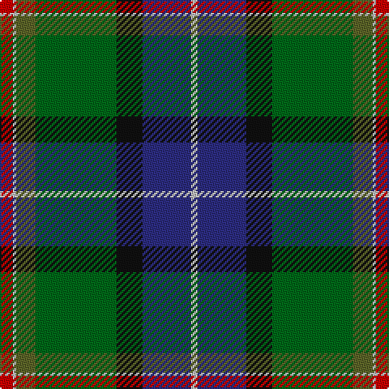

This page is one **sett** — a single exact thread-count. It belongs to the [tartan](/tartans/r4n1g6ga25k8db15n2/)
(the same proportion at any scale), whose colour order is pattern [RWGGKBW](/stripes/rwggkbw/).

Sourced from tartans-authority.  It is a [7 stripe tartan](/stripes/stripes7/).

Original link http://www.tartansauthority.com/tartan-ferret/display/2476/

3 attestations — the source records this cloth was collapsed from (oldest owns this page)

<ul>
<li>1997 — Jones (Name) (tartans-authority, <a href="http://www.tartansauthority.com/tartan-ferret/display/2476/">record</a>)</li>
<li>01/01/1998 — Jones (register-of-tartans, <a href="https://www.tartanregister.gov.uk/tartanDetails.aspx?ref=1904">record</a>)</li>
<li>undated — Jones Personal Tartan Tartan Number: 2476. Earliest known date: 1997 Designed by Peter MacDonald for Mrs Ros Jones, Aros, Isle of Mull and intended for all of the name Jones. Produced to raise money for National and International Charities. Registered Design Number :- 602573 See products available Copyright © Blair Urquhart, Comrie, 2015 (house-of-tartan, <a href="http://www.house-of-tartan.scotland.net/house/TartanViewjs.asp?colr=Def&tnam=2476">record</a>)</li>
</ul>

## Register references

External register numbers recorded for this tartan.

- Scottish Register of Tartans: [1904](https://www.tartanregister.gov.uk/tartanDetails.aspx?ref=1904)
- Scottish Tartans Authority (ITI): 2476
- Scottish Tartans World Register: 2476

## Thread count
R/8 N2 G12 Ga50 K16 DB30 N/4

## Palette
Each colour and the base-6 reference it is a variant of.

| Colour | Shade | Base |
|---|---|---|
| DB | <code style="background-color:#2C2C80;">#2C2C80</code> `oklch(35.0% 0.138 276.6)` <small>#2C2C80</small> | B <code style="background-color:#2A418A;">#2A418A</code> |
| G | <code style="background-color:#5C6428;">#5C6428</code> `oklch(48.3% 0.084 116.0)` <small>#5C6428</small> | G <code style="background-color:#006100;">#006100</code> |
| Ga | <code style="background-color:#006818;">#006818</code> `oklch(45.0% 0.142 145.0)` <small>#006818</small> | G <code style="background-color:#006100;">#006100</code> |
| K | <code style="background-color:#101010;">#101010</code> `oklch(17.3% 0.000 89.9)` <small>#101010</small> | K <code style="background-color:#000000;">#000000</code> |
| N | <code style="background-color:#C0C0C0;">#C0C0C0</code> `oklch(80.8% 0.000 89.9)` <small>#C0C0C0</small> | W <code style="background-color:#F7F7F7;">#F7F7F7</code> |
| R | <code style="background-color:#C80000;">#C80000</code> `oklch(52.3% 0.215 29.2)` <small>#C80000</small> | R <code style="background-color:#CC0000;">#CC0000</code> |

# Sample pattern

## Nearest tartans

The nearest existing variants by ΔTartan distance, with this tartan at the top so the swatches line up against it.

ΔTartan

Tartan

Sett

—

<a href="/ttd/edit/#slug=r4lb1y6g25k8db15lb2~x2">Jones (Name)</a> <a class="nn-out" href="/setts/s7/r4lb1y6g25k8db15lb2~x2/" title="open its dictionary page">↗</a>

0.82

<a href="/ttd/edit/#slug=r9dt8r8g52w2k32dt44b4">Highland Wedding (Fashion)</a> <a class="nn-out" href="/setts/s8/r9dt8r8g52w2k32dt44b4/" title="open its dictionary page">↗</a>

1.00

<a href="/ttd/edit/#slug=db5w3r12g37k12db21w2~x2">Bergen Scottish</a> <a class="nn-out" href="/setts/s7/db5w3r12g37k12db21w2~x2/" title="open its dictionary page">↗</a>

1.07

<a href="/ttd/edit/#slug=w1k6b9r12k12g32k6ly1~x2">McGeachie (Personal)</a> <a class="nn-out" href="/setts/s8/w1k6b9r12k12g32k6ly1~x2/" title="open its dictionary page">↗</a>

1.08

<a href="/ttd/edit/#slug=y5lo1r2y25k14db19w2y4~x2">Tooth (Personal)</a> <a class="nn-out" href="/setts/s8/y5lo1r2y25k14db19w2y4~x2/" title="open its dictionary page">↗</a>

1.08

<a href="/ttd/edit/#slug=dg20dg14db9ly2db9k1w2~x4">Hughes</a> <a class="nn-out" href="/setts/s7/dg20dg14db9ly2db9k1w2~x4/" title="open its dictionary page">↗</a>

1.08

<a href="/ttd/edit/#slug=g3dp4g23k10r2k10t18k1w3~x2">Birch Family Tartan Tartan Number: 2157. Earliest known date: 1993 The Birch family tartan was designed and produced by Mr Robin Birch of Connell Reid kiltmaker, Blairgowrie. The new sett has been recorded by the Scottish Tartans Society. See products available Copyright © Blair Urquhart, Comrie, 2015</a> <a class="nn-out" href="/setts/s9/g3dp4g23k10r2k10t18k1w3~x2/" title="open its dictionary page">↗</a>

1.10

<a href="/ttd/edit/#slug=r3dg1k16w3k15dg13dg22lo3~x2">Lawson, William</a> <a class="nn-out" href="/setts/s8/r3dg1k16w3k15dg13dg22lo3~x2/" title="open its dictionary page">↗</a>

1.11

<a href="/ttd/edit/#slug=g20dg14db9ly2db9k1w2~x4">Hughes</a> <a class="nn-out" href="/setts/s7/g20dg14db9ly2db9k1w2~x4/" title="open its dictionary page">↗</a>

1.13

<a href="/ttd/edit/#slug=dt11dt6dg25r1w2lo1dt25dt5w7~x2">Army Ranger</a> <a class="nn-out" href="/setts/s9/dt11dt6dg25r1w2lo1dt25dt5w7~x2/" title="open its dictionary page">↗</a>

1.14

<a href="/ttd/edit/#slug=t34r3t8db4t8k24g34k2w6">Hogg Dress (Name)</a> <a class="nn-out" href="/setts/s9/t34r3t8db4t8k24g34k2w6/" title="open its dictionary page">↗</a>

## Neighbour map

Every grey dot is one of 14299 variants placed by the first two principal components of the ΔTartan feature space (44% of its variance). Red is this tartan; blue dots are its nearest — click one to open its page.

<svg viewBox="0 0 640 380" role="img" style="max-width:100%;height:auto;border:1px solid #e0e0e0;border-radius:4px;display:block" xmlns="http://www.w3.org/2000/svg"><image href="/nn/cloud.v1.png" width="640" height="380"/><a href="/setts/s8/r9dt8r8g52w2k32dt44b4/"><circle cx="193.7" cy="144.4" r="4" fill="#3465a4"><title>Highland Wedding (Fashion)</title></circle></a><a href="/setts/s7/db5w3r12g37k12db21w2~x2/"><circle cx="170.0" cy="146.2" r="4" fill="#3465a4"><title>Bergen Scottish</title></circle></a><a href="/setts/s8/w1k6b9r12k12g32k6ly1~x2/"><circle cx="212.2" cy="119.8" r="4" fill="#3465a4"><title>McGeachie (Personal)</title></circle></a><a href="/setts/s8/y5lo1r2y25k14db19w2y4~x2/"><circle cx="257.8" cy="137.5" r="4" fill="#3465a4"><title>Tooth (Personal)</title></circle></a><a href="/setts/s7/dg20dg14db9ly2db9k1w2~x4/"><circle cx="196.1" cy="176.6" r="4" fill="#3465a4"><title>Hughes</title></circle></a><a href="/setts/s9/g3dp4g23k10r2k10t18k1w3~x2/"><circle cx="160.9" cy="128.5" r="4" fill="#3465a4"><title>Birch Family Tartan Tartan Number: 2157. Earliest known date: 1993 The Birch family tartan was designed and produced by Mr Robin Birch of Connell Reid kiltmaker, Blairgowrie. The new sett has been recorded by the Scottish Tartans Society. See products available Copyright © Blair Urquhart, Comrie, 2015</title></circle></a><a href="/setts/s8/r3dg1k16w3k15dg13dg22lo3~x2/"><circle cx="204.7" cy="162.1" r="4" fill="#3465a4"><title>Lawson, William</title></circle></a><a href="/setts/s7/g20dg14db9ly2db9k1w2~x4/"><circle cx="167.1" cy="160.1" r="4" fill="#3465a4"><title>Hughes</title></circle></a><a href="/setts/s9/dt11dt6dg25r1w2lo1dt25dt5w7~x2/"><circle cx="228.9" cy="135.1" r="4" fill="#3465a4"><title>Army Ranger</title></circle></a><a href="/setts/s9/t34r3t8db4t8k24g34k2w6/"><circle cx="181.6" cy="141.7" r="4" fill="#3465a4"><title>Hogg Dress (Name)</title></circle></a><circle cx="209.6" cy="147.1" r="5" fill="#c00000"/></svg>

ID: /setts/s7/r4lb1y6g25k8db15lb2~x2/
