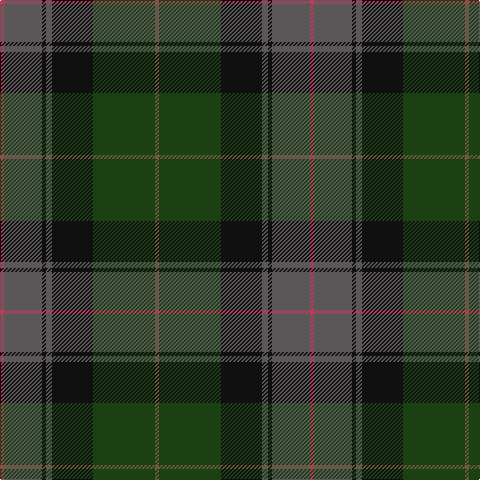

In pattern [GGKBKBR](/stripes/ggkbkbr/).

This was sourced from register-of-tartans.  It is a [7 stripe tartan](/stripes/stripes7/).

Original link https://www.tartanregister.gov.uk/tartanDetails.aspx?ref=10222

## Register references

External register numbers recorded for this tartan.

- Scottish Register of Tartans: [10222](https://www.tartanregister.gov.uk/tartanDetails.aspx?ref=10222)

## Thread count
R/4 N38 K4 N6 K41 DG62 G/4

## Palette
Each colour and the base-6 reference it is a variant of.

| Colour | Shade | Base |
|---|---|---|
| DG | <code style="background-color:#1A4014;">#1A4014</code> `oklch(33.2% 0.083 141.0)` <small>#1A4014</small> | G <code style="background-color:#006100;">#006100</code> |
| G | <code style="background-color:#715937;">#715937</code> `oklch(48.0% 0.058 75.3)` <small>#715937</small> | G <code style="background-color:#006100;">#006100</code> |
| K | <code style="background-color:#101010;">#101010</code> `oklch(17.3% 0.000 89.9)` <small>#101010</small> | K <code style="background-color:#000000;">#000000</code> |
| LR | <code style="background-color:#E6CDA5;">#E6CDA5</code> `oklch(85.9% 0.060 79.4)` <small>#E6CDA5</small> | Y <code style="background-color:#F2BF00;">#F2BF00</code> |
| N | <code style="background-color:#5B5758;">#5B5758</code> `oklch(46.1% 0.005 0.2)` <small>#5B5758</small> | B <code style="background-color:#2A418A;">#2A418A</code> |
| R | <code style="background-color:#B93E5A;">#B93E5A</code> `oklch(54.6% 0.159 10.5)` <small>#B93E5A</small> | R <code style="background-color:#CC0000;">#CC0000</code> |

# Sample pattern

## Nearest tartans

The nearest existing variants by ΔTartan distance.

1. [State Seal of Minnesota (Fashion)](/setts/s8/r4g46r10db10dy33db5dy4lo3~x2/) — ΔT 1.05
1. [John Muir Way](/setts/s8/dy35dg19r3g8r3dg8r3db3~x2/) — ΔT 1.11
1. [Eastern Western Motor Group, Dalbraith](/setts/s8/dy28g2dy4db18g23db2g3lo4~x2/) — ΔT 1.15
1. [Bailies of Bennachie Corporate Tartan Tartan Number: 3628. Earliest known date: 2002 The Bailes of Bennachie were founded in 1973 as caretakers of the mountain in Aberdeenshire, with the aim of 'preserving the amenity of the hill'. The tartan was produced on the occasion of the 25th anniversary to help create funds to continue their task. The colours reflect the autumn shades on the hill. See products available Copyright © Blair Urquhart, Comrie, 2015](/setts/s7/y27dr2y4o15db26k2db6~x2/) — ΔT 1.18
1. [Unidentified Waistcoat](/setts/s7/db4db4dg16dg16db4db4ly1~x4/) — ΔT 1.24
1. [Bennachie (Whisky)](/setts/s7/dt14k5dp5k5dt14dg32r4~x2/) — ΔT 1.25
1. [Passion of Scotland, Pewter (Fashion](/setts/s5/n8o3n34k34dp3~x2/) — ΔT 1.26
1. [Bobby Jones (Personal)](/setts/s6/r1dy2dt12dy8db16lo1~x2/) — ΔT 1.28
1. [MacSween Hunting (Lochs, Isle of Lewis) (Personal)](/setts/s7/dg3r3dg31dg18dg4k22lo3/) — ΔT 1.29
1. [Stansbury (2014)](/setts/s8/dg28r3k28dt8t1dg8r2k3~x2/) — ΔT 1.30

## Neighbour map

Every grey dot is one of 14299 variants placed by the first two principal components of the ΔTartan feature space (44% of its variance). Red is this tartan; blue dots are its nearest — click one to open its page.

<svg viewBox="0 0 640 380" role="img" style="max-width:100%;height:auto;border:1px solid #e0e0e0;border-radius:4px;display:block" xmlns="http://www.w3.org/2000/svg"><image href="/nn/cloud.v1.png" width="640" height="380"/><a href="/setts/s8/r4g46r10db10dy33db5dy4lo3~x2/"><circle cx="289.3" cy="195.0" r="4" fill="#3465a4"><title>State Seal of Minnesota (Fashion)</title></circle></a><a href="/setts/s8/dy35dg19r3g8r3dg8r3db3~x2/"><circle cx="300.4" cy="205.5" r="4" fill="#3465a4"><title>John Muir Way</title></circle></a><a href="/setts/s8/dy28g2dy4db18g23db2g3lo4~x2/"><circle cx="289.4" cy="218.9" r="4" fill="#3465a4"><title>Eastern Western Motor Group, Dalbraith</title></circle></a><a href="/setts/s7/y27dr2y4o15db26k2db6~x2/"><circle cx="261.3" cy="207.1" r="4" fill="#3465a4"><title>Bailies of Bennachie Corporate Tartan Tartan Number: 3628. Earliest known date: 2002 The Bailes of Bennachie were founded in 1973 as caretakers of the mountain in Aberdeenshire, with the aim of 'preserving the amenity of the hill'. The tartan was produced on the occasion of the 25th anniversary to help create funds to continue their task. The colours reflect the autumn shades on the hill. See products available Copyright © Blair Urquhart, Comrie, 2015</title></circle></a><a href="/setts/s7/db4db4dg16dg16db4db4ly1~x4/"><circle cx="233.3" cy="223.3" r="4" fill="#3465a4"><title>Unidentified Waistcoat</title></circle></a><a href="/setts/s7/dt14k5dp5k5dt14dg32r4~x2/"><circle cx="252.6" cy="242.9" r="4" fill="#3465a4"><title>Bennachie (Whisky)</title></circle></a><a href="/setts/s5/n8o3n34k34dp3~x2/"><circle cx="314.0" cy="246.4" r="4" fill="#3465a4"><title>Passion of Scotland, Pewter (Fashion</title></circle></a><a href="/setts/s6/r1dy2dt12dy8db16lo1~x2/"><circle cx="306.0" cy="229.1" r="4" fill="#3465a4"><title>Bobby Jones (Personal)</title></circle></a><a href="/setts/s7/dg3r3dg31dg18dg4k22lo3/"><circle cx="277.4" cy="229.4" r="4" fill="#3465a4"><title>MacSween Hunting (Lochs, Isle of Lewis) (Personal)</title></circle></a><a href="/setts/s8/dg28r3k28dt8t1dg8r2k3~x2/"><circle cx="358.9" cy="190.8" r="4" fill="#3465a4"><title>Stansbury (2014)</title></circle></a><circle cx="291.5" cy="211.6" r="5" fill="#c00000"/></svg>

ID: /setts/s7/r4n38k4n6k41dg62y4/
