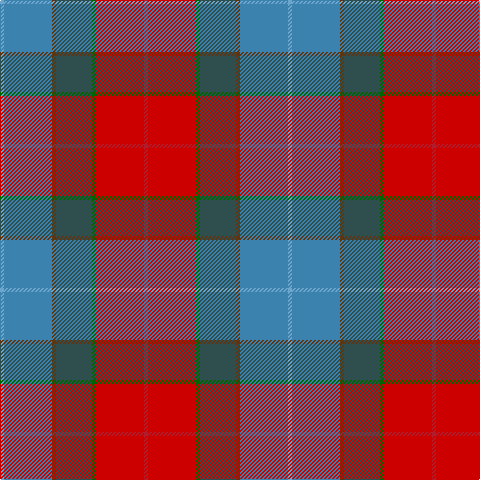

In pattern [RRGBGBY](/patterns/rrgbgby/).

This was sourced from register-of-tartans.  It is a [7 stripes tartan](/stripes/stripes7/).

Original link https://www.tartanregister.gov.uk/tartanDetails.aspx?ref=10680

## Thread count
Ba/4 B48 T4 N36 G4 Ra48 R/4

## Palette
Each colour and its ΔE from the base-6 reference it is a variant of.

| Colour | Shade | Base | ΔE (OKLab) |
|---|---|---|---|
| B | <code style="background-color:#3C82AF;">#3C82AF</code> `#3C82AF` | B <code style="background-color:#2C4084;">#2C4084</code> | 0.20 |
| Ba | <code style="background-color:#6CA6CD;">#6CA6CD</code> `#6CA6CD` | Y <code style="background-color:#E8C000;">#E8C000</code> | 0.27 |
| G | <code style="background-color:#006400;">#006400</code> `#006400` | G <code style="background-color:#006400;">#006400</code> | 0.00 |
| N | <code style="background-color:#2F4F4F;">#2F4F4F</code> `#2F4F4F` | B <code style="background-color:#2C4084;">#2C4084</code> | 0.11 |
| R | <code style="background-color:#AF1E2D;">#AF1E2D</code> `#AF1E2D` | R <code style="background-color:#C80000;">#C80000</code> | 0.05 |
| Ra | <code style="background-color:#CD0000;">#CD0000</code> `#CD0000` | R <code style="background-color:#C80000;">#C80000</code> | 0.01 |
| T | <code style="background-color:#603311;">#603311</code> `#603311` | G <code style="background-color:#006400;">#006400</code> | 0.18 |

# Sample pattern

ID: /setts/s7/r4ra48g4b36ga4ba48y4-b2f4f4f-ba3c82af-g006400-ga603311-raf1e2d-racd0000-y6ca6cd/
