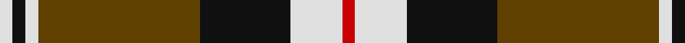

In pattern [RWKGWKW](/patterns/rwkgwkw/).

This was sourced from house-of-tartan.  It is a [7 stripes tartan](/stripes/stripes7/).

Original link http://www.house-of-tartan.scotland.net/house/TartanViewjs.asp?colr=Def&tnam=1688

## Thread count
LN/4 K4 LN4 T50 K28 LN16 R/4

## Palette
Each colour and its ΔE from the base-6 reference it is a variant of.

| Colour | Shade | Base | ΔE (OKLab) |
|---|---|---|---|
| K | <code style="background-color:#101010;">#101010</code> `#101010` | K <code style="background-color:#000000;">#000000</code> | 0.17 |
| LN | <code style="background-color:#E0E0E0;">#E0E0E0</code> `#E0E0E0` | W <code style="background-color:#F7F7F7;">#F7F7F7</code> | 0.07 |
| R | <code style="background-color:#C80000;">#C80000</code> `#C80000` | R <code style="background-color:#CC0000;">#CC0000</code> | 0.01 |
| T | <code style="background-color:#604000;">#604000</code> `#604000` | G <code style="background-color:#006100;">#006100</code> | 0.14 |

# Sample pattern

## Nearest tartans

The nearest existing variants by ΔTartan distance.

1. [Braemar or Blair Atholl](/setts/s8/b8w8k24b12k8r56k4r4-b441800-k101010-ra07c58-wffffff/) — ΔT 0.49
1. [Merric, Dark Camel..](/setts/s7/r4w16k28ra50w4k4w4-k000000-rc00000-ra806050-we0e0e0/) — ΔT 0.62
1. [Blair Atholl (Fashion)](/setts/s8/b8y8k24b12k8r56k4r4-b441800-k101010-ra07c58-yb8b8b8/) — ΔT 0.74
1. [Thomson Camel (Jedburgh Mill)](/setts/s6/r8k4w20k20g56k6-g8c7038-k101010-rc80000-wc0c0c0/) — ΔT 0.88
1. [Distripress Annual Congress 2012](/setts/s8/r12k2w8k4b16r2k31b2-b666666-k101010-rff0000-wffffff/) — ΔT 0.88
1. [Virginia Commonwealth University](/setts/s7/k60w4y8ya20w18k6y10-k101010-wffffff-ya0a0a0-yad87c00/) — ΔT 0.90
1. [Loch Ness](/setts/s6/r20w4k20w20g70k10-g503c14-k101010-rdc0000-we0e0e0/) — ΔT 0.90
1. [Bro-Leon](/setts/s9/b8k44y4k4g14y4k4y34k8-b2c2c80-g408060-k101010-ybc8c00/) — ΔT 0.92
1. [Burberry (Counterfeit #4)](/setts/s9/k20w20k20r64k4w4k4w4ra10-k000000-rb07430-ra880000-we0e0e0/) — ΔT 0.92
1. [Longford County Crest (Fashion)](/setts/s8/k88y18k6y16y32y30y12k14-k101010-ybc8c00/) — ΔT 0.95

## Neighbour map

Every grey dot is one of 15726 variants placed by the first two principal components of the ΔTartan feature space (44% of its variance). Red is this tartan; blue dots are its nearest — click one to open its page.

<svg viewBox="0 0 640 380" role="img" style="max-width:100%;height:auto;border:1px solid #e0e0e0;border-radius:4px;display:block" xmlns="http://www.w3.org/2000/svg"><image href="/nn/cloud.v1.png" width="640" height="380"/><a href="/setts/s8/b8w8k24b12k8r56k4r4-b441800-k101010-ra07c58-wffffff/"><circle cx="254.2" cy="155.3" r="4" fill="#3465a4"><title>Braemar or Blair Atholl</title></circle></a><a href="/setts/s7/r4w16k28ra50w4k4w4-k000000-rc00000-ra806050-we0e0e0/"><circle cx="219.2" cy="158.3" r="4" fill="#3465a4"><title>Merric, Dark Camel..</title></circle></a><a href="/setts/s8/b8y8k24b12k8r56k4r4-b441800-k101010-ra07c58-yb8b8b8/"><circle cx="265.7" cy="160.8" r="4" fill="#3465a4"><title>Blair Atholl (Fashion)</title></circle></a><a href="/setts/s6/r8k4w20k20g56k6-g8c7038-k101010-rc80000-wc0c0c0/"><circle cx="259.7" cy="177.5" r="4" fill="#3465a4"><title>Thomson Camel (Jedburgh Mill)</title></circle></a><a href="/setts/s8/r12k2w8k4b16r2k31b2-b666666-k101010-rff0000-wffffff/"><circle cx="235.5" cy="151.6" r="4" fill="#3465a4"><title>Distripress Annual Congress 2012</title></circle></a><a href="/setts/s7/k60w4y8ya20w18k6y10-k101010-wffffff-ya0a0a0-yad87c00/"><circle cx="246.0" cy="154.5" r="4" fill="#3465a4"><title>Virginia Commonwealth University</title></circle></a><a href="/setts/s6/r20w4k20w20g70k10-g503c14-k101010-rdc0000-we0e0e0/"><circle cx="251.5" cy="170.1" r="4" fill="#3465a4"><title>Loch Ness</title></circle></a><a href="/setts/s9/b8k44y4k4g14y4k4y34k8-b2c2c80-g408060-k101010-ybc8c00/"><circle cx="246.3" cy="168.5" r="4" fill="#3465a4"><title>Bro-Leon</title></circle></a><a href="/setts/s9/k20w20k20r64k4w4k4w4ra10-k000000-rb07430-ra880000-we0e0e0/"><circle cx="210.6" cy="132.7" r="4" fill="#3465a4"><title>Burberry (Counterfeit #4)</title></circle></a><a href="/setts/s8/k88y18k6y16y32y30y12k14-k101010-ybc8c00/"><circle cx="210.3" cy="166.3" r="4" fill="#3465a4"><title>Longford County Crest (Fashion)</title></circle></a><circle cx="231.9" cy="164.0" r="5" fill="#c00000"/></svg>

ID: /setts/s7/r4w16k28g50w4k4w4-g604000-k101010-rc80000-we0e0e0/
