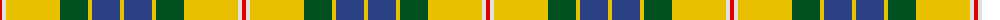

In pattern [RWYGYBY](/patterns/rwygyby/).

This was sourced from register-of-tartans.  It is a [7 stripes tartan](/stripes/stripes7/).

Original link https://www.tartanregister.gov.uk/tartanDetails.aspx?ref=1268

## Thread count
R/4 LN4 Y54 G28 Y4 B28 Y/4

## Palette
Each colour and its ΔE from the base-6 reference it is a variant of.

| Colour | Shade | Base | ΔE (OKLab) |
|---|---|---|---|
| B | <code style="background-color:#2C4084;">#2C4084</code> `#2C4084` | B <code style="background-color:#2A418A;">#2A418A</code> | 0.01 |
| G | <code style="background-color:#005020;">#005020</code> `#005020` | G <code style="background-color:#006100;">#006100</code> | 0.07 |
| LN | <code style="background-color:#E0E0E0;">#E0E0E0</code> `#E0E0E0` | W <code style="background-color:#F7F7F7;">#F7F7F7</code> | 0.07 |
| R | <code style="background-color:#DC0000;">#DC0000</code> `#DC0000` | R <code style="background-color:#CC0000;">#CC0000</code> | 0.03 |
| Y | <code style="background-color:#E8C000;">#E8C000</code> `#E8C000` | Y <code style="background-color:#F2BF00;">#F2BF00</code> | 0.02 |

# Sample pattern

## Nearest tartans

The nearest existing variants by ΔTartan distance.

1. [Fraser Yellow Tartan Tartan Number: 1709. Earliest known date: pre 2003 Similar to Vestiarium Scoticum See products available Copyright © Blair Urquhart, Comrie, 2015](/setts/s7/r4w4y54g28y4b28y4-b2c2c80-g006818-rc80000-we0e0e0-ye8c000/) — ΔT 0.07
1. [Fraser, Yellow](/setts/s7/r4w4y54g28y4b28y4-b304080-g008000-rc00000-we0e0e0-yf0c000/) — ΔT 0.49
1. [Regalia](/setts/s7/g4ga28g28r8ga4y60w4-g003820-ga604000-r888888-wf8f8f8-yd0b87c/) — ΔT 0.78
1. [Drummond of Perth Dress (Dance)](/setts/s9/g82y6ga14b6w48g20ga14b14w6-b5c5c5c-g285800-ga408060-wfcfcfc-ybc8c00/) — ΔT 1.04
1. [Shepherd Piping (Personal)](/setts/s6/k20y8g28ya72g8w8-g604000-k101010-we0e0e0-yf0e490-yad8bc0c/) — ΔT 1.05
1. [Hamilton of Brandon (Fashion)](/setts/s6/y64k28w4g28k4ya12-g006818-k101010-we0e0e0-ya08858-yae8c000/) — ΔT 1.18
1. [Shepherd, Derek (Piping)](/setts/s6/k20y8g28ya72g8w8-g603311-k101010-wffffff-yfee885-yaffec8b/) — ΔT 1.20
1. [Nova Scotia, dress](/setts/s9/g6w58g6b6g6b12g26y6r4-b304080-g008000-rc00000-we0e0e0-yf0c000/) — ΔT 1.34
1. [Cornish National Small Set Tartan Tartan Number: 7651. Earliest known date: See products available Copyright © Blair Urquhart, Comrie, 2015](/setts/s6/w4k22y22b6k2r2-b5c8ca8-k101010-rc80000-we0e0e0-ye8c000/) — ΔT 1.34
1. [Mostyn](/setts/s9/r40k4r4k4r4k16g48b4g6-b202060-g289c18-k101010-re87878/) — ΔT 1.37

## Neighbour map

Every grey dot is one of 15726 variants placed by the first two principal components of the ΔTartan feature space (44% of its variance). Red is this tartan; blue dots are its nearest — click one to open its page.

<svg viewBox="0 0 640 380" role="img" style="max-width:100%;height:auto;border:1px solid #e0e0e0;border-radius:4px;display:block" xmlns="http://www.w3.org/2000/svg"><image href="/nn/cloud.v1.png" width="640" height="380"/><a href="/setts/s7/r4w4y54g28y4b28y4-b2c2c80-g006818-rc80000-we0e0e0-ye8c000/"><circle cx="220.9" cy="143.1" r="4" fill="#3465a4"><title>Fraser Yellow Tartan Tartan Number: 1709. Earliest known date: pre 2003 Similar to Vestiarium Scoticum See products available Copyright © Blair Urquhart, Comrie, 2015</title></circle></a><a href="/setts/s7/r4w4y54g28y4b28y4-b304080-g008000-rc00000-we0e0e0-yf0c000/"><circle cx="226.9" cy="144.7" r="4" fill="#3465a4"><title>Fraser, Yellow</title></circle></a><a href="/setts/s7/g4ga28g28r8ga4y60w4-g003820-ga604000-r888888-wf8f8f8-yd0b87c/"><circle cx="208.6" cy="144.8" r="4" fill="#3465a4"><title>Regalia</title></circle></a><a href="/setts/s9/g82y6ga14b6w48g20ga14b14w6-b5c5c5c-g285800-ga408060-wfcfcfc-ybc8c00/"><circle cx="209.1" cy="136.9" r="4" fill="#3465a4"><title>Drummond of Perth Dress (Dance)</title></circle></a><a href="/setts/s6/k20y8g28ya72g8w8-g604000-k101010-we0e0e0-yf0e490-yad8bc0c/"><circle cx="207.2" cy="164.7" r="4" fill="#3465a4"><title>Shepherd Piping (Personal)</title></circle></a><a href="/setts/s6/y64k28w4g28k4ya12-g006818-k101010-we0e0e0-ya08858-yae8c000/"><circle cx="213.3" cy="162.6" r="4" fill="#3465a4"><title>Hamilton of Brandon (Fashion)</title></circle></a><a href="/setts/s6/k20y8g28ya72g8w8-g603311-k101010-wffffff-yfee885-yaffec8b/"><circle cx="191.9" cy="154.7" r="4" fill="#3465a4"><title>Shepherd, Derek (Piping)</title></circle></a><a href="/setts/s9/g6w58g6b6g6b12g26y6r4-b304080-g008000-rc00000-we0e0e0-yf0c000/"><circle cx="207.2" cy="121.1" r="4" fill="#3465a4"><title>Nova Scotia, dress</title></circle></a><a href="/setts/s6/w4k22y22b6k2r2-b5c8ca8-k101010-rc80000-we0e0e0-ye8c000/"><circle cx="171.6" cy="160.4" r="4" fill="#3465a4"><title>Cornish National Small Set Tartan Tartan Number: 7651. Earliest known date: See products available Copyright © Blair Urquhart, Comrie, 2015</title></circle></a><a href="/setts/s9/r40k4r4k4r4k16g48b4g6-b202060-g289c18-k101010-re87878/"><circle cx="221.1" cy="149.5" r="4" fill="#3465a4"><title>Mostyn</title></circle></a><circle cx="222.0" cy="143.6" r="5" fill="#c00000"/></svg>

ID: /setts/s7/r4w4y54g28y4b28y4-b2c4084-g005020-rdc0000-we0e0e0-ye8c000/
