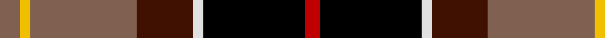

In pattern [RKWBRYR](/patterns/rkwbryr/).

This was sourced from weddslist.  It is a [7 stripes tartan](/stripes/stripes7/).

Original link http://www.weddslist.com/cgi-bin/tartans/pg.pl?source=sts

## Thread count
LT/8 Y4 LT42 DR22 LN4 K40 R/6

## Palette
Each colour and its ΔE from the base-6 reference it is a variant of.

| Colour | Shade | Base | ΔE (OKLab) |
|---|---|---|---|
| DR | <code style="background-color:#401000;">#401000</code> `#401000` | B <code style="background-color:#2A418A;">#2A418A</code> | 0.24 |
| K | <code style="background-color:#000000;">#000000</code> `#000000` | K <code style="background-color:#000000;">#000000</code> | 0.00 |
| LN | <code style="background-color:#E0E0E0;">#E0E0E0</code> `#E0E0E0` | W <code style="background-color:#F7F7F7;">#F7F7F7</code> | 0.07 |
| LT | <code style="background-color:#806050;">#806050</code> `#806050` | R <code style="background-color:#CC0000;">#CC0000</code> | 0.17 |
| R | <code style="background-color:#C00000;">#C00000</code> `#C00000` | R <code style="background-color:#CC0000;">#CC0000</code> | 0.03 |
| Y | <code style="background-color:#F0C000;">#F0C000</code> `#F0C000` | Y <code style="background-color:#F2BF00;">#F2BF00</code> | 0.00 |

# Sample pattern

## Nearest tartans

The nearest existing variants by ΔTartan distance.

1. [Clan MacLeod Society of Scotland, Centenary](/setts/s6/g3ga3r22k5ka22y2~g003000-ga30a010-k000000-ka000030-rc00000-yf0c000~x2/) — ΔT 0.73
1. [Scotch House 2000, dress](/setts/s7/g22w3k2y3k19r18ga4~g004010-ga30a010-k000000-rc00000-we0e0e0-yf0c000~x2/) — ΔT 1.04
1. [Mellor, Phillip (Oldham)](/setts/s7/b8w8k16g32ba3y5w5~b351e14-ba433a5a-g23321b-k000000-wf9f5ef-ye0a126~x2/) — ΔT 1.08
1. [Unidentified No 5](/setts/s8/k10y2g11r11w1r1w1k9~g005020-k101010-rdc0000-we0e0e0-ye8c000~x2/) — ΔT 1.12
1. [Loch Etive](/setts/s8/w3g2r21k26b18k2b3y3~b2c4084-g00643c-k101010-rdc0000-we0e0e0-yfccc00~x2/) — ΔT 1.12
1. [Barbour Corporate Tartan Tartan Number: 2489. Earliest known date: 1998 For the linings of Barbour's famous wax jackets. Tartan designed by Kinloch Anderson of Edinburgh. See products available Copyright © Blair Urquhart, Comrie, 2015](/setts/s7/g4y2g21b11w2k20r3~b441800-g6c6044-k101010-rc80000-wfcfcfc-ye8c000~x2/) — ΔT 1.12
1. [McMuldroch (2014)](/setts/s10/g19k18r18w2y2b2y2w2r8b3~b780078-g006818-k000000-r960028-wf8f8f8-yfccc00~x2/) — ΔT 1.12
1. [Barbour](/setts/s7/r3k20w2g11ra21y2ra2~g642400-k101010-rc80000-ra946434-wfcfcfc-ye8c000~x2/) — ΔT 1.14
1. [Loch Etive](/setts/s8/w3g2r21k26b18k2b3y3~b2c2c80-g289c18-k101010-rc80000-wc0c0c0-yfccc00~x2/) — ΔT 1.14
1. [MacLachlan W](/setts/s7/r24y2ya3g16k16y2ya3~g11450d-k000000-raa0000-yaaaaaa-yaaaaa00~x2/) — ΔT 1.16

## Neighbour map

Every grey dot is one of 15726 variants placed by the first two principal components of the ΔTartan feature space (44% of its variance). Red is this tartan; blue dots are its nearest — click one to open its page.

<svg viewBox="0 0 640 380" role="img" style="max-width:100%;height:auto;border:1px solid #e0e0e0;border-radius:4px;display:block" xmlns="http://www.w3.org/2000/svg"><image href="/nn/cloud.v1.png" width="640" height="380"/><a href="/setts/s6/g3ga3r22k5ka22y2~g003000-ga30a010-k000000-ka000030-rc00000-yf0c000~x2/"><circle cx="167.8" cy="156.0" r="4" fill="#3465a4"><title>Clan MacLeod Society of Scotland, Centenary</title></circle></a><a href="/setts/s7/g22w3k2y3k19r18ga4~g004010-ga30a010-k000000-rc00000-we0e0e0-yf0c000~x2/"><circle cx="98.1" cy="155.6" r="4" fill="#3465a4"><title>Scotch House 2000, dress</title></circle></a><a href="/setts/s7/b8w8k16g32ba3y5w5~b351e14-ba433a5a-g23321b-k000000-wf9f5ef-ye0a126~x2/"><circle cx="124.4" cy="153.0" r="4" fill="#3465a4"><title>Mellor, Phillip (Oldham)</title></circle></a><a href="/setts/s8/k10y2g11r11w1r1w1k9~g005020-k101010-rdc0000-we0e0e0-ye8c000~x2/"><circle cx="172.1" cy="171.2" r="4" fill="#3465a4"><title>Unidentified No 5</title></circle></a><a href="/setts/s8/w3g2r21k26b18k2b3y3~b2c4084-g00643c-k101010-rdc0000-we0e0e0-yfccc00~x2/"><circle cx="151.1" cy="132.3" r="4" fill="#3465a4"><title>Loch Etive</title></circle></a><a href="/setts/s7/g4y2g21b11w2k20r3~b441800-g6c6044-k101010-rc80000-wfcfcfc-ye8c000~x2/"><circle cx="174.0" cy="166.3" r="4" fill="#3465a4"><title>Barbour Corporate Tartan Tartan Number: 2489. Earliest known date: 1998 For the linings of Barbour's famous wax jackets. Tartan designed by Kinloch Anderson of Edinburgh. See products available Copyright © Blair Urquhart, Comrie, 2015</title></circle></a><a href="/setts/s10/g19k18r18w2y2b2y2w2r8b3~b780078-g006818-k000000-r960028-wf8f8f8-yfccc00~x2/"><circle cx="103.9" cy="130.2" r="4" fill="#3465a4"><title>McMuldroch (2014)</title></circle></a><a href="/setts/s7/r3k20w2g11ra21y2ra2~g642400-k101010-rc80000-ra946434-wfcfcfc-ye8c000~x2/"><circle cx="165.4" cy="155.2" r="4" fill="#3465a4"><title>Barbour</title></circle></a><a href="/setts/s8/w3g2r21k26b18k2b3y3~b2c2c80-g289c18-k101010-rc80000-wc0c0c0-yfccc00~x2/"><circle cx="155.9" cy="135.4" r="4" fill="#3465a4"><title>Loch Etive</title></circle></a><a href="/setts/s7/r24y2ya3g16k16y2ya3~g11450d-k000000-raa0000-yaaaaaa-yaaaaa00~x2/"><circle cx="153.6" cy="162.3" r="4" fill="#3465a4"><title>MacLachlan W</title></circle></a><circle cx="150.2" cy="156.7" r="5" fill="#c00000"/></svg>

ID: /setts/s7/r4y2r21b11w2k20ra3~b401000-k000000-r806050-rac00000-we0e0e0-yf0c000~x2/
