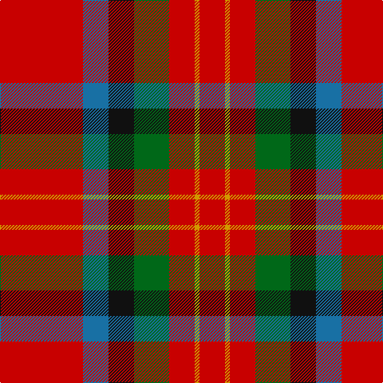

**Bands:** [RYRGKBR](/stripes/ryrgkbr/) · **Stripes:** [R LO R G K B R](/stripes/stripes7/) R LO R G K B R

This was sourced from tartans-authority.  It is a [7 band tartan](/bands/bands7/).

Original link http://www.tartansauthority.com/tartan-ferret/display/1359/

## Also known as

This cloth is also recorded under:

- Sturrock, Blue/Black

## Thread count
R/104 B32 K32 G44 R32 DY6 R/32

## Palette
Each colour and its ΔE from the base-6 reference it is a variant of.

| Colour | Shade | Base | ΔE (OKLab) |
|---|---|---|---|
| B | <code style="background-color:#1870A4;">#1870A4</code> `#1870A4` | B <code style="background-color:#2A418A;">#2A418A</code> | 0.13 |
| DY | <code style="background-color:#D09800;">#D09800</code> `#D09800` | Y <code style="background-color:#F2BF00;">#F2BF00</code> | 0.12 |
| G | <code style="background-color:#006818;">#006818</code> `#006818` | G <code style="background-color:#006100;">#006100</code> | 0.02 |
| K | <code style="background-color:#101010;">#101010</code> `#101010` | K <code style="background-color:#000000;">#000000</code> | 0.17 |
| R | <code style="background-color:#C80000;">#C80000</code> `#C80000` | R <code style="background-color:#CC0000;">#CC0000</code> | 0.01 |

# Sample pattern

## Nearest tartans

The nearest existing variants by ΔTartan distance.

1. [Thompson/Thomson/MacTavish (Mackinlay)](/setts/s6/r40t11w2k12dg36r32~x2/) — ΔT 0.75
1. [Caithness (1848) (District?)](/setts/s6/r40t11w2k12g36r32~x2/) — ΔT 0.79
1. [Sturrock](/setts/s7/r52db16k16g22r16ly3r16/) — ΔT 0.79
1. [Loch Lochy (District)](/setts/s8/r6g14r6db12r31lb2r4ly3~x2/) — ΔT 0.90
1. [MacDuff](/setts/s7/r96db16dg34dg48r18k6r9/) — ΔT 0.98
1. [MacDuff - 1819 (Clan)](/setts/s7/r36db9k12g17r10k3r10~x2/) — ΔT 1.08
1. [Loch Lochy](/setts/s8/r6dg14r6db11r31lb2r4ly3~x2/) — ΔT 1.17
1. [MacDuff](/setts/s7/r96db16dg34g48r18k6r9/) — ΔT 1.18
1. [Tipperary](/setts/s7/r33k8dr12g12r8dr2r8~x2/) — ΔT 1.19
1. [MacDuff #6](/setts/s7/r36lt9k12g17r10k3r10~x2/) — ΔT 1.21

## Neighbour map

Every grey dot is one of 14299 variants placed by the first two principal components of the ΔTartan feature space (44% of its variance). Red is this tartan; blue dots are its nearest — click one to open its page.

<svg viewBox="0 0 640 380" role="img" style="max-width:100%;height:auto;border:1px solid #e0e0e0;border-radius:4px;display:block" xmlns="http://www.w3.org/2000/svg"><image href="/nn/cloud.v1.png" width="640" height="380"/><a href="/setts/s6/r40t11w2k12dg36r32~x2/"><circle cx="282.9" cy="173.6" r="4" fill="#3465a4"><title>Thompson/Thomson/MacTavish (Mackinlay)</title></circle></a><a href="/setts/s6/r40t11w2k12g36r32~x2/"><circle cx="294.5" cy="179.7" r="4" fill="#3465a4"><title>Caithness (1848) (District?)</title></circle></a><a href="/setts/s7/r52db16k16g22r16ly3r16/"><circle cx="296.5" cy="164.0" r="4" fill="#3465a4"><title>Sturrock</title></circle></a><a href="/setts/s8/r6g14r6db12r31lb2r4ly3~x2/"><circle cx="334.9" cy="149.1" r="4" fill="#3465a4"><title>Loch Lochy (District)</title></circle></a><a href="/setts/s7/r96db16dg34dg48r18k6r9/"><circle cx="294.1" cy="155.8" r="4" fill="#3465a4"><title>MacDuff</title></circle></a><a href="/setts/s7/r36db9k12g17r10k3r10~x2/"><circle cx="309.8" cy="199.6" r="4" fill="#3465a4"><title>MacDuff - 1819 (Clan)</title></circle></a><a href="/setts/s8/r6dg14r6db11r31lb2r4ly3~x2/"><circle cx="332.5" cy="143.3" r="4" fill="#3465a4"><title>Loch Lochy</title></circle></a><a href="/setts/s7/r96db16dg34g48r18k6r9/"><circle cx="293.7" cy="159.4" r="4" fill="#3465a4"><title>MacDuff</title></circle></a><a href="/setts/s7/r33k8dr12g12r8dr2r8~x2/"><circle cx="329.1" cy="178.0" r="4" fill="#3465a4"><title>Tipperary</title></circle></a><a href="/setts/s7/r36lt9k12g17r10k3r10~x2/"><circle cx="292.6" cy="190.1" r="4" fill="#3465a4"><title>MacDuff #6</title></circle></a><circle cx="317.0" cy="172.8" r="5" fill="#c00000"/></svg>

ID: /setts/s7/r52b16k16g22r16lo3r16~x2/
