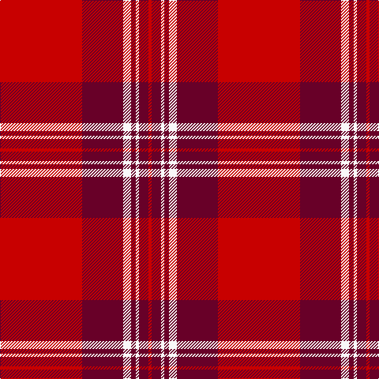

This page is one **sett** — a single exact thread-count. It belongs to the [tartan](/tartans/r52dr26w5dr3w2dr6r2/)
(the same proportion at any scale), whose colour order is pattern [RBWBWBR](/stripes/rbwbwbr/).

Sourced from tartans-authority.  It is a [7 stripe tartan](/stripes/stripes7/).

Original link http://www.tartansauthority.com/tartan-ferret/display/7744/

## Also known as

This cloth is also recorded under:

- St Andrew's School, Delaware

2 attestations — the source records this cloth was collapsed from (oldest owns this page)

<ul>
<li>Sep 2008 — St. Andrews School (Delaware) (Corp) (tartans-authority, <a href="http://www.tartansauthority.com/tartan-ferret/display/7744/">record</a>)</li>
<li>undated — St Andrew's School, Delaware (register-of-tartans, <a href="https://www.tartanregister.gov.uk/tartanDetails.aspx?ref=5725">record</a>)</li>
</ul>

## Register references

External register numbers recorded for this tartan.

- Scottish Register of Tartans: [5725](https://www.tartanregister.gov.uk/tartanDetails.aspx?ref=5725)
- Scottish Tartans Authority (ITI): 7744

## Thread count
R/104 DR52 W10 DR6 W4 DR12 R/4

## Palette

Palette: <strong>Tartan Register</strong>
<table><thead><tr><th>Colour</th><th>Threads</th><th>Shade</th><th>Base</th><th>OKLCh</th></tr></thead><tbody><tr><td>R/</td><td style="text-align:right;font-variant-numeric:tabular-nums">104</td><td><code style="background-color:#C80000;">#C80000</code> <small style="color:#888">#C80000</small></td><td>R <code style="background-color:#CC0000;">#CC0000</code></td><td><small style="color:#888">oklch(52.3% 0.215 29.2)</small></td></tr><tr><td>DR</td><td style="text-align:right;font-variant-numeric:tabular-nums">52</td><td><code style="background-color:#680028;">#680028</code> <small style="color:#888">#680028</small></td><td>B <code style="background-color:#2A418A;">#2A418A</code></td><td><small style="color:#888">oklch(33.1% 0.133 8.3)</small></td></tr><tr><td>W</td><td style="text-align:right;font-variant-numeric:tabular-nums">10</td><td><code style="background-color:#F8F8F8;">#F8F8F8</code> <small style="color:#888">#F8F8F8</small></td><td>W <code style="background-color:#F7F7F7;">#F7F7F7</code></td><td><small style="color:#888">oklch(97.9% 0.000 89.9)</small></td></tr><tr><td>DR</td><td style="text-align:right;font-variant-numeric:tabular-nums">6</td><td><code style="background-color:#680028;">#680028</code> <small style="color:#888">#680028</small></td><td>B <code style="background-color:#2A418A;">#2A418A</code></td><td><small style="color:#888">oklch(33.1% 0.133 8.3)</small></td></tr><tr><td>W</td><td style="text-align:right;font-variant-numeric:tabular-nums">4</td><td><code style="background-color:#F8F8F8;">#F8F8F8</code> <small style="color:#888">#F8F8F8</small></td><td>W <code style="background-color:#F7F7F7;">#F7F7F7</code></td><td><small style="color:#888">oklch(97.9% 0.000 89.9)</small></td></tr><tr><td>DR</td><td style="text-align:right;font-variant-numeric:tabular-nums">12</td><td><code style="background-color:#680028;">#680028</code> <small style="color:#888">#680028</small></td><td>B <code style="background-color:#2A418A;">#2A418A</code></td><td><small style="color:#888">oklch(33.1% 0.133 8.3)</small></td></tr><tr><td>R/</td><td style="text-align:right;font-variant-numeric:tabular-nums">4</td><td><code style="background-color:#C80000;">#C80000</code> <small style="color:#888">#C80000</small></td><td>R <code style="background-color:#CC0000;">#CC0000</code></td><td><small style="color:#888">oklch(52.3% 0.215 29.2)</small></td></tr></tbody></table>

# Sample pattern

## Nearest tartans

The nearest existing variants by ΔTartan distance, with this tartan at the top so the swatches line up against it.

ΔTartan

Tartan

Sett

—

<a href="/ttd/edit/#slug=r52dr26w5dr3w2dr6r2~x2">St. Andrews School (Delaware) (Corp)</a> <a class="nn-out" href="/setts/s7/r52dr26w5dr3w2dr6r2~x2/" title="open its dictionary page">↗</a>

1.35

<a href="/ttd/edit/#slug=r80dp19r8dg36r10dp2~x2">Lovat or Fraser #2</a> <a class="nn-out" href="/setts/s6/r80dp19r8dg36r10dp2~x2/" title="open its dictionary page">↗</a>

1.40

<a href="/ttd/edit/#slug=dg2r2db1r24db6r3dg12r4db1~x2">MacDonald #7</a> <a class="nn-out" href="/setts/s9/dg2r2db1r24db6r3dg12r4db1~x2/" title="open its dictionary page">↗</a>

1.53

<a href="/ttd/edit/#slug=r3dg16r4k6r28dg1r3~x2">Maxwell Ancient</a> <a class="nn-out" href="/setts/s7/r3dg16r4k6r28dg1r3~x2/" title="open its dictionary page">↗</a>

1.53

<a href="/ttd/edit/#slug=r48db2r3dg28r4db2~x2">MacKintosh #3</a> <a class="nn-out" href="/setts/s6/r48db2r3dg28r4db2~x2/" title="open its dictionary page">↗</a>

1.54

<a href="/ttd/edit/#slug=w2k1r28k3m28k1w2~x2">Aberdeen Football Club (1990)</a> <a class="nn-out" href="/setts/s7/w2k1r28k3m28k1w2~x2/" title="open its dictionary page">↗</a>

1.54

<a href="/ttd/edit/#slug=r68db18r9dg34r9db3~x2">MacKintosh #2</a> <a class="nn-out" href="/setts/s6/r68db18r9dg34r9db3~x2/" title="open its dictionary page">↗</a>

1.55

<a href="/ttd/edit/#slug=r107k9r5dp41r5g51r14">Buccleuch</a> <a class="nn-out" href="/setts/s7/r107k9r5dp41r5g51r14/" title="open its dictionary page">↗</a>

1.59

<a href="/ttd/edit/#slug=r2dg20r2db8r36dg1~x2">Robertson</a> <a class="nn-out" href="/setts/s6/r2dg20r2db8r36dg1~x2/" title="open its dictionary page">↗</a>

1.63

<a href="/ttd/edit/#slug=r80p19r8g36r10p2~x2">Lovat, or Fraser</a> <a class="nn-out" href="/setts/s6/r80p19r8g36r10p2~x2/" title="open its dictionary page">↗</a>

1.65

<a href="/ttd/edit/#slug=r12y6k1y2k1y1k6r24w2~x4">Stuart of Bute</a> <a class="nn-out" href="/setts/s9/r12y6k1y2k1y1k6r24w2~x4/" title="open its dictionary page">↗</a>

## Neighbour map

Every grey dot is one of 14359 variants placed by the first two principal components of the ΔTartan feature space (44% of its variance). Red is this tartan; blue dots are its nearest — click one to open its page.

<svg viewBox="0 0 640 380" role="img" style="max-width:100%;height:auto;border:1px solid #e0e0e0;border-radius:4px;display:block" xmlns="http://www.w3.org/2000/svg"><image href="/nn/cloud.v1.png" width="640" height="380"/><a href="/setts/s6/r80dp19r8dg36r10dp2~x2/"><circle cx="454.1" cy="152.6" r="4" fill="#3465a4"><title>Lovat or Fraser #2</title></circle></a><a href="/setts/s9/dg2r2db1r24db6r3dg12r4db1~x2/"><circle cx="413.3" cy="147.6" r="4" fill="#3465a4"><title>MacDonald #7</title></circle></a><a href="/setts/s7/r3dg16r4k6r28dg1r3~x2/"><circle cx="427.3" cy="156.5" r="4" fill="#3465a4"><title>Maxwell Ancient</title></circle></a><a href="/setts/s6/r48db2r3dg28r4db2~x2/"><circle cx="459.2" cy="163.0" r="4" fill="#3465a4"><title>MacKintosh #3</title></circle></a><a href="/setts/s7/w2k1r28k3m28k1w2~x2/"><circle cx="344.1" cy="127.1" r="4" fill="#3465a4"><title>Aberdeen Football Club (1990)</title></circle></a><a href="/setts/s6/r68db18r9dg34r9db3~x2/"><circle cx="411.4" cy="181.1" r="4" fill="#3465a4"><title>MacKintosh #2</title></circle></a><a href="/setts/s7/r107k9r5dp41r5g51r14/"><circle cx="362.8" cy="153.5" r="4" fill="#3465a4"><title>Buccleuch</title></circle></a><a href="/setts/s6/r2dg20r2db8r36dg1~x2/"><circle cx="423.6" cy="154.4" r="4" fill="#3465a4"><title>Robertson</title></circle></a><a href="/setts/s6/r80p19r8g36r10p2~x2/"><circle cx="469.5" cy="163.0" r="4" fill="#3465a4"><title>Lovat, or Fraser</title></circle></a><a href="/setts/s9/r12y6k1y2k1y1k6r24w2~x4/"><circle cx="412.3" cy="120.6" r="4" fill="#3465a4"><title>Stuart of Bute</title></circle></a><circle cx="428.5" cy="144.4" r="5" fill="#c00000"/></svg>

ID: /setts/s7/r52dr26w5dr3w2dr6r2~x2/
