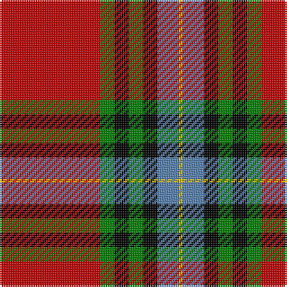

In pattern [RGKGKBY](/patterns/rgkgkby/).

This was sourced from weddslist.  It is a [7 stripes tartan](/stripes/stripes7/).

Original link http://www.weddslist.com/cgi-bin/tartans/pg.pl?source=sts

## Thread count
R/56 G8 K8 G8 K8 B12 Y/2

## Palette
Each colour and its ΔE from the base-6 reference it is a variant of.

| Colour | Shade | Base | ΔE (OKLab) |
|---|---|---|---|
| B | <code style="background-color:#5480B0;">#5480B0</code> `#5480B0` | B <code style="background-color:#2C4084;">#2C4084</code> | 0.20 |
| G | <code style="background-color:#008000;">#008000</code> `#008000` | G <code style="background-color:#006400;">#006400</code> | 0.09 |
| K | <code style="background-color:#000000;">#000000</code> `#000000` | K <code style="background-color:#000000;">#000000</code> | 0.00 |
| R | <code style="background-color:#C00000;">#C00000</code> `#C00000` | R <code style="background-color:#C80000;">#C80000</code> | 0.02 |
| Y | <code style="background-color:#F0C000;">#F0C000</code> `#F0C000` | Y <code style="background-color:#E8C000;">#E8C000</code> | 0.01 |

# Sample pattern

## Nearest tartans

The nearest existing variants by ΔTartan distance.

1. [Livingstone MacLay MacLeay](/setts/s7/r56g8k8g8k8b12y2-b3c82af-g005020-k101010-rdc0000-ye8c000/) — ΔT 0.66
1. [Livingstone MacLay MacLeay Clan Tartan Tartan Number: 1488. Earliest known date: 1934 Nothing See products available Copyright © Blair Urquhart, Comrie, 2015](/setts/s7/r56g8k8g8k8b12y2-b5c8ca8-g006818-k101010-rc80000-ye8c000/) — ΔT 0.77
1. [MacLeay (Clan)](/setts/s7/r108g16k16g16k16b24y4-b2c2c80-g006818-k101010-rc80000-yd09800/) — ΔT 0.85
1. [Chisholm VS](/setts/s10/r12w2r48b12g4k2g4k2g24r2-b000064-g004c00-k000000-rc80000-wd0d0d0/) — ΔT 0.99
1. [Aberdeen Football Club (1999)](/setts/s8/r10k2ra4k8ra72k46w8y4-k101010-re13200-rac80028-we0e0e0-ye8c000/) — ΔT 1.03
1. [MacLeay](/setts/s7/r108g16k16g16k16b24y4-b5c8ca8-g789484-k101010-rc80000-yd09800/) — ΔT 1.05
1. [Mensah](/setts/s8/y6g18b18k2y4k30r74g4-b2c2c80-g006818-k101010-rc80000-ye8c000/) — ΔT 1.05
1. [Unidentified Plaid 10](/setts/s10/w8r100b42r5k3r5g42k42r100w8-b5480b0-g008000-k000000-rc00000-we0e0e0/) — ΔT 1.05
1. [Bro-Zol](/setts/s10/b6w10r50b2g6b2r16k4w18k6-b2c2c80-g006818-k101010-r880000-we0e0e0/) — ΔT 1.07
1. [Drummond of Perth](/setts/s8/r72w2b6y2g32r16b6w10-b000064-g004c00-rc80000-wd0d0d0-yffc800/) — ΔT 1.11

## Neighbour map

Every grey dot is one of 15726 variants placed by the first two principal components of the ΔTartan feature space (44% of its variance). Red is this tartan; blue dots are its nearest — click one to open its page.

<svg viewBox="0 0 640 380" role="img" style="max-width:100%;height:auto;border:1px solid #e0e0e0;border-radius:4px;display:block" xmlns="http://www.w3.org/2000/svg"><image href="/nn/cloud.v1.png" width="640" height="380"/><a href="/setts/s7/r56g8k8g8k8b12y2-b3c82af-g005020-k101010-rdc0000-ye8c000/"><circle cx="323.7" cy="111.2" r="4" fill="#3465a4"><title>Livingstone MacLay MacLeay</title></circle></a><a href="/setts/s7/r56g8k8g8k8b12y2-b5c8ca8-g006818-k101010-rc80000-ye8c000/"><circle cx="329.5" cy="115.5" r="4" fill="#3465a4"><title>Livingstone MacLay MacLeay Clan Tartan Tartan Number: 1488. Earliest known date: 1934 Nothing See products available Copyright © Blair Urquhart, Comrie, 2015</title></circle></a><a href="/setts/s7/r108g16k16g16k16b24y4-b2c2c80-g006818-k101010-rc80000-yd09800/"><circle cx="324.3" cy="120.5" r="4" fill="#3465a4"><title>MacLeay (Clan)</title></circle></a><a href="/setts/s10/r12w2r48b12g4k2g4k2g24r2-b000064-g004c00-k000000-rc80000-wd0d0d0/"><circle cx="329.5" cy="103.1" r="4" fill="#3465a4"><title>Chisholm VS</title></circle></a><a href="/setts/s8/r10k2ra4k8ra72k46w8y4-k101010-re13200-rac80028-we0e0e0-ye8c000/"><circle cx="314.6" cy="89.4" r="4" fill="#3465a4"><title>Aberdeen Football Club (1999)</title></circle></a><a href="/setts/s7/r108g16k16g16k16b24y4-b5c8ca8-g789484-k101010-rc80000-yd09800/"><circle cx="324.0" cy="117.1" r="4" fill="#3465a4"><title>MacLeay</title></circle></a><a href="/setts/s8/y6g18b18k2y4k30r74g4-b2c2c80-g006818-k101010-rc80000-ye8c000/"><circle cx="277.7" cy="97.4" r="4" fill="#3465a4"><title>Mensah</title></circle></a><a href="/setts/s10/w8r100b42r5k3r5g42k42r100w8-b5480b0-g008000-k000000-rc00000-we0e0e0/"><circle cx="324.3" cy="96.9" r="4" fill="#3465a4"><title>Unidentified Plaid 10</title></circle></a><a href="/setts/s10/b6w10r50b2g6b2r16k4w18k6-b2c2c80-g006818-k101010-r880000-we0e0e0/"><circle cx="290.8" cy="96.5" r="4" fill="#3465a4"><title>Bro-Zol</title></circle></a><a href="/setts/s8/r72w2b6y2g32r16b6w10-b000064-g004c00-rc80000-wd0d0d0-yffc800/"><circle cx="372.1" cy="94.9" r="4" fill="#3465a4"><title>Drummond of Perth</title></circle></a><circle cx="308.4" cy="108.6" r="5" fill="#c00000"/></svg>

ID: /setts/s7/r56g8k8g8k8b12y2-b5480b0-g008000-k000000-rc00000-yf0c000/
