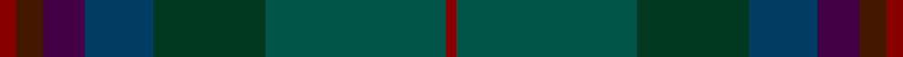

This page is one **sett** — a single exact thread-count. It belongs to the [tartan](/tartans/r5do8dp13dt21dg34dgi55r3/)
(the same proportion at any scale), whose colour order is pattern [RBBBGGR](/stripes/rbbbggr/).

Sourced from register-of-tartans.  It is a [7 stripe tartan](/stripes/stripes7/).

Original link https://www.tartanregister.gov.uk/tartanDetails.aspx?ref=4195

2 attestations — the source records this cloth was collapsed from (oldest owns this page)

<ul>
<li>01/09/2006 — Uitwaaien Papi (Personal) (register-of-tartans, <a href="https://www.tartanregister.gov.uk/tartanDetails.aspx?ref=4195">record</a>)</li>
<li>2006 September — Uitwaaien Papi (Personal) (tartans-authority, <a href="http://www.tartansauthority.com/tartan-ferret/display/7007/">record</a>)</li>
</ul>

## Register references

External register numbers recorded for this tartan.

- Scottish Register of Tartans: [4195](https://www.tartanregister.gov.uk/tartanDetails.aspx?ref=4195)
- Scottish Tartans Authority (ITI): 7007

## Thread count
DR/5 DRa8 DP13 DB21 DG34 G55 DR/3

## Palette

Palette: <strong>Tartan Register</strong>
<table><thead><tr><th>Colour</th><th>Threads</th><th>Shade</th><th>Base</th><th>OKLCh</th></tr></thead><tbody><tr><td>DR/</td><td style="text-align:right;font-variant-numeric:tabular-nums">5</td><td><code style="background-color:#880000;">#880000</code> <small style="color:#888">#880000</small></td><td>R <code style="background-color:#CC0000;">#CC0000</code></td><td><small style="color:#888">oklch(39.4% 0.162 29.2)</small></td></tr><tr><td>DRa</td><td style="text-align:right;font-variant-numeric:tabular-nums">8</td><td><code style="background-color:#441800;">#441800</code> <small style="color:#888">#441800</small></td><td>B <code style="background-color:#2A418A;">#2A418A</code></td><td><small style="color:#888">oklch(27.3% 0.076 46.3)</small></td></tr><tr><td>DP</td><td style="text-align:right;font-variant-numeric:tabular-nums">13</td><td><code style="background-color:#440044;">#440044</code> <small style="color:#888">#440044</small></td><td>B <code style="background-color:#2A418A;">#2A418A</code></td><td><small style="color:#888">oklch(27.1% 0.125 328.4)</small></td></tr><tr><td>DB</td><td style="text-align:right;font-variant-numeric:tabular-nums">21</td><td><code style="background-color:#003C64;">#003C64</code> <small style="color:#888">#003C64</small></td><td>B <code style="background-color:#2A418A;">#2A418A</code></td><td><small style="color:#888">oklch(34.5% 0.089 246.0)</small></td></tr><tr><td>DG</td><td style="text-align:right;font-variant-numeric:tabular-nums">34</td><td><code style="background-color:#003820;">#003820</code> <small style="color:#888">#003820</small></td><td>G <code style="background-color:#006100;">#006100</code></td><td><small style="color:#888">oklch(30.0% 0.070 158.3)</small></td></tr><tr><td>G</td><td style="text-align:right;font-variant-numeric:tabular-nums">55</td><td><code style="background-color:#005448;">#005448</code> <small style="color:#888">#005448</small></td><td>G <code style="background-color:#006100;">#006100</code></td><td><small style="color:#888">oklch(39.9% 0.073 178.8)</small></td></tr><tr><td>DR/</td><td style="text-align:right;font-variant-numeric:tabular-nums">3</td><td><code style="background-color:#880000;">#880000</code> <small style="color:#888">#880000</small></td><td>R <code style="background-color:#CC0000;">#CC0000</code></td><td><small style="color:#888">oklch(39.4% 0.162 29.2)</small></td></tr></tbody></table>

# Sample pattern

## Nearest tartans

The nearest existing variants by ΔTartan distance, with this tartan at the top so the swatches line up against it.

ΔTartan

Tartan

Sett

—

<a href="/ttd/edit/#slug=r5do8dp13dt21dg34dgi55r3">Uitwaaien Papi (Personal)</a> <a class="nn-out" href="/setts/s7/r5do8dp13dt21dg34dgi55r3/" title="open its dictionary page">↗</a>

1.20

<a href="/setts/s7/o5r8dp13dgi21dg34dgii55o3/">Lunting Papi (Personal)</a>

1.67

<a href="/ttd/edit/#slug=p3dt1do3o8dg4o3dg17do11db6do4db21dt1~x2">Doane</a> <a class="nn-out" href="/setts/s12/p3dt1do3o8dg4o3dg17do11db6do4db21dt1~x2/" title="open its dictionary page">↗</a>

1.80

<a href="/ttd/edit/#slug=dg20r2y3dt12k20r2n3dt4n3~x2">Ithilien Heather (Personal)</a> <a class="nn-out" href="/setts/s9/dg20r2y3dt12k20r2n3dt4n3~x2/" title="open its dictionary page">↗</a>

1.80

<a href="/ttd/edit/#slug=dp2dg16dti16dt2dti2dt2dti2dt15db3lo2~x2">Brydon (Scottish Borders)</a> <a class="nn-out" href="/setts/s10/dp2dg16dti16dt2dti2dt2dti2dt15db3lo2~x2/" title="open its dictionary page">↗</a>

1.80

<a href="/ttd/edit/#slug=k10lo1k3dt8dg8dgi1dg8dt8k15lo1~x2">Ryder Cup 2006</a> <a class="nn-out" href="/setts/s10/k10lo1k3dt8dg8dgi1dg8dt8k15lo1~x2/" title="open its dictionary page">↗</a>

1.81

<a href="/setts/s9/dgi4dgii52dt4g8dt6dg12dgi17dgii7lo4/">The McAlbourne</a>

1.81

<a href="/ttd/edit/#slug=dy31y6o3db31dy8yi60y7b7~x2">Little-Dowse Wedding</a> <a class="nn-out" href="/setts/s8/dy31y6o3db31dy8yi60y7b7~x2/" title="open its dictionary page">↗</a>

1.82

<a href="/setts/s11/k2ki20dg30ki2dg4ki2dg30ki3db30ki35r2/">Phillips Welsh Name Tartan Tartan Number: 5751. Earliest known date: 2002 The tartan for this Welsh surname and its variations, Filpin, Phelps, Philipson, Phillips, Philpin, Phipps is actually woven in Wales at the Cambrian Woollen Mill, weaving on the same site since 1830. This tartan differs from many traditional patterns in that the warp and weft differ, giving the finished worsted wool cloth more of a predominant stripe, noticeable in the finished Kilt, or Cilt in Wales. See products available Copyright © Blair Urquhart, Comrie, 2015</a>

1.83

<a href="/ttd/edit/#slug=dg28k2dbi3k11dbi3k2dbi17db4lr2~x2">West of Wells (Personal)</a> <a class="nn-out" href="/setts/s9/dg28k2dbi3k11dbi3k2dbi17db4lr2~x2/" title="open its dictionary page">↗</a>

1.83

<a href="/ttd/edit/#slug=dgi5dg2db2dg2db2dt5dg2dt1lo1dt1dg10db3~x4">Protheroe (Welsh Name)</a> <a class="nn-out" href="/setts/s12/dgi5dg2db2dg2db2dt5dg2dt1lo1dt1dg10db3~x4/" title="open its dictionary page">↗</a>

## Neighbour map

Every grey dot is one of 14359 variants placed by the first two principal components of the ΔTartan feature space (44% of its variance). Red is this tartan; blue dots are its nearest — click one to open its page.

<svg viewBox="0 0 640 380" role="img" style="max-width:100%;height:auto;border:1px solid #e0e0e0;border-radius:4px;display:block" xmlns="http://www.w3.org/2000/svg"><image href="/nn/cloud.v1.png" width="640" height="380"/><a href="/setts/s7/o5r8dp13dgi21dg34dgii55o3/"><circle cx="283.9" cy="218.2" r="4" fill="#3465a4"><title>Lunting Papi (Personal)</title></circle></a><a href="/setts/s12/p3dt1do3o8dg4o3dg17do11db6do4db21dt1~x2/"><circle cx="284.7" cy="198.0" r="4" fill="#3465a4"><title>Doane</title></circle></a><a href="/setts/s9/dg20r2y3dt12k20r2n3dt4n3~x2/"><circle cx="227.9" cy="224.2" r="4" fill="#3465a4"><title>Ithilien Heather (Personal)</title></circle></a><a href="/setts/s10/dp2dg16dti16dt2dti2dt2dti2dt15db3lo2~x2/"><circle cx="255.9" cy="235.2" r="4" fill="#3465a4"><title>Brydon (Scottish Borders)</title></circle></a><a href="/setts/s10/k10lo1k3dt8dg8dgi1dg8dt8k15lo1~x2/"><circle cx="333.3" cy="256.4" r="4" fill="#3465a4"><title>Ryder Cup 2006</title></circle></a><a href="/setts/s9/dgi4dgii52dt4g8dt6dg12dgi17dgii7lo4/"><circle cx="375.9" cy="217.6" r="4" fill="#3465a4"><title>The McAlbourne</title></circle></a><a href="/setts/s8/dy31y6o3db31dy8yi60y7b7~x2/"><circle cx="285.8" cy="185.7" r="4" fill="#3465a4"><title>Little-Dowse Wedding</title></circle></a><a href="/setts/s11/k2ki20dg30ki2dg4ki2dg30ki3db30ki35r2/"><circle cx="361.2" cy="232.1" r="4" fill="#3465a4"><title>Phillips Welsh Name Tartan Tartan Number: 5751. Earliest known date: 2002 The tartan for this Welsh surname and its variations, Filpin, Phelps, Philipson, Phillips, Philpin, Phipps is actually woven in Wales at the Cambrian Woollen Mill, weaving on the same site since 1830. This tartan differs from many traditional patterns in that the warp and weft differ, giving the finished worsted wool cloth more of a predominant stripe, noticeable in the finished Kilt, or Cilt in Wales. See products available Copyright © Blair Urquhart, Comrie, 2015</title></circle></a><a href="/setts/s9/dg28k2dbi3k11dbi3k2dbi17db4lr2~x2/"><circle cx="317.8" cy="222.5" r="4" fill="#3465a4"><title>West of Wells (Personal)</title></circle></a><a href="/setts/s12/dgi5dg2db2dg2db2dt5dg2dt1lo1dt1dg10db3~x4/"><circle cx="308.6" cy="248.7" r="4" fill="#3465a4"><title>Protheroe (Welsh Name)</title></circle></a><circle cx="309.9" cy="231.2" r="5" fill="#c00000"/></svg>

ID: /setts/s7/r5do8dp13dt21dg34dgi55r3/
