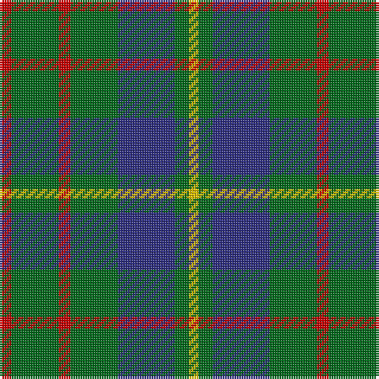

This page is one **sett** — a single exact thread-count. It belongs to the [tartan](/tartans/r5g20r5g20db24g6ly4/)
(the same proportion at any scale), whose colour order is pattern [RGRGBGY](/stripes/rgrgbgy/).

Sourced from house-of-tartan.  It is a [7 stripe tartan](/stripes/stripes7/).

Original link http://www.house-of-tartan.scotland.net/house/TartanViewjs.asp?colr=Def&tnam=5351

## Thread count
R/5 G20 R5 G20 DB24 G6 Y/4

## Palette

Palette: <strong>Tartan Register</strong>
<table><thead><tr><th>Colour</th><th>Threads</th><th>Shade</th><th>Base</th><th>OKLCh</th></tr></thead><tbody><tr><td>R/</td><td style="text-align:right;font-variant-numeric:tabular-nums">5</td><td><code style="background-color:#C80000;">#C80000</code> <small style="color:#888">#C80000</small></td><td>R <code style="background-color:#CC0000;">#CC0000</code></td><td><small style="color:#888">oklch(52.3% 0.215 29.2)</small></td></tr><tr><td>G</td><td style="text-align:right;font-variant-numeric:tabular-nums">20</td><td><code style="background-color:#006818;">#006818</code> <small style="color:#888">#006818</small></td><td>G <code style="background-color:#006100;">#006100</code></td><td><small style="color:#888">oklch(45.0% 0.142 145.0)</small></td></tr><tr><td>R</td><td style="text-align:right;font-variant-numeric:tabular-nums">5</td><td><code style="background-color:#C80000;">#C80000</code> <small style="color:#888">#C80000</small></td><td>R <code style="background-color:#CC0000;">#CC0000</code></td><td><small style="color:#888">oklch(52.3% 0.215 29.2)</small></td></tr><tr><td>G</td><td style="text-align:right;font-variant-numeric:tabular-nums">20</td><td><code style="background-color:#006818;">#006818</code> <small style="color:#888">#006818</small></td><td>G <code style="background-color:#006100;">#006100</code></td><td><small style="color:#888">oklch(45.0% 0.142 145.0)</small></td></tr><tr><td>DB</td><td style="text-align:right;font-variant-numeric:tabular-nums">24</td><td><code style="background-color:#2C2C80;">#2C2C80</code> <small style="color:#888">#2C2C80</small></td><td>B <code style="background-color:#2A418A;">#2A418A</code></td><td><small style="color:#888">oklch(35.0% 0.138 276.6)</small></td></tr><tr><td>G</td><td style="text-align:right;font-variant-numeric:tabular-nums">6</td><td><code style="background-color:#006818;">#006818</code> <small style="color:#888">#006818</small></td><td>G <code style="background-color:#006100;">#006100</code></td><td><small style="color:#888">oklch(45.0% 0.142 145.0)</small></td></tr><tr><td>Y/</td><td style="text-align:right;font-variant-numeric:tabular-nums">4</td><td><code style="background-color:#E8C000;">#E8C000</code> <small style="color:#888">#E8C000</small></td><td>Y <code style="background-color:#F2BF00;">#F2BF00</code></td><td><small style="color:#888">oklch(81.9% 0.168 93.7)</small></td></tr></tbody></table>

# Sample pattern

## Nearest tartans

The nearest existing variants by ΔTartan distance, with this tartan at the top so the swatches line up against it.

ΔTartan

Tartan

Sett

—

<a href="/ttd/edit/#slug=r5g20r5g20db24g6ly4">Cameron of Lochiel (Hunting) Clan/Family Tartan Tartan Number: 5351. Earliest known date: 01/01/1940 Design close to Cameron Hunting which has two red lines shown in Vestiarium Scoticum. This design evolved in the 1940s by J G MacKay of Portree and was first put on show at the Cameron Gathering at Achnacarry in 1956. (original STA ref: 1535) See products available Copyright © Blair Urquhart, Comrie, 2015</a> <a class="nn-out" href="/setts/s7/r5g20r5g20db24g6ly4/" title="open its dictionary page">↗</a>

0.87

<a href="/ttd/edit/#slug=r3g10r3g14db16g3ly2~x2">Cameron of Lochiel (Hunting)</a> <a class="nn-out" href="/setts/s7/r3g10r3g14db16g3ly2~x2/" title="open its dictionary page">↗</a>

0.93

<a href="/ttd/edit/#slug=db6r15g41r15db20g41t6">Bean Hunting</a> <a class="nn-out" href="/setts/s7/db6r15g41r15db20g41t6/" title="open its dictionary page">↗</a>

0.94

<a href="/ttd/edit/#slug=db5dg8k1ly2k1dg8db4~x4">Salvation Army Htg (Corporate)</a> <a class="nn-out" href="/setts/s7/db5dg8k1ly2k1dg8db4~x4/" title="open its dictionary page">↗</a>

1.06

<a href="/ttd/edit/#slug=k4g21w3g21db21r4~x2">Duncan</a> <a class="nn-out" href="/setts/s6/k4g21w3g21db21r4~x2/" title="open its dictionary page">↗</a>

1.07

<a href="/ttd/edit/#slug=dt6r15g41r15dt20g41db6">Bean of Freeport Htg (Corporate)</a> <a class="nn-out" href="/setts/s7/dt6r15g41r15dt20g41db6/" title="open its dictionary page">↗</a>

1.09

<a href="/ttd/edit/#slug=db1r1g6db6ly1db6r1g1~x2">MacHardy</a> <a class="nn-out" href="/setts/s8/db1r1g6db6ly1db6r1g1~x2/" title="open its dictionary page">↗</a>

1.10

<a href="/ttd/edit/#slug=r3dg10r3dg14db16dg3ly2">Cameron Hunting</a> <a class="nn-out" href="/setts/s7/r3dg10r3dg14db16dg3ly2/" title="open its dictionary page">↗</a>

1.13

<a href="/ttd/edit/#slug=dg2n8dg2k3dg12r2~x2">Wcwm 1045</a> <a class="nn-out" href="/setts/s6/dg2n8dg2k3dg12r2~x2/" title="open its dictionary page">↗</a>

1.13

<a href="/ttd/edit/#slug=g3db1g8db7k3ly1~x2">Trafalgar (Fashion)</a> <a class="nn-out" href="/setts/s6/g3db1g8db7k3ly1~x2/" title="open its dictionary page">↗</a>

1.16

<a href="/ttd/edit/#slug=g3db8g3k4g15r2~x2">Lauder (Family)</a> <a class="nn-out" href="/setts/s6/g3db8g3k4g15r2~x2/" title="open its dictionary page">↗</a>

## Neighbour map

Every grey dot is one of 14299 variants placed by the first two principal components of the ΔTartan feature space (44% of its variance). Red is this tartan; blue dots are its nearest — click one to open its page.

<svg viewBox="0 0 640 380" role="img" style="max-width:100%;height:auto;border:1px solid #e0e0e0;border-radius:4px;display:block" xmlns="http://www.w3.org/2000/svg"><image href="/nn/cloud.v1.png" width="640" height="380"/><a href="/setts/s7/r3g10r3g14db16g3ly2~x2/"><circle cx="260.0" cy="224.9" r="4" fill="#3465a4"><title>Cameron of Lochiel (Hunting)</title></circle></a><a href="/setts/s7/db6r15g41r15db20g41t6/"><circle cx="284.3" cy="246.5" r="4" fill="#3465a4"><title>Bean Hunting</title></circle></a><a href="/setts/s7/db5dg8k1ly2k1dg8db4~x4/"><circle cx="295.5" cy="252.0" r="4" fill="#3465a4"><title>Salvation Army Htg (Corporate)</title></circle></a><a href="/setts/s6/k4g21w3g21db21r4~x2/"><circle cx="264.9" cy="234.8" r="4" fill="#3465a4"><title>Duncan</title></circle></a><a href="/setts/s7/dt6r15g41r15dt20g41db6/"><circle cx="305.0" cy="258.2" r="4" fill="#3465a4"><title>Bean of Freeport Htg (Corporate)</title></circle></a><a href="/setts/s8/db1r1g6db6ly1db6r1g1~x2/"><circle cx="291.6" cy="228.7" r="4" fill="#3465a4"><title>MacHardy</title></circle></a><a href="/setts/s7/r3dg10r3dg14db16dg3ly2/"><circle cx="263.7" cy="229.7" r="4" fill="#3465a4"><title>Cameron Hunting</title></circle></a><a href="/setts/s6/dg2n8dg2k3dg12r2~x2/"><circle cx="294.4" cy="259.4" r="4" fill="#3465a4"><title>Wcwm 1045</title></circle></a><a href="/setts/s6/g3db1g8db7k3ly1~x2/"><circle cx="248.8" cy="247.4" r="4" fill="#3465a4"><title>Trafalgar (Fashion)</title></circle></a><a href="/setts/s6/g3db8g3k4g15r2~x2/"><circle cx="329.0" cy="253.4" r="4" fill="#3465a4"><title>Lauder (Family)</title></circle></a><circle cx="264.1" cy="247.8" r="5" fill="#c00000"/></svg>

ID: /setts/s7/r5g20r5g20db24g6ly4/
