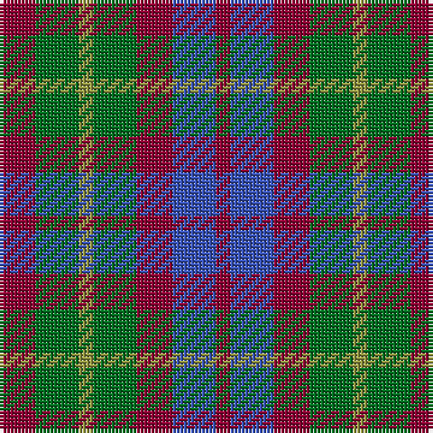

This page is one **sett** — a single exact thread-count. It belongs to the [tartan](/tartans/r5g6ly2g6r5b6r2/)
(the same proportion at any scale), whose colour order is pattern [RBRGYGR](/stripes/rbrgygr/).

Sourced from register-of-tartans.  It is a [7 stripe tartan](/stripes/stripes7/).

Original link https://www.tartanregister.gov.uk/tartanDetails.aspx?ref=1412

## Register references

External register numbers recorded for this tartan.

- Scottish Register of Tartans: [1412](https://www.tartanregister.gov.uk/tartanDetails.aspx?ref=1412)
- Scottish Tartans Authority (ITI): 2107
- Scottish Tartans World Register: 2107

## Thread count
DR/10 G12 LT4 G12 DR10 B12 DR/4

## Palette

Palette: <strong>custom</strong>
<table><thead><tr><th>Colour</th><th>Threads</th><th>Shade</th><th>Base</th><th>OKLCh</th></tr></thead><tbody><tr><td>DR/</td><td style="text-align:right;font-variant-numeric:tabular-nums">10</td><td><code style="background-color:#8C0034;">#8C0034</code> <small style="color:#888">#8C0034</small></td><td>R <code style="background-color:#CC0000;">#CC0000</code></td><td><small style="color:#888">oklch(40.9% 0.163 10.7)</small></td></tr><tr><td>G</td><td style="text-align:right;font-variant-numeric:tabular-nums">12</td><td><code style="background-color:#006E21;">#006E21</code> <small style="color:#888">#006E21</small></td><td>G <code style="background-color:#006100;">#006100</code></td><td><small style="color:#888">oklch(46.8% 0.142 146.2)</small></td></tr><tr><td>LT</td><td style="text-align:right;font-variant-numeric:tabular-nums">4</td><td><code style="background-color:#919441;">#919441</code> <small style="color:#888">#919441</small></td><td>Y <code style="background-color:#F2BF00;">#F2BF00</code></td><td><small style="color:#888">oklch(64.6% 0.107 110.9)</small></td></tr><tr><td>G</td><td style="text-align:right;font-variant-numeric:tabular-nums">12</td><td><code style="background-color:#006E21;">#006E21</code> <small style="color:#888">#006E21</small></td><td>G <code style="background-color:#006100;">#006100</code></td><td><small style="color:#888">oklch(46.8% 0.142 146.2)</small></td></tr><tr><td>DR</td><td style="text-align:right;font-variant-numeric:tabular-nums">10</td><td><code style="background-color:#8C0034;">#8C0034</code> <small style="color:#888">#8C0034</small></td><td>R <code style="background-color:#CC0000;">#CC0000</code></td><td><small style="color:#888">oklch(40.9% 0.163 10.7)</small></td></tr><tr><td>B</td><td style="text-align:right;font-variant-numeric:tabular-nums">12</td><td><code style="background-color:#3953B5;">#3953B5</code> <small style="color:#888">#3953B5</small></td><td>B <code style="background-color:#2A418A;">#2A418A</code></td><td><small style="color:#888">oklch(47.9% 0.158 268.6)</small></td></tr><tr><td>DR/</td><td style="text-align:right;font-variant-numeric:tabular-nums">4</td><td><code style="background-color:#8C0034;">#8C0034</code> <small style="color:#888">#8C0034</small></td><td>R <code style="background-color:#CC0000;">#CC0000</code></td><td><small style="color:#888">oklch(40.9% 0.163 10.7)</small></td></tr></tbody></table>

# Sample pattern

## Nearest tartans

The nearest existing variants by ΔTartan distance, with this tartan at the top so the swatches line up against it.

ΔTartan

Tartan

Sett

—

<a href="/ttd/edit/#slug=r5g6ly2g6r5b6r2~x2">Gleneagles Group</a> <a class="nn-out" href="/setts/s7/r5g6ly2g6r5b6r2~x2/" title="open its dictionary page">↗</a>

0.60

<a href="/ttd/edit/#slug=dr5g6y2g6dr5db6dr2~x2">Gleneagles Group</a> <a class="nn-out" href="/setts/s7/dr5g6y2g6dr5db6dr2~x2/" title="open its dictionary page">↗</a>

1.07

<a href="/ttd/edit/#slug=g6dp3k3dp3k3dp3g6r2~x2">Wilson's No.137</a> <a class="nn-out" href="/setts/s8/g6dp3k3dp3k3dp3g6r2~x2/" title="open its dictionary page">↗</a>

1.36

<a href="/setts/s8/dg6dp3ki3dp3ki3dp3dg6k2~x2/">Wilson's No.173</a>

1.40

<a href="/setts/s8/r4dg4r1db4r4~x12/">Gow</a>

1.43

<a href="/setts/s8/n11k4r4lo4n11~x4/">Ikelman #3 (Personal)</a>

1.50

<a href="/ttd/edit/#slug=k1db3k3dg3r1dg3k3dg1r1~x2">Unidentified No 30</a> <a class="nn-out" href="/setts/s9/k1db3k3dg3r1dg3k3dg1r1~x2/" title="open its dictionary page">↗</a>

1.52

<a href="/ttd/edit/#slug=t1g3r1p3t1~x4">Wilson's, No 95</a> <a class="nn-out" href="/setts/s5/t1g3r1p3t1~x4/" title="open its dictionary page">↗</a>

1.54

<a href="/ttd/edit/#slug=lo28r24dg55dp19~x2">Hirstwood (Name)</a> <a class="nn-out" href="/setts/s4/lo28r24dg55dp19~x2/" title="open its dictionary page">↗</a>

1.55

<a href="/ttd/edit/#slug=dr5g6dy1g6dr5db6dr1~x2">Gleneagles Group Corporate Tartan Tartan Number: 2107. Earliest known date: 1989 Designed for a range of tartan goods called the Gleneagles Collection. See products available Copyright © Blair Urquhart, Comrie, 2015</a> <a class="nn-out" href="/setts/s7/dr5g6dy1g6dr5db6dr1~x2/" title="open its dictionary page">↗</a>

1.56

<a href="/ttd/edit/#slug=n2r1k1lr1~x10">Kucher, Gregory (Personal)</a> <a class="nn-out" href="/setts/s4/n2r1k1lr1~x10/" title="open its dictionary page">↗</a>

## Neighbour map

Every grey dot is one of 14359 variants placed by the first two principal components of the ΔTartan feature space (44% of its variance). Red is this tartan; blue dots are its nearest — click one to open its page.

<svg viewBox="0 0 640 380" role="img" style="max-width:100%;height:auto;border:1px solid #e0e0e0;border-radius:4px;display:block" xmlns="http://www.w3.org/2000/svg"><image href="/nn/cloud.v1.png" width="640" height="380"/><a href="/setts/s7/dr5g6y2g6dr5db6dr2~x2/"><circle cx="131.7" cy="313.7" r="4" fill="#3465a4"><title>Gleneagles Group</title></circle></a><a href="/setts/s8/g6dp3k3dp3k3dp3g6r2~x2/"><circle cx="131.8" cy="297.0" r="4" fill="#3465a4"><title>Wilson's No.137</title></circle></a><a href="/setts/s8/dg6dp3ki3dp3ki3dp3dg6k2~x2/"><circle cx="136.1" cy="302.0" r="4" fill="#3465a4"><title>Wilson's No.173</title></circle></a><a href="/setts/s8/r4dg4r1db4r4~x12/"><circle cx="170.5" cy="296.9" r="4" fill="#3465a4"><title>Gow</title></circle></a><a href="/setts/s8/n11k4r4lo4n11~x4/"><circle cx="174.0" cy="277.9" r="4" fill="#3465a4"><title>Ikelman #3 (Personal)</title></circle></a><a href="/setts/s9/k1db3k3dg3r1dg3k3dg1r1~x2/"><circle cx="140.1" cy="297.2" r="4" fill="#3465a4"><title>Unidentified No 30</title></circle></a><a href="/setts/s5/t1g3r1p3t1~x4/"><circle cx="123.9" cy="289.5" r="4" fill="#3465a4"><title>Wilson's, No 95</title></circle></a><a href="/setts/s4/lo28r24dg55dp19~x2/"><circle cx="162.8" cy="322.4" r="4" fill="#3465a4"><title>Hirstwood (Name)</title></circle></a><a href="/setts/s7/dr5g6dy1g6dr5db6dr1~x2/"><circle cx="212.9" cy="284.7" r="4" fill="#3465a4"><title>Gleneagles Group Corporate Tartan Tartan Number: 2107. Earliest known date: 1989 Designed for a range of tartan goods called the Gleneagles Collection. See products available Copyright © Blair Urquhart, Comrie, 2015</title></circle></a><a href="/setts/s4/n2r1k1lr1~x10/"><circle cx="104.7" cy="340.8" r="4" fill="#3465a4"><title>Kucher, Gregory (Personal)</title></circle></a><circle cx="138.2" cy="311.6" r="5" fill="#c00000"/></svg>

ID: /setts/s7/r5g6ly2g6r5b6r2~x2/
