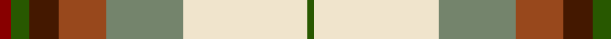

In pattern [GWGRBGR](/patterns/gwgrbgr/).

This was sourced from tartans-authority.  It is a [7 stripes tartan](/stripes/stripes7/).

Original link http://www.tartansauthority.com/tartan-ferret/display/7886/

## Thread count
DRa/5 G8 DR13 T21 N34 W55 G/3

## Palette
Each colour and its ΔE from the base-6 reference it is a variant of.

| Colour | Shade | Base | ΔE (OKLab) |
|---|---|---|---|
| DR | <code style="background-color:#441800;">#441800</code> `#441800` | B <code style="background-color:#2A418A;">#2A418A</code> | 0.23 |
| DRa | <code style="background-color:#880000;">#880000</code> `#880000` | R <code style="background-color:#CC0000;">#CC0000</code> | 0.15 |
| G | <code style="background-color:#285800;">#285800</code> `#285800` | G <code style="background-color:#006100;">#006100</code> | 0.03 |
| N | <code style="background-color:#74846C;">#74846C</code> `#74846C` | G <code style="background-color:#006100;">#006100</code> | 0.20 |
| T | <code style="background-color:#98481C;">#98481C</code> `#98481C` | R <code style="background-color:#CC0000;">#CC0000</code> | 0.11 |
| W | <code style="background-color:#F0E4CC;">#F0E4CC</code> `#F0E4CC` | W <code style="background-color:#F7F7F7;">#F7F7F7</code> | 0.06 |

# Sample pattern

## Nearest tartans

The nearest existing variants by ΔTartan distance.

1. [Ball Hunting](/setts/s6/y13g8k5w3wa2r1~g009468-k101010-rc80000-w98c8e8-waf8f8f8-ydc943c~x4/) — ΔT 0.88
1. [Ball](/setts/s6/y13b8r5k3w2g1~b1474b4-g006818-k101010-rc80000-wfcfcfc-ydc943c~x4/) — ΔT 1.00
1. [MacLachlan Dress Clan Tartan Tartan Number: 828. Earliest known date: 1990 Based on the MacLachlan pattern in Old And Rare See products available Copyright © Blair Urquhart, Comrie, 2015](/setts/s7/r34w3g4ga23w24k3g4~g006428-ga006818-k101010-rd05054-we0e0e0~x2/) — ΔT 1.21
1. [MacLean, dress](/setts/s6/r1w12g6r8b3y1~b5480b0-g008000-rc00000-we0e0e0-yf0c000~x4/) — ΔT 1.25
1. [MacLachlan, dress](/setts/s7/r34w3g4ga23w24k3g4~g006030-ga008000-k000000-rd03030-we0e0e0~x2/) — ΔT 1.26
1. [Rosevear](/setts/s9/r50y4w16b2w4b2w15g27ra4~b304080-g008000-r802040-rac00000-we0e0e0-yf0c000~x2/) — ΔT 1.27
1. [Carmen Lau (Hong Kong) (Personal)](/setts/s7/y8r3b2ba1w6g12ba2~b1474b4-ba2c2c80-g006818-r901c38-wfcfcfc-yfccc00~x2/) — ΔT 1.30
1. [Bouguet, Adrian Dress (Personal)](/setts/s11/w16g5y20r3g3r3y4ga14y2r2ra1~g003820-ga006818-r888888-rac80000-w98c8e8-yec8048~x2/) — ΔT 1.30
1. [MacLean Dress (Lumsden)](/setts/s6/r1w12g6r8wa3y1~g006818-ra40000-wf8ece0-waa8ace8-yd09800~x4/) — ΔT 1.32
1. [Gillies Blue Dress Clan Tartan Tartan Number: 934. Earliest known date: pre 2003 A name associated with Badenoch and the Hebrides. It means 'servant of Jesus'. See products available Copyright © Blair Urquhart, Comrie, 2015](/setts/s10/r7k2b16y5b10k13w28g2w4g2~b5c8ca8-g006818-k101010-rc80000-we0e0e0-ye8c000~x2/) — ΔT 1.35

## Neighbour map

Every grey dot is one of 15726 variants placed by the first two principal components of the ΔTartan feature space (44% of its variance). Red is this tartan; blue dots are its nearest — click one to open its page.

<svg viewBox="0 0 640 380" role="img" style="max-width:100%;height:auto;border:1px solid #e0e0e0;border-radius:4px;display:block" xmlns="http://www.w3.org/2000/svg"><image href="/nn/cloud.v1.png" width="640" height="380"/><a href="/setts/s6/y13g8k5w3wa2r1~g009468-k101010-rc80000-w98c8e8-waf8f8f8-ydc943c~x4/"><circle cx="139.5" cy="153.3" r="4" fill="#3465a4"><title>Ball Hunting</title></circle></a><a href="/setts/s6/y13b8r5k3w2g1~b1474b4-g006818-k101010-rc80000-wfcfcfc-ydc943c~x4/"><circle cx="149.5" cy="152.3" r="4" fill="#3465a4"><title>Ball</title></circle></a><a href="/setts/s7/r34w3g4ga23w24k3g4~g006428-ga006818-k101010-rd05054-we0e0e0~x2/"><circle cx="152.8" cy="156.2" r="4" fill="#3465a4"><title>MacLachlan Dress Clan Tartan Tartan Number: 828. Earliest known date: 1990 Based on the MacLachlan pattern in Old And Rare See products available Copyright © Blair Urquhart, Comrie, 2015</title></circle></a><a href="/setts/s6/r1w12g6r8b3y1~b5480b0-g008000-rc00000-we0e0e0-yf0c000~x4/"><circle cx="157.5" cy="166.8" r="4" fill="#3465a4"><title>MacLean, dress</title></circle></a><a href="/setts/s7/r34w3g4ga23w24k3g4~g006030-ga008000-k000000-rd03030-we0e0e0~x2/"><circle cx="147.1" cy="152.9" r="4" fill="#3465a4"><title>MacLachlan, dress</title></circle></a><a href="/setts/s9/r50y4w16b2w4b2w15g27ra4~b304080-g008000-r802040-rac00000-we0e0e0-yf0c000~x2/"><circle cx="190.5" cy="86.5" r="4" fill="#3465a4"><title>Rosevear</title></circle></a><a href="/setts/s7/y8r3b2ba1w6g12ba2~b1474b4-ba2c2c80-g006818-r901c38-wfcfcfc-yfccc00~x2/"><circle cx="86.9" cy="144.9" r="4" fill="#3465a4"><title>Carmen Lau (Hong Kong) (Personal)</title></circle></a><a href="/setts/s11/w16g5y20r3g3r3y4ga14y2r2ra1~g003820-ga006818-r888888-rac80000-w98c8e8-yec8048~x2/"><circle cx="152.4" cy="102.9" r="4" fill="#3465a4"><title>Bouguet, Adrian Dress (Personal)</title></circle></a><a href="/setts/s6/r1w12g6r8wa3y1~g006818-ra40000-wf8ece0-waa8ace8-yd09800~x4/"><circle cx="148.0" cy="162.2" r="4" fill="#3465a4"><title>MacLean Dress (Lumsden)</title></circle></a><a href="/setts/s10/r7k2b16y5b10k13w28g2w4g2~b5c8ca8-g006818-k101010-rc80000-we0e0e0-ye8c000~x2/"><circle cx="108.4" cy="113.4" r="4" fill="#3465a4"><title>Gillies Blue Dress Clan Tartan Tartan Number: 934. Earliest known date: pre 2003 A name associated with Badenoch and the Hebrides. It means 'servant of Jesus'. See products available Copyright © Blair Urquhart, Comrie, 2015</title></circle></a><circle cx="151.7" cy="121.4" r="5" fill="#c00000"/></svg>

ID: /setts/s7/r5g8b13ra21ga34w55g3~b441800-g285800-ga74846c-r880000-ra98481c-wf0e4cc/
