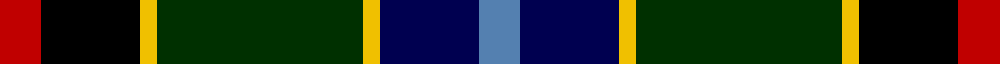

In pattern [BBYGYKR](/stripes/bbygykr/).

This was sourced from weddslist.  It is a [7 stripe tartan](/stripes/stripes7/).

Original link http://www.weddslist.com/cgi-bin/tartans/pg.pl?source=sts

## Thread count
R/10 K24 Y4 DG50 Y4 DB24 B/10

## Palette
Each colour and the base-6 reference it is a variant of.

| Colour | Shade | Base |
|---|---|---|
| B | <code style="background-color:#5480B0;">#5480B0</code> `oklch(58.8% 0.089 251.5)` <small>#5480B0</small> | B <code style="background-color:#2A418A;">#2A418A</code> |
| DB | <code style="background-color:#000050;">#000050</code> `oklch(19.5% 0.135 264.1)` <small>#000050</small> | B <code style="background-color:#2A418A;">#2A418A</code> |
| DG | <code style="background-color:#003000;">#003000</code> `oklch(26.8% 0.091 142.5)` <small>#003000</small> | G <code style="background-color:#006100;">#006100</code> |
| K | <code style="background-color:#000000;">#000000</code> `oklch(0.0% 0.000 0.0)` <small>#000000</small> | K <code style="background-color:#000000;">#000000</code> |
| R | <code style="background-color:#C00000;">#C00000</code> `oklch(50.7% 0.208 29.2)` <small>#C00000</small> | R <code style="background-color:#CC0000;">#CC0000</code> |
| Y | <code style="background-color:#F0C000;">#F0C000</code> `oklch(82.7% 0.169 90.5)` <small>#F0C000</small> | Y <code style="background-color:#F2BF00;">#F2BF00</code> |

# Sample pattern

## Nearest tartans

The nearest existing variants by ΔTartan distance, with this tartan at the top so the swatches line up against it.

ΔTartan

Tartan

Sett

—

<a href="/ttd/edit/#slug=r5k12ly2dg25ly2db12t5~x2">James</a> <a class="nn-out" href="/setts/s7/r5k12ly2dg25ly2db12t5~x2/" title="open its dictionary page">↗</a>

0.81

<a href="/ttd/edit/#slug=g36ly3dy5db18k10k18~x2">Dobson Name Tartan Tartan Number: 10943. Earliest known date: 2013 Designed by Kelly Dobson Matson for the personal use of the Dobson Family, Palm Bay, Florida, a family of bagpipers, who wish to wear their own tartan while they play. The colours are favoured colours chosen by the majority of the family. See products available Copyright © Blair Urquhart, Comrie, 2015</a> <a class="nn-out" href="/setts/s6/g36ly3dy5db18k10k18~x2/" title="open its dictionary page">↗</a>

0.84

<a href="/ttd/edit/#slug=w5k26ly2dg24db8k4r3~x2">Cornish Htg (District)</a> <a class="nn-out" href="/setts/s7/w5k26ly2dg24db8k4r3~x2/" title="open its dictionary page">↗</a>

0.97

<a href="/ttd/edit/#slug=w5k26ly2dg24dt7k3r3~x2">Cornish Hunting District Tartan Tartan Number: 1568. Earliest known date: 1984 The Cornish Hunting tartan was first produced in 1984, and was marketed by the firm, Cornovi Creations, Cornwall. It is based on the Cornish National tartan designed by E.E. Morton-Nance, who regarded tartan as the heritage of all Celts, not Scots alone. (P Smith and G Teall, District Tartans, 1992) The hunting sett replaces the 'National' yellow with dark green and the azure with a darker shade of blue. Cornish Hunting is a registered design (No. 514267). See products available Copyright © Blair Urquhart, Comrie, 2015</a> <a class="nn-out" href="/setts/s7/w5k26ly2dg24dt7k3r3~x2/" title="open its dictionary page">↗</a>

0.98

<a href="/ttd/edit/#slug=w5k26ly2dg24k7k3r3~x2">Cornish, hunting</a> <a class="nn-out" href="/setts/s7/w5k26ly2dg24k7k3r3~x2/" title="open its dictionary page">↗</a>

0.99

<a href="/ttd/edit/#slug=w1r2db16k14g15k3ly1~x2">MacNeil 7</a> <a class="nn-out" href="/setts/s7/w1r2db16k14g15k3ly1~x2/" title="open its dictionary page">↗</a>

1.02

<a href="/ttd/edit/#slug=r3w2dy10dg37k12db21w2~x2">Jones, The</a> <a class="nn-out" href="/setts/s7/r3w2dy10dg37k12db21w2~x2/" title="open its dictionary page">↗</a>

1.07

<a href="/ttd/edit/#slug=ly1k3dg15k14db16r2lb1~x2">MacNeil</a> <a class="nn-out" href="/setts/s7/ly1k3dg15k14db16r2lb1~x2/" title="open its dictionary page">↗</a>

1.08

<a href="/ttd/edit/#slug=r2k6ly1dg12ly1db6lr2~x4">James (Personal)</a> <a class="nn-out" href="/setts/s7/r2k6ly1dg12ly1db6lr2~x4/" title="open its dictionary page">↗</a>

1.12

<a href="/ttd/edit/#slug=w3dp22r3k22g22ly2~x2">Morris of Balgonie</a> <a class="nn-out" href="/setts/s6/w3dp22r3k22g22ly2~x2/" title="open its dictionary page">↗</a>

1.12

<a href="/ttd/edit/#slug=w10k52db52dg24ly10dg5r5">Harvey of Cornwall (Personal)</a> <a class="nn-out" href="/setts/s7/w10k52db52dg24ly10dg5r5/" title="open its dictionary page">↗</a>

## Neighbour map

Every grey dot is one of 14299 variants placed by the first two principal components of the ΔTartan feature space (44% of its variance). Red is this tartan; blue dots are its nearest — click one to open its page.

<svg viewBox="0 0 640 380" role="img" style="max-width:100%;height:auto;border:1px solid #e0e0e0;border-radius:4px;display:block" xmlns="http://www.w3.org/2000/svg"><image href="/nn/cloud.v1.png" width="640" height="380"/><a href="/setts/s6/g36ly3dy5db18k10k18~x2/"><circle cx="148.7" cy="190.5" r="4" fill="#3465a4"><title>Dobson Name Tartan Tartan Number: 10943. Earliest known date: 2013 Designed by Kelly Dobson Matson for the personal use of the Dobson Family, Palm Bay, Florida, a family of bagpipers, who wish to wear their own tartan while they play. The colours are favoured colours chosen by the majority of the family. See products available Copyright © Blair Urquhart, Comrie, 2015</title></circle></a><a href="/setts/s7/w5k26ly2dg24db8k4r3~x2/"><circle cx="165.9" cy="155.6" r="4" fill="#3465a4"><title>Cornish Htg (District)</title></circle></a><a href="/setts/s7/w5k26ly2dg24dt7k3r3~x2/"><circle cx="196.2" cy="163.3" r="4" fill="#3465a4"><title>Cornish Hunting District Tartan Tartan Number: 1568. Earliest known date: 1984 The Cornish Hunting tartan was first produced in 1984, and was marketed by the firm, Cornovi Creations, Cornwall. It is based on the Cornish National tartan designed by E.E. Morton-Nance, who regarded tartan as the heritage of all Celts, not Scots alone. (P Smith and G Teall, District Tartans, 1992) The hunting sett replaces the 'National' yellow with dark green and the azure with a darker shade of blue. Cornish Hunting is a registered design (No. 514267). See products available Copyright © Blair Urquhart, Comrie, 2015</title></circle></a><a href="/setts/s7/w5k26ly2dg24k7k3r3~x2/"><circle cx="175.9" cy="155.9" r="4" fill="#3465a4"><title>Cornish, hunting</title></circle></a><a href="/setts/s7/w1r2db16k14g15k3ly1~x2/"><circle cx="135.0" cy="148.1" r="4" fill="#3465a4"><title>MacNeil 7</title></circle></a><a href="/setts/s7/r3w2dy10dg37k12db21w2~x2/"><circle cx="199.4" cy="153.9" r="4" fill="#3465a4"><title>Jones, The</title></circle></a><a href="/setts/s7/ly1k3dg15k14db16r2lb1~x2/"><circle cx="150.7" cy="160.3" r="4" fill="#3465a4"><title>MacNeil</title></circle></a><a href="/setts/s7/r2k6ly1dg12ly1db6lr2~x4/"><circle cx="163.5" cy="169.8" r="4" fill="#3465a4"><title>James (Personal)</title></circle></a><a href="/setts/s6/w3dp22r3k22g22ly2~x2/"><circle cx="101.3" cy="172.1" r="4" fill="#3465a4"><title>Morris of Balgonie</title></circle></a><a href="/setts/s7/w10k52db52dg24ly10dg5r5/"><circle cx="123.6" cy="167.4" r="4" fill="#3465a4"><title>Harvey of Cornwall (Personal)</title></circle></a><circle cx="143.4" cy="165.2" r="5" fill="#c00000"/></svg>

ID: /setts/s7/r5k12ly2dg25ly2db12t5~x2/
