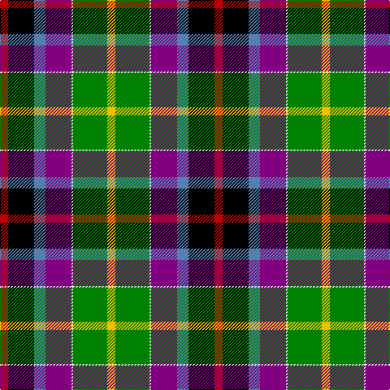

In pattern [RKBBWGY](/stripes/rkbbwgy/).

This was sourced from weddslist.  It is a [7 stripe tartan](/stripes/stripes7/).

Original link http://www.weddslist.com/cgi-bin/tartans/pg.pl?source=sts

## Also known as

This cloth is also recorded under:

- Gallowater New
- Gallowater, New

## Thread count
R/10 K32 B14 P32 LN2 G42 Y/10

## Palette
Each colour and the base-6 reference it is a variant of.

| Colour | Shade | Base |
|---|---|---|
| B | <code style="background-color:#5480B0;">#5480B0</code> `oklch(58.8% 0.089 251.5)` <small>#5480B0</small> | B <code style="background-color:#2A418A;">#2A418A</code> |
| G | <code style="background-color:#008000;">#008000</code> `oklch(52.0% 0.177 142.5)` <small>#008000</small> | G <code style="background-color:#006100;">#006100</code> |
| K | <code style="background-color:#000000;">#000000</code> `oklch(0.0% 0.000 0.0)` <small>#000000</small> | K <code style="background-color:#000000;">#000000</code> |
| LN | <code style="background-color:#E0E0E0;">#E0E0E0</code> `oklch(90.7% 0.000 89.9)` <small>#E0E0E0</small> | W <code style="background-color:#F7F7F7;">#F7F7F7</code> |
| P | <code style="background-color:#800080;">#800080</code> `oklch(42.1% 0.193 328.4)` <small>#800080</small> | B <code style="background-color:#2A418A;">#2A418A</code> |
| R | <code style="background-color:#C00000;">#C00000</code> `oklch(50.7% 0.208 29.2)` <small>#C00000</small> | R <code style="background-color:#CC0000;">#CC0000</code> |
| Y | <code style="background-color:#F0C000;">#F0C000</code> `oklch(82.7% 0.169 90.5)` <small>#F0C000</small> | Y <code style="background-color:#F2BF00;">#F2BF00</code> |

# Sample pattern

## Nearest tartans

The nearest existing variants by ΔTartan distance, with this tartan at the top so the swatches line up against it.

ΔTartan

Tartan

Sett

—

<a href="/ttd/edit/#slug=r5k16t7p16w1g21ly5~x2">Gallowater, New</a> <a class="nn-out" href="/setts/s7/r5k16t7p16w1g21ly5~x2/" title="open its dictionary page">↗</a>

0.56

<a href="/ttd/edit/#slug=r11k33t14dp32w2g42ly10">Gallowater, New (District)</a> <a class="nn-out" href="/setts/s7/r11k33t14dp32w2g42ly10/" title="open its dictionary page">↗</a>

0.74

<a href="/ttd/edit/#slug=r5k16t7dp16w1g21ly5~x2">Gallowater New District Tartan Tartan Number: 1571. Earliest known date: 1819 The Gallowater district tartan, sometimes referred to as the 'Gala Water' was first mentioned in the records of Wilson's of Bannockburn in 1793. The design progressed until 1819 when this 'New' sett was recorded in the company's pattern book with a red band and a thin white stripe. See products available Copyright © Blair Urquhart, Comrie, 2015</a> <a class="nn-out" href="/setts/s7/r5k16t7dp16w1g21ly5~x2/" title="open its dictionary page">↗</a>

0.96

<a href="/ttd/edit/#slug=r5k16t7dp16w1dg21ly5~x2">Gala Water New</a> <a class="nn-out" href="/setts/s7/r5k16t7dp16w1dg21ly5~x2/" title="open its dictionary page">↗</a>

1.27

<a href="/ttd/edit/#slug=k2t6k1db7g13w1k11r14ly2~x2">Teall of Teallach (Personal)</a> <a class="nn-out" href="/setts/s9/k2t6k1db7g13w1k11r14ly2~x2/" title="open its dictionary page">↗</a>

1.28

<a href="/ttd/edit/#slug=k7r22t9dp20lb2g28ly7~x2">Jefferson (Personal)</a> <a class="nn-out" href="/setts/s7/k7r22t9dp20lb2g28ly7~x2/" title="open its dictionary page">↗</a>

1.29

<a href="/ttd/edit/#slug=k2t6k1db7dg13w1k11r14ly2~x2">Teall of Teallach</a> <a class="nn-out" href="/setts/s9/k2t6k1db7dg13w1k11r14ly2~x2/" title="open its dictionary page">↗</a>

1.32

<a href="/ttd/edit/#slug=r5lb1dt10w2k10y10k1ly3~x4">Culloden 1746 - Original</a> <a class="nn-out" href="/setts/s8/r5lb1dt10w2k10y10k1ly3~x4/" title="open its dictionary page">↗</a>

1.37

<a href="/ttd/edit/#slug=w2db3r6k8g12lo1db4k2w2~x2">National (1934), The</a> <a class="nn-out" href="/setts/s9/w2db3r6k8g12lo1db4k2w2~x2/" title="open its dictionary page">↗</a>

1.39

<a href="/ttd/edit/#slug=dt8t1db1t1m12ly6k12w2~x4">Maryland</a> <a class="nn-out" href="/setts/s8/dt8t1db1t1m12ly6k12w2~x4/" title="open its dictionary page">↗</a>

1.44

<a href="/ttd/edit/#slug=w2db3r6k8g12ly1db4k2w2~x2">National</a> <a class="nn-out" href="/setts/s9/w2db3r6k8g12ly1db4k2w2~x2/" title="open its dictionary page">↗</a>

## Neighbour map

Every grey dot is one of 14299 variants placed by the first two principal components of the ΔTartan feature space (44% of its variance). Red is this tartan; blue dots are its nearest — click one to open its page.

<svg viewBox="0 0 640 380" role="img" style="max-width:100%;height:auto;border:1px solid #e0e0e0;border-radius:4px;display:block" xmlns="http://www.w3.org/2000/svg"><image href="/nn/cloud.v1.png" width="640" height="380"/><a href="/setts/s7/r11k33t14dp32w2g42ly10/"><circle cx="77.1" cy="132.7" r="4" fill="#3465a4"><title>Gallowater, New (District)</title></circle></a><a href="/setts/s7/r5k16t7dp16w1g21ly5~x2/"><circle cx="88.2" cy="135.1" r="4" fill="#3465a4"><title>Gallowater New District Tartan Tartan Number: 1571. Earliest known date: 1819 The Gallowater district tartan, sometimes referred to as the 'Gala Water' was first mentioned in the records of Wilson's of Bannockburn in 1793. The design progressed until 1819 when this 'New' sett was recorded in the company's pattern book with a red band and a thin white stripe. See products available Copyright © Blair Urquhart, Comrie, 2015</title></circle></a><a href="/setts/s7/r5k16t7dp16w1dg21ly5~x2/"><circle cx="90.1" cy="139.1" r="4" fill="#3465a4"><title>Gala Water New</title></circle></a><a href="/setts/s9/k2t6k1db7g13w1k11r14ly2~x2/"><circle cx="61.2" cy="128.7" r="4" fill="#3465a4"><title>Teall of Teallach (Personal)</title></circle></a><a href="/setts/s7/k7r22t9dp20lb2g28ly7~x2/"><circle cx="74.8" cy="147.9" r="4" fill="#3465a4"><title>Jefferson (Personal)</title></circle></a><a href="/setts/s9/k2t6k1db7dg13w1k11r14ly2~x2/"><circle cx="62.2" cy="128.7" r="4" fill="#3465a4"><title>Teall of Teallach</title></circle></a><a href="/setts/s8/r5lb1dt10w2k10y10k1ly3~x4/"><circle cx="44.4" cy="147.7" r="4" fill="#3465a4"><title>Culloden 1746 - Original</title></circle></a><a href="/setts/s9/w2db3r6k8g12lo1db4k2w2~x2/"><circle cx="74.9" cy="145.8" r="4" fill="#3465a4"><title>National (1934), The</title></circle></a><a href="/setts/s8/dt8t1db1t1m12ly6k12w2~x4/"><circle cx="68.6" cy="125.4" r="4" fill="#3465a4"><title>Maryland</title></circle></a><a href="/setts/s9/w2db3r6k8g12ly1db4k2w2~x2/"><circle cx="65.6" cy="142.8" r="4" fill="#3465a4"><title>National</title></circle></a><circle cx="68.0" cy="126.0" r="5" fill="#c00000"/></svg>

ID: /setts/s7/r5k16t7p16w1g21ly5~x2/
