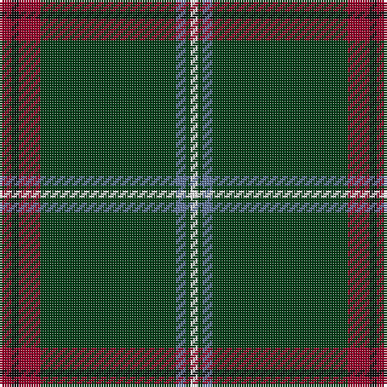

In pattern [RKRGBGW](/patterns/rkrgbgw/).

This was sourced from register-of-tartans.  It is a [7 stripes tartan](/stripes/stripes7/).

Original link https://www.tartanregister.gov.uk/tartanDetails.aspx?ref=11153

## Thread count
DR/5 K3 DR9 DG56 B4 DG2 W/3

## Palette
Each colour and its ΔE from the base-6 reference it is a variant of.

| Colour | Shade | Base | ΔE (OKLab) |
|---|---|---|---|
| B | <code style="background-color:#5F749C;">#5F749C</code> `#5F749C` | B <code style="background-color:#2A418A;">#2A418A</code> | 0.17 |
| DG | <code style="background-color:#003C14;">#003C14</code> `#003C14` | G <code style="background-color:#006100;">#006100</code> | 0.13 |
| DR | <code style="background-color:#960028;">#960028</code> `#960028` | R <code style="background-color:#CC0000;">#CC0000</code> | 0.12 |
| K | <code style="background-color:#101010;">#101010</code> `#101010` | K <code style="background-color:#000000;">#000000</code> | 0.17 |
| W | <code style="background-color:#FFFFFF;">#FFFFFF</code> `#FFFFFF` | W <code style="background-color:#F7F7F7;">#F7F7F7</code> | 0.02 |

# Sample pattern

## Nearest tartans

The nearest existing variants by ΔTartan distance.

1. [MTV](/setts/s7/b5k3b9g56ba4g2w3~b680028-ba5c8ca8-g003820-k101010-wfcfcfc/) — ΔT 0.55
1. [Hall, from Springbrook and Newtown (Personal)](/setts/s8/w3r11b4r6g48ra2g3ra2~b141e46-g003c14-r781c38-rac87814-we0e0e0~x2/) — ΔT 1.00
1. [Tough (Personal)](/setts/s6/b4y1k4g32k4r2~b646464-g004c00-k000000-r8c0000-ydcbc00~x2/) — ΔT 1.11
1. [Touch](/setts/s6/g5y1k5ga46k5r3~g808080-ga003000-k000000-rc00000-yf0c000~x2/) — ΔT 1.23
1. [Bro-sant-Brieg](/setts/s7/b3g6b2y3b42k6w3~b103848-g407040-k101010-we0e0e0-yd8c800~x2/) — ΔT 1.25
1. [Moran Family Ubique](/setts/s10/g68k2g2k2g2y8r8k8y2b7~b2c4084-g002814-k101010-rc80028-yc89600~x2/) — ΔT 1.27
1. [Scotts Valley](/setts/s9/g20r1y1r1w1g1r1w1b5~b00008c-g004c00-r8c0000-wc8c8c8-yc89800~x4/) — ΔT 1.27
1. [Aviemore Highland (Corporate)](/setts/s7/g40k3w1k5r1k2ra10~g285800-k101010-rc80000-rae87878-we0e0e0~x2/) — ΔT 1.30
1. [Moran (French) (Name)](/setts/s10/g67k2g2k2g2y8r8k8y2b7~b2888c4-g003820-k101010-rc80000-ye8c000~x2/) — ΔT 1.30
1. [Palmer, Arnold](/setts/s10/g40r5k2w2k2y3k2g10r3k3~g285800-k101010-r880000-we0e0e0-ye8c000~x2/) — ΔT 1.31

## Neighbour map

Every grey dot is one of 15726 variants placed by the first two principal components of the ΔTartan feature space (44% of its variance). Red is this tartan; blue dots are its nearest — click one to open its page.

<svg viewBox="0 0 640 380" role="img" style="max-width:100%;height:auto;border:1px solid #e0e0e0;border-radius:4px;display:block" xmlns="http://www.w3.org/2000/svg"><image href="/nn/cloud.v1.png" width="640" height="380"/><a href="/setts/s7/b5k3b9g56ba4g2w3~b680028-ba5c8ca8-g003820-k101010-wfcfcfc/"><circle cx="477.1" cy="137.0" r="4" fill="#3465a4"><title>MTV</title></circle></a><a href="/setts/s8/w3r11b4r6g48ra2g3ra2~b141e46-g003c14-r781c38-rac87814-we0e0e0~x2/"><circle cx="425.5" cy="135.2" r="4" fill="#3465a4"><title>Hall, from Springbrook and Newtown (Personal)</title></circle></a><a href="/setts/s6/b4y1k4g32k4r2~b646464-g004c00-k000000-r8c0000-ydcbc00~x2/"><circle cx="439.9" cy="142.5" r="4" fill="#3465a4"><title>Tough (Personal)</title></circle></a><a href="/setts/s6/g5y1k5ga46k5r3~g808080-ga003000-k000000-rc00000-yf0c000~x2/"><circle cx="480.6" cy="129.1" r="4" fill="#3465a4"><title>Touch</title></circle></a><a href="/setts/s7/b3g6b2y3b42k6w3~b103848-g407040-k101010-we0e0e0-yd8c800~x2/"><circle cx="453.4" cy="146.7" r="4" fill="#3465a4"><title>Bro-sant-Brieg</title></circle></a><a href="/setts/s10/g68k2g2k2g2y8r8k8y2b7~b2c4084-g002814-k101010-rc80028-yc89600~x2/"><circle cx="440.2" cy="101.8" r="4" fill="#3465a4"><title>Moran Family Ubique</title></circle></a><a href="/setts/s9/g20r1y1r1w1g1r1w1b5~b00008c-g004c00-r8c0000-wc8c8c8-yc89800~x4/"><circle cx="400.5" cy="122.0" r="4" fill="#3465a4"><title>Scotts Valley</title></circle></a><a href="/setts/s7/g40k3w1k5r1k2ra10~g285800-k101010-rc80000-rae87878-we0e0e0~x2/"><circle cx="419.4" cy="110.8" r="4" fill="#3465a4"><title>Aviemore Highland (Corporate)</title></circle></a><a href="/setts/s10/g67k2g2k2g2y8r8k8y2b7~b2888c4-g003820-k101010-rc80000-ye8c000~x2/"><circle cx="413.6" cy="92.2" r="4" fill="#3465a4"><title>Moran (French) (Name)</title></circle></a><a href="/setts/s10/g40r5k2w2k2y3k2g10r3k3~g285800-k101010-r880000-we0e0e0-ye8c000~x2/"><circle cx="436.7" cy="126.5" r="4" fill="#3465a4"><title>Palmer, Arnold</title></circle></a><circle cx="469.1" cy="131.8" r="5" fill="#c00000"/></svg>

ID: /setts/s7/r5k3r9g56b4g2w3~b5f749c-g003c14-k101010-r960028-wffffff/
