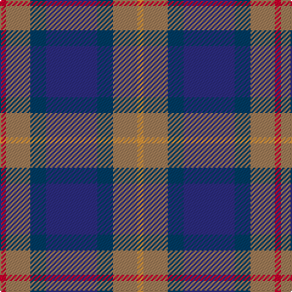

In pattern [RRBBBRY](/stripes/rrbbbry/).

This was sourced from house-of-tartan.  It is a [7 stripe tartan](/stripes/stripes7/).

Original link http://www.house-of-tartan.scotland.net/house/TartanViewjs.asp?colr=Def&tnam=2053

## Thread count
R/5 LT20 DBa13 DB42 DBa13 LT20 O/5

## Palette
Each colour and the base-6 reference it is a variant of.

| Colour | Shade | Base |
|---|---|---|
| DB | <code style="background-color:#2C2C80;">#2C2C80</code> `oklch(35.0% 0.138 276.6)` <small>#2C2C80</small> | B <code style="background-color:#2A418A;">#2A418A</code> |
| DBa | <code style="background-color:#003C64;">#003C64</code> `oklch(34.5% 0.089 246.0)` <small>#003C64</small> | B <code style="background-color:#2A418A;">#2A418A</code> |
| LT | <code style="background-color:#A07C58;">#A07C58</code> `oklch(61.2% 0.067 66.0)` <small>#A07C58</small> | R <code style="background-color:#CC0000;">#CC0000</code> |
| O | <code style="background-color:#DC943C;">#DC943C</code> `oklch(72.3% 0.133 67.9)` <small>#DC943C</small> | Y <code style="background-color:#F2BF00;">#F2BF00</code> |
| R | <code style="background-color:#C8002C;">#C8002C</code> `oklch(52.6% 0.212 22.0)` <small>#C8002C</small> | R <code style="background-color:#CC0000;">#CC0000</code> |

# Sample pattern

## Nearest tartans

The nearest existing variants by ΔTartan distance, with this tartan at the top so the swatches line up against it.

ΔTartan

Tartan

Sett

—

<a href="/ttd/edit/#slug=r5o20dt13db42dt13o20lo5">Newmill Corporate Tartan Tartan Number: 2053. Earliest known date: March 1992 Designed to be used in the refurbishing of Johnstons of Elgin new mill shop and based on the colours of the mill shop house style. The lighter square is represented here as green from the 'Antique' colour range, a speciality of Johnstons of Elgin. See products available Copyright © Blair Urquhart, Comrie, 2015</a> <a class="nn-out" href="/setts/s7/r5o20dt13db42dt13o20lo5/" title="open its dictionary page">↗</a>

0.85

<a href="/ttd/edit/#slug=r1o5dt3dt11dt3o5lo1~x8">Newmill</a> <a class="nn-out" href="/setts/s7/r1o5dt3dt11dt3o5lo1~x8/" title="open its dictionary page">↗</a>

1.04

<a href="/ttd/edit/#slug=dp10db10g10w1ly1~x6">Edelstein (Personal)</a> <a class="nn-out" href="/setts/s5/dp10db10g10w1ly1~x6/" title="open its dictionary page">↗</a>

1.07

<a href="/ttd/edit/#slug=db30ly3dy11ly3y33r6~x2">Balfour</a> <a class="nn-out" href="/setts/s6/db30ly3dy11ly3y33r6~x2/" title="open its dictionary page">↗</a>

1.07

<a href="/ttd/edit/#slug=w3t2n14o8t14db16n13t2w3~x2">Caitriot</a> <a class="nn-out" href="/setts/s9/w3t2n14o8t14db16n13t2w3~x2/" title="open its dictionary page">↗</a>

1.08

<a href="/ttd/edit/#slug=m5g20k13db42k13g20ly5~x2">Newmill</a> <a class="nn-out" href="/setts/s7/m5g20k13db42k13g20ly5~x2/" title="open its dictionary page">↗</a>

1.11

<a href="/ttd/edit/#slug=db27o9w3dy16r7~x2">Unidentified (Sock Tie)</a> <a class="nn-out" href="/setts/s5/db27o9w3dy16r7~x2/" title="open its dictionary page">↗</a>

1.13

<a href="/ttd/edit/#slug=r9g3b19k3g19r13k3lo3~x2">Orkney (District?)</a> <a class="nn-out" href="/setts/s8/r9g3b19k3g19r13k3lo3~x2/" title="open its dictionary page">↗</a>

1.15

<a href="/ttd/edit/#slug=r4do27lo6n19b38lb4~x2">State Seal of Michigan (Fashion)</a> <a class="nn-out" href="/setts/s6/r4do27lo6n19b38lb4~x2/" title="open its dictionary page">↗</a>

1.16

<a href="/ttd/edit/#slug=db30ly3dy11ly3o33r6~x2">Balfour Family Tartan Tartan Number: 683. Earliest known date: 1984 Presented by William Balfour. See products available Copyright © Blair Urquhart, Comrie, 2015</a> <a class="nn-out" href="/setts/s6/db30ly3dy11ly3o33r6~x2/" title="open its dictionary page">↗</a>

1.23

<a href="/ttd/edit/#slug=db5k15o5n9o2db2o2db2n9k3~x2">Ryukoku University Heian SHS (Corp)</a> <a class="nn-out" href="/setts/s10/db5k15o5n9o2db2o2db2n9k3~x2/" title="open its dictionary page">↗</a>

## Neighbour map

Every grey dot is one of 14299 variants placed by the first two principal components of the ΔTartan feature space (44% of its variance). Red is this tartan; blue dots are its nearest — click one to open its page.

<svg viewBox="0 0 640 380" role="img" style="max-width:100%;height:auto;border:1px solid #e0e0e0;border-radius:4px;display:block" xmlns="http://www.w3.org/2000/svg"><image href="/nn/cloud.v1.png" width="640" height="380"/><a href="/setts/s7/r1o5dt3dt11dt3o5lo1~x8/"><circle cx="206.0" cy="208.4" r="4" fill="#3465a4"><title>Newmill</title></circle></a><a href="/setts/s5/dp10db10g10w1ly1~x6/"><circle cx="162.2" cy="220.6" r="4" fill="#3465a4"><title>Edelstein (Personal)</title></circle></a><a href="/setts/s6/db30ly3dy11ly3y33r6~x2/"><circle cx="214.3" cy="196.8" r="4" fill="#3465a4"><title>Balfour</title></circle></a><a href="/setts/s9/w3t2n14o8t14db16n13t2w3~x2/"><circle cx="136.0" cy="204.0" r="4" fill="#3465a4"><title>Caitriot</title></circle></a><a href="/setts/s7/m5g20k13db42k13g20ly5~x2/"><circle cx="163.1" cy="220.7" r="4" fill="#3465a4"><title>Newmill</title></circle></a><a href="/setts/s5/db27o9w3dy16r7~x2/"><circle cx="195.4" cy="224.4" r="4" fill="#3465a4"><title>Unidentified (Sock Tie)</title></circle></a><a href="/setts/s8/r9g3b19k3g19r13k3lo3~x2/"><circle cx="151.6" cy="221.4" r="4" fill="#3465a4"><title>Orkney (District?)</title></circle></a><a href="/setts/s6/r4do27lo6n19b38lb4~x2/"><circle cx="173.8" cy="195.4" r="4" fill="#3465a4"><title>State Seal of Michigan (Fashion)</title></circle></a><a href="/setts/s6/db30ly3dy11ly3o33r6~x2/"><circle cx="199.1" cy="187.5" r="4" fill="#3465a4"><title>Balfour Family Tartan Tartan Number: 683. Earliest known date: 1984 Presented by William Balfour. See products available Copyright © Blair Urquhart, Comrie, 2015</title></circle></a><a href="/setts/s10/db5k15o5n9o2db2o2db2n9k3~x2/"><circle cx="149.5" cy="203.4" r="4" fill="#3465a4"><title>Ryukoku University Heian SHS (Corp)</title></circle></a><circle cx="177.2" cy="218.3" r="5" fill="#c00000"/></svg>

ID: /setts/s7/r5o20dt13db42dt13o20lo5/
