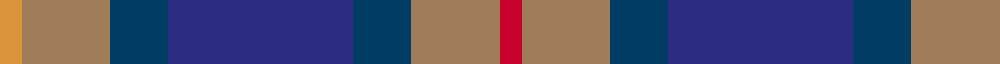

In pattern [RRBBBRY](/patterns/rrbbbry/).

This was sourced from house-of-tartan.  It is a [7 stripes tartan](/stripes/stripes7/).

Original link http://www.house-of-tartan.scotland.net/house/TartanViewjs.asp?colr=Def&tnam=2053

## Thread count
O/5 LT20 DBa13 DB42 DBa13 LT20 R/5

## Palette
Each colour and its ΔE from the base-6 reference it is a variant of.

| Colour | Shade | Base | ΔE (OKLab) |
|---|---|---|---|
| DB | <code style="background-color:#2C2C80;">#2C2C80</code> `#2C2C80` | B <code style="background-color:#2A418A;">#2A418A</code> | 0.06 |
| DBa | <code style="background-color:#003C64;">#003C64</code> `#003C64` | B <code style="background-color:#2A418A;">#2A418A</code> | 0.08 |
| LT | <code style="background-color:#A07C58;">#A07C58</code> `#A07C58` | R <code style="background-color:#CC0000;">#CC0000</code> | 0.19 |
| O | <code style="background-color:#DC943C;">#DC943C</code> `#DC943C` | Y <code style="background-color:#F2BF00;">#F2BF00</code> | 0.12 |
| R | <code style="background-color:#C8002C;">#C8002C</code> `#C8002C` | R <code style="background-color:#CC0000;">#CC0000</code> | 0.03 |

# Sample pattern

## Nearest tartans

The nearest existing variants by ΔTartan distance.

1. [Newmill](/setts/s7/r1ra5b3ba11b3ra5y1~b14283c-ba003c64-r880000-ra888888-yd09800~x8/) — ΔT 0.85
1. [Edelstein (Personal)](/setts/s5/b10ba10g10w1y1~b780078-ba2c2c80-g006818-we0e0e0-ye8c000~x6/) — ΔT 1.04
1. [Balfour](/setts/s6/b30y3g11y3ga33r6~b2c4084-g503c14-ga808080-rdc0000-ye8c000~x2/) — ΔT 1.07
1. [Caitriot](/setts/s9/w3b2ba14r8b14bb16ba13b2w3~b5c8ca8-ba5c5c5c-bb202060-r888888-wfcfcfc~x2/) — ΔT 1.07
1. [Newmill](/setts/s7/r5g20k13b42k13g20y5~b304080-g407050-k000030-r802040-yf0c000~x2/) — ΔT 1.07
1. [Unidentified (Sock Tie)](/setts/s5/b27r9w3g16ra7~b003c96-g525014-rbe7832-ra960028-we0e0e0~x2/) — ΔT 1.11
1. [Orkney (District?)](/setts/s8/r9g3b19k3g19r13k3y3~b1870a4-g408060-k101010-r901c38-ybc8c00~x2/) — ΔT 1.14
1. [State Seal of Michigan (Fashion)](/setts/s6/r4b27y6ba19bb38w4~b441800-ba5c5c5c-bb1474b4-r880000-we8ccb8-ya08858~x2/) — ΔT 1.15
1. [Cooke Family Tartan Tartan Number: 2131. Earliest known date: 1993 Designed for Mr Bob Cooke and his family. Cookes were seafarers from the West Coast of Scotland and Ireland. Some including the designer, can trace forebears to Liverpool and the North West coast of England. The colours of the tartan reflect the seas, the skys and the heart of the sailor. See products available Copyright © Blair Urquhart, Comrie, 2015](/setts/s7/k6b2ba12g8r5k2g3~b2888c4-ba2c2c80-g408060-k101010-rc8002c~x4/) — ΔT 1.16
1. [Balfour Family Tartan Tartan Number: 683. Earliest known date: 1984 Presented by William Balfour. See products available Copyright © Blair Urquhart, Comrie, 2015](/setts/s6/b30y3g11y3r33ra6~b2c2c80-g604000-r888888-rac80000-ye8c000~x2/) — ΔT 1.16

## Neighbour map

Every grey dot is one of 15726 variants placed by the first two principal components of the ΔTartan feature space (44% of its variance). Red is this tartan; blue dots are its nearest — click one to open its page.

<svg viewBox="0 0 640 380" role="img" style="max-width:100%;height:auto;border:1px solid #e0e0e0;border-radius:4px;display:block" xmlns="http://www.w3.org/2000/svg"><image href="/nn/cloud.v1.png" width="640" height="380"/><a href="/setts/s7/r1ra5b3ba11b3ra5y1~b14283c-ba003c64-r880000-ra888888-yd09800~x8/"><circle cx="203.2" cy="202.4" r="4" fill="#3465a4"><title>Newmill</title></circle></a><a href="/setts/s5/b10ba10g10w1y1~b780078-ba2c2c80-g006818-we0e0e0-ye8c000~x6/"><circle cx="159.3" cy="217.3" r="4" fill="#3465a4"><title>Edelstein (Personal)</title></circle></a><a href="/setts/s6/b30y3g11y3ga33r6~b2c4084-g503c14-ga808080-rdc0000-ye8c000~x2/"><circle cx="212.2" cy="192.2" r="4" fill="#3465a4"><title>Balfour</title></circle></a><a href="/setts/s9/w3b2ba14r8b14bb16ba13b2w3~b5c8ca8-ba5c5c5c-bb202060-r888888-wfcfcfc~x2/"><circle cx="133.2" cy="198.9" r="4" fill="#3465a4"><title>Caitriot</title></circle></a><a href="/setts/s7/r5g20k13b42k13g20y5~b304080-g407050-k000030-r802040-yf0c000~x2/"><circle cx="159.6" cy="215.7" r="4" fill="#3465a4"><title>Newmill</title></circle></a><a href="/setts/s5/b27r9w3g16ra7~b003c96-g525014-rbe7832-ra960028-we0e0e0~x2/"><circle cx="193.0" cy="221.7" r="4" fill="#3465a4"><title>Unidentified (Sock Tie)</title></circle></a><a href="/setts/s8/r9g3b19k3g19r13k3y3~b1870a4-g408060-k101010-r901c38-ybc8c00~x2/"><circle cx="149.3" cy="214.4" r="4" fill="#3465a4"><title>Orkney (District?)</title></circle></a><a href="/setts/s6/r4b27y6ba19bb38w4~b441800-ba5c5c5c-bb1474b4-r880000-we8ccb8-ya08858~x2/"><circle cx="171.2" cy="189.8" r="4" fill="#3465a4"><title>State Seal of Michigan (Fashion)</title></circle></a><a href="/setts/s7/k6b2ba12g8r5k2g3~b2888c4-ba2c2c80-g408060-k101010-rc8002c~x4/"><circle cx="108.2" cy="227.0" r="4" fill="#3465a4"><title>Cooke Family Tartan Tartan Number: 2131. Earliest known date: 1993 Designed for Mr Bob Cooke and his family. Cookes were seafarers from the West Coast of Scotland and Ireland. Some including the designer, can trace forebears to Liverpool and the North West coast of England. The colours of the tartan reflect the seas, the skys and the heart of the sailor. See products available Copyright © Blair Urquhart, Comrie, 2015</title></circle></a><a href="/setts/s6/b30y3g11y3r33ra6~b2c2c80-g604000-r888888-rac80000-ye8c000~x2/"><circle cx="196.8" cy="185.0" r="4" fill="#3465a4"><title>Balfour Family Tartan Tartan Number: 683. Earliest known date: 1984 Presented by William Balfour. See products available Copyright © Blair Urquhart, Comrie, 2015</title></circle></a><circle cx="174.8" cy="213.1" r="5" fill="#c00000"/></svg>

ID: /setts/s7/r5ra20b13ba42b13ra20y5~b003c64-ba2c2c80-rc8002c-raa07c58-ydc943c/
