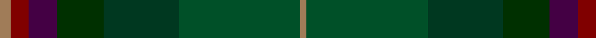

In pattern [RGGGBRR](/patterns/rgggbrr/).

This was sourced from tartans-authority.  It is a [7 stripes tartan](/stripes/stripes7/).

Original link http://www.tartansauthority.com/tartan-ferret/display/7223/

## Thread count
LT/5 DR8 DP13 DGa21 DG34 G55 LT/3

## Palette
Each colour and its ΔE from the base-6 reference it is a variant of.

| Colour | Shade | Base | ΔE (OKLab) |
|---|---|---|---|
| DG | <code style="background-color:#003820;">#003820</code> `#003820` | G <code style="background-color:#006400;">#006400</code> | 0.16 |
| DGa | <code style="background-color:#003000;">#003000</code> `#003000` | G <code style="background-color:#006400;">#006400</code> | 0.18 |
| DP | <code style="background-color:#440044;">#440044</code> `#440044` | B <code style="background-color:#2C4084;">#2C4084</code> | 0.17 |
| DR | <code style="background-color:#800000;">#800000</code> `#800000` | R <code style="background-color:#C80000;">#C80000</code> | 0.16 |
| G | <code style="background-color:#005028;">#005028</code> `#005028` | G <code style="background-color:#006400;">#006400</code> | 0.08 |
| LT | <code style="background-color:#A07C58;">#A07C58</code> `#A07C58` | R <code style="background-color:#C80000;">#C80000</code> | 0.19 |

# Sample pattern

ID: /setts/s7/r5ra8b13g21ga34gb55r3-b440044-g003000-ga003820-gb005028-ra07c58-ra800000/
