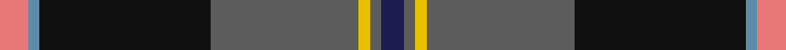

In pattern [BBYBKBR](/stripes/bbybkbr/).

This was sourced from tartans-authority.  It is a [7 stripe tartan](/stripes/stripes7/).

Original link http://www.tartansauthority.com/tartan-ferret/display/10066/

## Thread count
LR/10 B4 K60 N52 Y4 N4 DB/8

## Palette
Each colour and the base-6 reference it is a variant of.

| Colour | Shade | Base |
|---|---|---|
| B | <code style="background-color:#5C8CA8;">#5C8CA8</code> `oklch(61.7% 0.067 235.0)` <small>#5C8CA8</small> | B <code style="background-color:#2A418A;">#2A418A</code> |
| DB | <code style="background-color:#1C1C50;">#1C1C50</code> `oklch(26.2% 0.093 277.9)` <small>#1C1C50</small> | B <code style="background-color:#2A418A;">#2A418A</code> |
| K | <code style="background-color:#101010;">#101010</code> `oklch(17.3% 0.000 89.9)` <small>#101010</small> | K <code style="background-color:#000000;">#000000</code> |
| LR | <code style="background-color:#E87878;">#E87878</code> `oklch(70.0% 0.139 21.2)` <small>#E87878</small> | R <code style="background-color:#CC0000;">#CC0000</code> |
| N | <code style="background-color:#5C5C5C;">#5C5C5C</code> `oklch(47.5% 0.000 89.9)` <small>#5C5C5C</small> | B <code style="background-color:#2A418A;">#2A418A</code> |
| Y | <code style="background-color:#E8C000;">#E8C000</code> `oklch(81.9% 0.168 93.7)` <small>#E8C000</small> | Y <code style="background-color:#F2BF00;">#F2BF00</code> |

# Sample pattern

## Nearest tartans

The nearest existing variants by ΔTartan distance, with this tartan at the top so the swatches line up against it.

ΔTartan

Tartan

Sett

—

<a href="/ttd/edit/#slug=r5t2k30n26ly2n2db4~x2">Milne-Murtaugh (Personal)</a> <a class="nn-out" href="/setts/s7/r5t2k30n26ly2n2db4~x2/" title="open its dictionary page">↗</a>

0.31

<a href="/ttd/edit/#slug=m5y2k30y26y2y2k4~x2">Milne-Murtagh (2009)</a> <a class="nn-out" href="/setts/s7/m5y2k30y26y2y2k4~x2/" title="open its dictionary page">↗</a>

0.60

<a href="/ttd/edit/#slug=o11k66y32dg11y10db6y10r4">Turnbull, Dress Bruce (Personal)</a> <a class="nn-out" href="/setts/s8/o11k66y32dg11y10db6y10r4/" title="open its dictionary page">↗</a>

0.85

<a href="/ttd/edit/#slug=db46ly4db4ly4db6k16n66lb11r6">Scottish Association for Neurological Sciences</a> <a class="nn-out" href="/setts/s9/db46ly4db4ly4db6k16n66lb11r6/" title="open its dictionary page">↗</a>

0.96

<a href="/ttd/edit/#slug=lo11k66o32dg11o10db6o10lo4">Royal College of General Practitioners</a> <a class="nn-out" href="/setts/s8/lo11k66o32dg11o10db6o10lo4/" title="open its dictionary page">↗</a>

0.99

<a href="/ttd/edit/#slug=r3w6r2dg32db36k2db4lo2~x2">Canadian Centennial</a> <a class="nn-out" href="/setts/s8/r3w6r2dg32db36k2db4lo2~x2/" title="open its dictionary page">↗</a>

1.01

<a href="/ttd/edit/#slug=w5k26ly2dg24dt7k3r3~x2">Cornish Hunting District Tartan Tartan Number: 1568. Earliest known date: 1984 The Cornish Hunting tartan was first produced in 1984, and was marketed by the firm, Cornovi Creations, Cornwall. It is based on the Cornish National tartan designed by E.E. Morton-Nance, who regarded tartan as the heritage of all Celts, not Scots alone. (P Smith and G Teall, District Tartans, 1992) The hunting sett replaces the 'National' yellow with dark green and the azure with a darker shade of blue. Cornish Hunting is a registered design (No. 514267). See products available Copyright © Blair Urquhart, Comrie, 2015</a> <a class="nn-out" href="/setts/s7/w5k26ly2dg24dt7k3r3~x2/" title="open its dictionary page">↗</a>

1.04

<a href="/ttd/edit/#slug=lo2dg20db8dp3db2dp2db16w1lg2~x2">Scotland’s Golf Coast</a> <a class="nn-out" href="/setts/s9/lo2dg20db8dp3db2dp2db16w1lg2~x2/" title="open its dictionary page">↗</a>

1.06

<a href="/ttd/edit/#slug=w4dt38g6dr2g6dr36lo2dr3~x2">Scotland 2000</a> <a class="nn-out" href="/setts/s8/w4dt38g6dr2g6dr36lo2dr3~x2/" title="open its dictionary page">↗</a>

1.09

<a href="/ttd/edit/#slug=lo3k2o15k10dt23r2dt1w2~x2">Vienna Highlander (Fashion)</a> <a class="nn-out" href="/setts/s8/lo3k2o15k10dt23r2dt1w2~x2/" title="open its dictionary page">↗</a>

1.11

<a href="/ttd/edit/#slug=ly4g22r3k17r3db37w3~x2">Souza Nery (Personal)</a> <a class="nn-out" href="/setts/s7/ly4g22r3k17r3db37w3~x2/" title="open its dictionary page">↗</a>

## Neighbour map

Every grey dot is one of 14299 variants placed by the first two principal components of the ΔTartan feature space (44% of its variance). Red is this tartan; blue dots are its nearest — click one to open its page.

<svg viewBox="0 0 640 380" role="img" style="max-width:100%;height:auto;border:1px solid #e0e0e0;border-radius:4px;display:block" xmlns="http://www.w3.org/2000/svg"><image href="/nn/cloud.v1.png" width="640" height="380"/><a href="/setts/s7/m5y2k30y26y2y2k4~x2/"><circle cx="243.5" cy="148.3" r="4" fill="#3465a4"><title>Milne-Murtagh (2009)</title></circle></a><a href="/setts/s8/o11k66y32dg11y10db6y10r4/"><circle cx="219.0" cy="133.6" r="4" fill="#3465a4"><title>Turnbull, Dress Bruce (Personal)</title></circle></a><a href="/setts/s9/db46ly4db4ly4db6k16n66lb11r6/"><circle cx="216.1" cy="127.9" r="4" fill="#3465a4"><title>Scottish Association for Neurological Sciences</title></circle></a><a href="/setts/s8/lo11k66o32dg11o10db6o10lo4/"><circle cx="206.2" cy="126.5" r="4" fill="#3465a4"><title>Royal College of General Practitioners</title></circle></a><a href="/setts/s8/r3w6r2dg32db36k2db4lo2~x2/"><circle cx="263.7" cy="132.6" r="4" fill="#3465a4"><title>Canadian Centennial</title></circle></a><a href="/setts/s7/w5k26ly2dg24dt7k3r3~x2/"><circle cx="196.2" cy="163.3" r="4" fill="#3465a4"><title>Cornish Hunting District Tartan Tartan Number: 1568. Earliest known date: 1984 The Cornish Hunting tartan was first produced in 1984, and was marketed by the firm, Cornovi Creations, Cornwall. It is based on the Cornish National tartan designed by E.E. Morton-Nance, who regarded tartan as the heritage of all Celts, not Scots alone. (P Smith and G Teall, District Tartans, 1992) The hunting sett replaces the 'National' yellow with dark green and the azure with a darker shade of blue. Cornish Hunting is a registered design (No. 514267). See products available Copyright © Blair Urquhart, Comrie, 2015</title></circle></a><a href="/setts/s9/lo2dg20db8dp3db2dp2db16w1lg2~x2/"><circle cx="258.8" cy="135.7" r="4" fill="#3465a4"><title>Scotland’s Golf Coast</title></circle></a><a href="/setts/s8/w4dt38g6dr2g6dr36lo2dr3~x2/"><circle cx="274.6" cy="147.4" r="4" fill="#3465a4"><title>Scotland 2000</title></circle></a><a href="/setts/s8/lo3k2o15k10dt23r2dt1w2~x2/"><circle cx="201.9" cy="119.3" r="4" fill="#3465a4"><title>Vienna Highlander (Fashion)</title></circle></a><a href="/setts/s7/ly4g22r3k17r3db37w3~x2/"><circle cx="176.3" cy="155.4" r="4" fill="#3465a4"><title>Souza Nery (Personal)</title></circle></a><circle cx="235.4" cy="144.2" r="5" fill="#c00000"/></svg>

ID: /setts/s7/r5t2k30n26ly2n2db4~x2/
