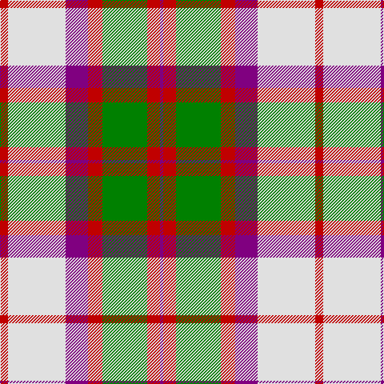

In pattern [BRGRBWR](/stripes/brgrbwr/).

This was sourced from weddslist.  It is a [7 stripe tartan](/stripes/stripes7/).

Original link http://www.weddslist.com/cgi-bin/tartans/pg.pl?source=sts

## Thread count
R/10 LN72 P28 R18 G56 R16 P/4

## Palette
Each colour and the base-6 reference it is a variant of.

| Colour | Shade | Base |
|---|---|---|
| G | <code style="background-color:#008000;">#008000</code> `oklch(52.0% 0.177 142.5)` <small>#008000</small> | G <code style="background-color:#006100;">#006100</code> |
| LN | <code style="background-color:#E0E0E0;">#E0E0E0</code> `oklch(90.7% 0.000 89.9)` <small>#E0E0E0</small> | W <code style="background-color:#F7F7F7;">#F7F7F7</code> |
| P | <code style="background-color:#800080;">#800080</code> `oklch(42.1% 0.193 328.4)` <small>#800080</small> | B <code style="background-color:#2A418A;">#2A418A</code> |
| R | <code style="background-color:#C00000;">#C00000</code> `oklch(50.7% 0.208 29.2)` <small>#C00000</small> | R <code style="background-color:#CC0000;">#CC0000</code> |

# Sample pattern

## Nearest tartans

The nearest existing variants by ΔTartan distance, with this tartan at the top so the swatches line up against it.

ΔTartan

Tartan

Sett

—

<a href="/ttd/edit/#slug=r5w36p14r9g28r8p2~x2">MacKintosh, Arisaid</a> <a class="nn-out" href="/setts/s7/r5w36p14r9g28r8p2~x2/" title="open its dictionary page">↗</a>

0.49

<a href="/ttd/edit/#slug=r5w36dp14r9g28r8dp2~x2">MacKintosh (Artefact)</a> <a class="nn-out" href="/setts/s7/r5w36dp14r9g28r8dp2~x2/" title="open its dictionary page">↗</a>

0.98

<a href="/ttd/edit/#slug=do2lo2do15lo1w10lo15lo2lo2~x2">Bannockbane Orange Stripes</a> <a class="nn-out" href="/setts/s8/do2lo2do15lo1w10lo15lo2lo2~x2/" title="open its dictionary page">↗</a>

0.99

<a href="/ttd/edit/#slug=r6dg3w22r5w5k9dg16r4k1r4~x2">MacDuff Dress #3</a> <a class="nn-out" href="/setts/s10/r6dg3w22r5w5k9dg16r4k1r4~x2/" title="open its dictionary page">↗</a>

1.18

<a href="/ttd/edit/#slug=r6g3w22r5w5k9g16r4k1r4~x2">MacDuff, dress</a> <a class="nn-out" href="/setts/s10/r6g3w22r5w5k9g16r4k1r4~x2/" title="open its dictionary page">↗</a>

1.20

<a href="/ttd/edit/#slug=g3r12g12lo5r1w25g2r1~x2">Dogwood Trade Tartan Tartan Number: 913. Earliest known date: 1968 The registered tartan of the Dinwiddie Clan. Dinwiddies are normally associated with the Maxwells, but Lord Lyon stated, in 1988, that Dinwiddies were a sept of no other clan. See products available Copyright © Blair Urquhart, Comrie, 2015</a> <a class="nn-out" href="/setts/s8/g3r12g12lo5r1w25g2r1~x2/" title="open its dictionary page">↗</a>

1.21

<a href="/ttd/edit/#slug=ly6r6ly6r6ly6k1db18w2db1w4~x2">Catalunya Escocia</a> <a class="nn-out" href="/setts/s10/ly6r6ly6r6ly6k1db18w2db1w4~x2/" title="open its dictionary page">↗</a>

1.21

<a href="/ttd/edit/#slug=do4r3do21r2w14o22r3o4~x2">Bannock Bane M.405</a> <a class="nn-out" href="/setts/s8/do4r3do21r2w14o22r3o4~x2/" title="open its dictionary page">↗</a>

1.21

<a href="/ttd/edit/#slug=r1w12g6r8lb3lo1~x4">MacLean Dress (Lumsden)</a> <a class="nn-out" href="/setts/s6/r1w12g6r8lb3lo1~x4/" title="open its dictionary page">↗</a>

1.22

<a href="/ttd/edit/#slug=r34w3g4g23w24k3g4~x2">MacLachlan Dress Clan Tartan Tartan Number: 828. Earliest known date: 1990 Based on the MacLachlan pattern in Old And Rare See products available Copyright © Blair Urquhart, Comrie, 2015</a> <a class="nn-out" href="/setts/s7/r34w3g4g23w24k3g4~x2/" title="open its dictionary page">↗</a>

1.23

<a href="/ttd/edit/#slug=dr4ly2dr13ly1w8t13ly2t4~x2">Bannockbane, Dark Tan</a> <a class="nn-out" href="/setts/s8/dr4ly2dr13ly1w8t13ly2t4~x2/" title="open its dictionary page">↗</a>

## Neighbour map

Every grey dot is one of 14299 variants placed by the first two principal components of the ΔTartan feature space (44% of its variance). Red is this tartan; blue dots are its nearest — click one to open its page.

<svg viewBox="0 0 640 380" role="img" style="max-width:100%;height:auto;border:1px solid #e0e0e0;border-radius:4px;display:block" xmlns="http://www.w3.org/2000/svg"><image href="/nn/cloud.v1.png" width="640" height="380"/><a href="/setts/s7/r5w36dp14r9g28r8dp2~x2/"><circle cx="166.9" cy="156.6" r="4" fill="#3465a4"><title>MacKintosh (Artefact)</title></circle></a><a href="/setts/s8/do2lo2do15lo1w10lo15lo2lo2~x2/"><circle cx="185.6" cy="151.1" r="4" fill="#3465a4"><title>Bannockbane Orange Stripes</title></circle></a><a href="/setts/s10/r6dg3w22r5w5k9dg16r4k1r4~x2/"><circle cx="167.5" cy="128.5" r="4" fill="#3465a4"><title>MacDuff Dress #3</title></circle></a><a href="/setts/s10/r6g3w22r5w5k9g16r4k1r4~x2/"><circle cx="160.3" cy="127.8" r="4" fill="#3465a4"><title>MacDuff, dress</title></circle></a><a href="/setts/s8/g3r12g12lo5r1w25g2r1~x2/"><circle cx="223.1" cy="124.7" r="4" fill="#3465a4"><title>Dogwood Trade Tartan Tartan Number: 913. Earliest known date: 1968 The registered tartan of the Dinwiddie Clan. Dinwiddies are normally associated with the Maxwells, but Lord Lyon stated, in 1988, that Dinwiddies were a sept of no other clan. See products available Copyright © Blair Urquhart, Comrie, 2015</title></circle></a><a href="/setts/s10/ly6r6ly6r6ly6k1db18w2db1w4~x2/"><circle cx="135.7" cy="116.2" r="4" fill="#3465a4"><title>Catalunya Escocia</title></circle></a><a href="/setts/s8/do4r3do21r2w14o22r3o4~x2/"><circle cx="185.4" cy="171.2" r="4" fill="#3465a4"><title>Bannock Bane M.405</title></circle></a><a href="/setts/s6/r1w12g6r8lb3lo1~x4/"><circle cx="149.5" cy="158.8" r="4" fill="#3465a4"><title>MacLean Dress (Lumsden)</title></circle></a><a href="/setts/s7/r34w3g4g23w24k3g4~x2/"><circle cx="154.6" cy="155.2" r="4" fill="#3465a4"><title>MacLachlan Dress Clan Tartan Tartan Number: 828. Earliest known date: 1990 Based on the MacLachlan pattern in Old And Rare See products available Copyright © Blair Urquhart, Comrie, 2015</title></circle></a><a href="/setts/s8/dr4ly2dr13ly1w8t13ly2t4~x2/"><circle cx="163.9" cy="170.8" r="4" fill="#3465a4"><title>Bannockbane, Dark Tan</title></circle></a><circle cx="170.0" cy="154.8" r="5" fill="#c00000"/></svg>

ID: /setts/s7/r5w36p14r9g28r8p2~x2/
