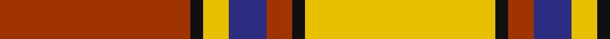
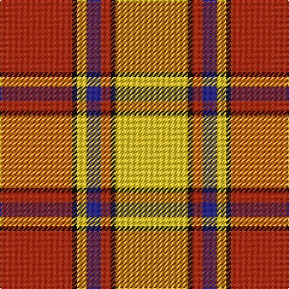

In pattern [RKYBRKY](/patterns/rkybrky/).

This was sourced from house-of-tartan.  It is a [7 stripes tartan](/stripes/stripes7/).

Original link http://www.house-of-tartan.scotland.net/house/TartanViewjs.asp?colr=Def&tnam=1627

## Thread count
R/60 K4 Y8 DB12 R8 K4 Y/60

## Palette
Each colour and its ΔE from the base-6 reference it is a variant of.

| Colour | Shade | Base | ΔE (OKLab) |
|---|---|---|---|
| DB | <code style="background-color:#2C2C80;">#2C2C80</code> `#2C2C80` | B <code style="background-color:#2C4084;">#2C4084</code> | 0.05 |
| K | <code style="background-color:#101010;">#101010</code> `#101010` | K <code style="background-color:#000000;">#000000</code> | 0.17 |
| R | <code style="background-color:#A03400;">#A03400</code> `#A03400` | R <code style="background-color:#C80000;">#C80000</code> | 0.08 |
| Y | <code style="background-color:#E8C000;">#E8C000</code> `#E8C000` | Y <code style="background-color:#E8C000;">#E8C000</code> | 0.00 |

# Sample pattern

## Nearest tartans

The nearest existing variants by ΔTartan distance.

1. [Fernandes (Personal)](/setts/s7/g10y10g10y70r88ra6r6-g289c18-r880000-rac80000-ye8c000/) — ΔT 0.45
1. [Scrymgeour](/setts/s7/r90k6y12b18r12k6y90-b000052-k000000-raa0000-yaaaa00/) — ΔT 0.66
1. [Scrymgeour](/setts/s7/r45k3y6b9r6k3y45-b000052-k000000-raa0000-yaaaa00/) — ΔT 0.66
1. [Scrymgeour](/setts/s7/r46k3y6b8r6k3y46-b00004c-k000000-rc80000-yffc800/) — ΔT 0.98
1. [Brisbane (Artefact)](/setts/s8/g72w12y4r8y4r12y4r40-g006818-rc80000-wffffff-ye8c000/) — ΔT 1.00
1. [Starr (1978) (Name)](/setts/s7/k8r16w4r40g48r8w8-g00881c-k101010-rc80000-we0e0e0/) — ΔT 1.04
1. [Brisbane (Artefact)](/setts/s8/g72w12y4r8y4r12y4r40-g006818-rc80000-wc0c0c0-ye8c000/) — ΔT 1.24
1. [Karibu (Corporate)](/setts/s9/g48w4r4w16r4w4r32y8r4-g006818-rc80000-wfcfcfc-ye8c000/) — ΔT 1.28
1. [Glassary #3](/setts/s8/b16y4r48y8r8y48r4y16-b2c2c80-rc80000-ye8c000/) — ΔT 1.38
1. [Karibu Corporate Tartan Tartan Number: 10674. Earliest known date: 15 August 2012 The colours of the Karibu tartan are those of Karibu Scotland. Karibu (meaning 'welcome' in Swahili) was set-up in 2004 by Henriette Koubakouenda in her living room in Glasgow. She saw a need to provide support to the refugees and asylum seekers arriving in Glasgow at that time as part of the Asylum Seeker's Dispersal Programme. Karibu Scotland now has over 100 members, representing 12 African countries, with premises in the Pearce Institute in the Govan area of Glasgow. The organisation runs multiple projects throughout the city to promote the confidence, skills and integration of African women. See products available Copyright © Blair Urquhart, Comrie, 2015](/setts/s9/g48w4r4w16r4w4r32y8r4-g008b00-rff0000-wffffff-yffe600/) — ΔT 1.38

## Neighbour map

Every grey dot is one of 15726 variants placed by the first two principal components of the ΔTartan feature space (44% of its variance). Red is this tartan; blue dots are its nearest — click one to open its page.

<svg viewBox="0 0 640 380" role="img" style="max-width:100%;height:auto;border:1px solid #e0e0e0;border-radius:4px;display:block" xmlns="http://www.w3.org/2000/svg"><image href="/nn/cloud.v1.png" width="640" height="380"/><a href="/setts/s7/g10y10g10y70r88ra6r6-g289c18-r880000-rac80000-ye8c000/"><circle cx="284.5" cy="145.9" r="4" fill="#3465a4"><title>Fernandes (Personal)</title></circle></a><a href="/setts/s7/r90k6y12b18r12k6y90-b000052-k000000-raa0000-yaaaa00/"><circle cx="266.2" cy="151.3" r="4" fill="#3465a4"><title>Scrymgeour</title></circle></a><a href="/setts/s7/r45k3y6b9r6k3y45-b000052-k000000-raa0000-yaaaa00/"><circle cx="266.2" cy="151.3" r="4" fill="#3465a4"><title>Scrymgeour</title></circle></a><a href="/setts/s7/r46k3y6b8r6k3y46-b00004c-k000000-rc80000-yffc800/"><circle cx="263.3" cy="134.8" r="4" fill="#3465a4"><title>Scrymgeour</title></circle></a><a href="/setts/s8/g72w12y4r8y4r12y4r40-g006818-rc80000-wffffff-ye8c000/"><circle cx="281.1" cy="138.9" r="4" fill="#3465a4"><title>Brisbane (Artefact)</title></circle></a><a href="/setts/s7/k8r16w4r40g48r8w8-g00881c-k101010-rc80000-we0e0e0/"><circle cx="264.5" cy="178.7" r="4" fill="#3465a4"><title>Starr (1978) (Name)</title></circle></a><a href="/setts/s8/g72w12y4r8y4r12y4r40-g006818-rc80000-wc0c0c0-ye8c000/"><circle cx="296.0" cy="145.9" r="4" fill="#3465a4"><title>Brisbane (Artefact)</title></circle></a><a href="/setts/s9/g48w4r4w16r4w4r32y8r4-g006818-rc80000-wfcfcfc-ye8c000/"><circle cx="198.5" cy="142.1" r="4" fill="#3465a4"><title>Karibu (Corporate)</title></circle></a><a href="/setts/s8/b16y4r48y8r8y48r4y16-b2c2c80-rc80000-ye8c000/"><circle cx="299.5" cy="174.9" r="4" fill="#3465a4"><title>Glassary #3</title></circle></a><a href="/setts/s9/g48w4r4w16r4w4r32y8r4-g008b00-rff0000-wffffff-yffe600/"><circle cx="197.5" cy="137.4" r="4" fill="#3465a4"><title>Karibu Corporate Tartan Tartan Number: 10674. Earliest known date: 15 August 2012 The colours of the Karibu tartan are those of Karibu Scotland. Karibu (meaning 'welcome' in Swahili) was set-up in 2004 by Henriette Koubakouenda in her living room in Glasgow. She saw a need to provide support to the refugees and asylum seekers arriving in Glasgow at that time as part of the Asylum Seeker's Dispersal Programme. Karibu Scotland now has over 100 members, representing 12 African countries, with premises in the Pearce Institute in the Govan area of Glasgow. The organisation runs multiple projects throughout the city to promote the confidence, skills and integration of African women. See products available Copyright © Blair Urquhart, Comrie, 2015</title></circle></a><circle cx="267.2" cy="148.3" r="5" fill="#c00000"/></svg>

ID: /setts/s7/r60k4y8b12r8k4y60-b2c2c80-k101010-ra03400-ye8c000/
