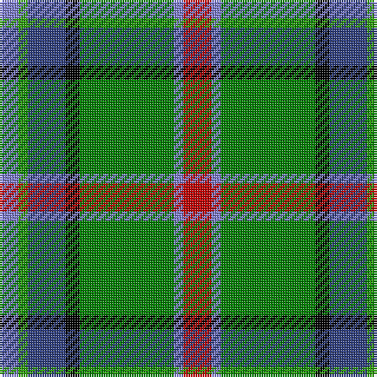

In pattern [BGBKGBR](/patterns/bgbkgbr/).

This was sourced from weddslist.  It is a [7 stripes tartan](/stripes/stripes7/).

Original link http://www.weddslist.com/cgi-bin/tartans/pg.pl?source=sts

## Thread count
B/8 G4 Ba16 K6 Ga40 B4 R/12

## Palette
Each colour and its ΔE from the base-6 reference it is a variant of.

| Colour | Shade | Base | ΔE (OKLab) |
|---|---|---|---|
| B | <code style="background-color:#8080D0;">#8080D0</code> `#8080D0` | B <code style="background-color:#2A418A;">#2A418A</code> | 0.24 |
| Ba | <code style="background-color:#304080;">#304080</code> `#304080` | B <code style="background-color:#2A418A;">#2A418A</code> | 0.02 |
| G | <code style="background-color:#30A010;">#30A010</code> `#30A010` | G <code style="background-color:#006100;">#006100</code> | 0.20 |
| Ga | <code style="background-color:#008000;">#008000</code> `#008000` | G <code style="background-color:#006100;">#006100</code> | 0.10 |
| K | <code style="background-color:#000000;">#000000</code> `#000000` | K <code style="background-color:#000000;">#000000</code> | 0.00 |
| R | <code style="background-color:#C00000;">#C00000</code> `#C00000` | R <code style="background-color:#CC0000;">#CC0000</code> | 0.03 |

# Sample pattern

## Nearest tartans

The nearest existing variants by ΔTartan distance.

1. [Carleton College Rugby](/setts/s6/r5b30w3g15y8ra4x2~b003c64-g004c00-rb07430-rac80000-wf8f8f8-yfccc00/) — ΔT 0.78
1. [Royal British Legion (Corporate)](/setts/s7/r3w2g20k3b8ga2w2x2~b2c2c80-g006818-ga289c18-k101010-rc80000-w98c8e8/) — ΔT 0.86
1. [Mission](/setts/s8/r2b14k1g11k2y2ga2k1x4~b5480b0-g008000-ga407050-k000000-r703000-ye0a0a0/) — ΔT 1.01
1. [Driver (Name)](/setts/s6/g11w11k3y3ga36ya7x2~g006818-ga003820-k101010-we0e0e0-ye8c000-yad87c00/) — ΔT 1.04
1. [Turnbull of Thornton (Personal)](/setts/s6/k6r3g30y10b30w3x2~b2c2c80-g006818-k101010-rc80000-wfcfcfc-yd8b000/) — ΔT 1.05
1. [Ayrshire](/setts/s8/b2r1b10w1ra4g8y1g2x4~b304080-g008000-rc00000-ra806050-we0e0e0-yf0c000/) — ΔT 1.07
1. [East Lothian](/setts/s7/b6ba17bb4ba2k11g33y4x2~b5480b0-ba304080-bb800080-g008000-k000000-yf0c000/) — ΔT 1.09
1. [Mission](/setts/s8/y2b14k1g11k2w2ga2k1x4~b5c8ca8-g006818-ga408060-k101010-wffe1ff-yffa500/) — ΔT 1.09
1. [Crofters (Personal)](/setts/s7/b20r2g9w6y4k2g8x2~b2c4084-g309c18-k101010-rdc0000-we0e0e0-ye8c000/) — ΔT 1.10
1. [Lundy (Personal)](/setts/s7/w2k2g8ga8r1ga1wa1x4~g006818-ga048888-k101010-rc80000-w98c8e8-waf8f8f8/) — ΔT 1.11

## Neighbour map

Every grey dot is one of 15726 variants placed by the first two principal components of the ΔTartan feature space (44% of its variance). Red is this tartan; blue dots are its nearest — click one to open its page.

<svg viewBox="0 0 640 380" role="img" style="max-width:100%;height:auto;border:1px solid #e0e0e0;border-radius:4px;display:block" xmlns="http://www.w3.org/2000/svg"><image href="/nn/cloud.v1.png" width="640" height="380"/><a href="/setts/s6/r5b30w3g15y8ra4x2~b003c64-g004c00-rb07430-rac80000-wf8f8f8-yfccc00/"><circle cx="169.0" cy="167.5" r="4" fill="#3465a4"><title>Carleton College Rugby</title></circle></a><a href="/setts/s7/r3w2g20k3b8ga2w2x2~b2c2c80-g006818-ga289c18-k101010-rc80000-w98c8e8/"><circle cx="216.1" cy="157.7" r="4" fill="#3465a4"><title>Royal British Legion (Corporate)</title></circle></a><a href="/setts/s8/r2b14k1g11k2y2ga2k1x4~b5480b0-g008000-ga407050-k000000-r703000-ye0a0a0/"><circle cx="171.1" cy="132.3" r="4" fill="#3465a4"><title>Mission</title></circle></a><a href="/setts/s6/g11w11k3y3ga36ya7x2~g006818-ga003820-k101010-we0e0e0-ye8c000-yad87c00/"><circle cx="199.2" cy="155.3" r="4" fill="#3465a4"><title>Driver (Name)</title></circle></a><a href="/setts/s6/k6r3g30y10b30w3x2~b2c2c80-g006818-k101010-rc80000-wfcfcfc-yd8b000/"><circle cx="140.5" cy="171.2" r="4" fill="#3465a4"><title>Turnbull of Thornton (Personal)</title></circle></a><a href="/setts/s8/b2r1b10w1ra4g8y1g2x4~b304080-g008000-rc00000-ra806050-we0e0e0-yf0c000/"><circle cx="189.2" cy="167.4" r="4" fill="#3465a4"><title>Ayrshire</title></circle></a><a href="/setts/s7/b6ba17bb4ba2k11g33y4x2~b5480b0-ba304080-bb800080-g008000-k000000-yf0c000/"><circle cx="167.0" cy="142.8" r="4" fill="#3465a4"><title>East Lothian</title></circle></a><a href="/setts/s8/y2b14k1g11k2w2ga2k1x4~b5c8ca8-g006818-ga408060-k101010-wffe1ff-yffa500/"><circle cx="178.5" cy="133.0" r="4" fill="#3465a4"><title>Mission</title></circle></a><a href="/setts/s7/b20r2g9w6y4k2g8x2~b2c4084-g309c18-k101010-rdc0000-we0e0e0-ye8c000/"><circle cx="127.3" cy="162.9" r="4" fill="#3465a4"><title>Crofters (Personal)</title></circle></a><a href="/setts/s7/w2k2g8ga8r1ga1wa1x4~g006818-ga048888-k101010-rc80000-w98c8e8-waf8f8f8/"><circle cx="154.5" cy="176.4" r="4" fill="#3465a4"><title>Lundy (Personal)</title></circle></a><circle cx="165.7" cy="161.7" r="5" fill="#c00000"/></svg>

ID: /setts/s7/r6b2g20k3ba8ga2b4x2~b8080d0-ba304080-g008000-ga30a010-k000000-rc00000/
