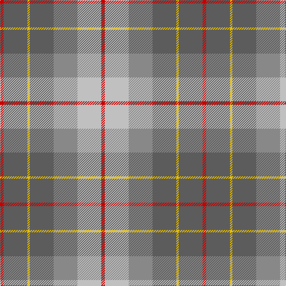

In pattern [RBYBRWR](/patterns/rbybrwr/).

This was sourced from house-of-tartan.  It is a [7 stripes tartan](/stripes/stripes7/).

Original link http://www.house-of-tartan.scotland.net/house/TartanViewjs.asp?colr=Def&tnam=1630

## Thread count
R/6 N40 Y4 N40 Na40 Nb40 R/6

## Palette
Each colour and its ΔE from the base-6 reference it is a variant of.

| Colour | Shade | Base | ΔE (OKLab) |
|---|---|---|---|
| N | <code style="background-color:#5C5C5C;">#5C5C5C</code> `#5C5C5C` | B <code style="background-color:#2C4084;">#2C4084</code> | 0.14 |
| Na | <code style="background-color:#888888;">#888888</code> `#888888` | R <code style="background-color:#C80000;">#C80000</code> | 0.24 |
| Nb | <code style="background-color:#C0C0C0;">#C0C0C0</code> `#C0C0C0` | W <code style="background-color:#F4F4F0;">#F4F4F0</code> | 0.16 |
| R | <code style="background-color:#C80000;">#C80000</code> `#C80000` | R <code style="background-color:#C80000;">#C80000</code> | 0.00 |
| Y | <code style="background-color:#E8C000;">#E8C000</code> `#E8C000` | Y <code style="background-color:#E8C000;">#E8C000</code> | 0.00 |

# Sample pattern

## Nearest tartans

The nearest existing variants by ΔTartan distance.

1. [Brodie Silver](/setts/s7/r6b40k4b40ra40w40r6-b5c5c5c-k000000-rc80000-ra888888-wc0c0c0/) — ΔT 0.62
1. [Brodie, Silver](/setts/s7/r6b40y4b40g40w40r6-b505050-g808080-rc00000-wc0c0c0-yf0c000/) — ΔT 0.62
1. [Buchanhaven Heritage](/setts/s7/b48r54g40y12g40r4w6-b5c8ca8-g408060-rc82828-we0e0e0-ye0a126/) — ΔT 0.85
1. [Rotary Corporate Tartan Tartan Number: 2187. Earliest known date: 1995 The tartan was designed by K. Lumsden of the Scottish Tartans Society in conjuntion with the Rotary Club of Glasgow. It was decided to use as a base the City of Glasgow Tartan; the colours being brightened and the gold and the deep blue of the Rotary Wheel added. The actual shades are specific Rotary colours. The tartan is currently available only from Geoffrey (Tailor) Highland Crafts, The Royal Mile, Edinburgh. See products available Copyright © Blair Urquhart, Comrie, 2015](/setts/s7/g38r6b38r22g38y4ba8-b5c8ca8-ba2c2c80-g5c6428-rc80000-ye8c000/) — ΔT 0.97
1. [Hawaii (District)](/setts/s8/b16r4y4b48ba16g40y4r12-b5c8ca8-ba4c3428-g406054-rc80000-ye8c000/) — ΔT 1.03
1. [Sterling, Rob (Florida) (Persona Name Tartan Tartan Number: 10653. Earliest known date: 10/07/2012 Designed by Rob Sterling, St. Petersburg, Florida, for use by his family and associates. See products available Copyright © Blair Urquhart, Comrie, 2015](/setts/s5/g22y20b22ba66w6-b433a5a-ba5f749c-g649848-wf9f5ef-ye0a126/) — ΔT 1.12
1. [McHale (Personal)](/setts/s6/g30k20b60r22w6g10-b5c5c5c-g74846c-k101010-ra07c58-wfcfcfc/) — ΔT 1.18
1. [Balfour](/setts/s6/b60y6r22y6g66ra12-b304080-g808080-r806050-rac00000-yf0c000/) — ΔT 1.25
1. [Un-named Dutch](/setts/s7/b4r20b20ra6r4y48w4-b5c5c5c-r880000-ra888888-wf8f8f8-ya0a0a0/) — ΔT 1.35
1. [Organic](/setts/s9/g50b6g16b26y16ya4yb22g4b6-b9058d8-g669999-yc89800-yaa0a0a0-ybc4bc68/) — ΔT 1.36

## Neighbour map

Every grey dot is one of 15726 variants placed by the first two principal components of the ΔTartan feature space (44% of its variance). Red is this tartan; blue dots are its nearest — click one to open its page.

<svg viewBox="0 0 640 380" role="img" style="max-width:100%;height:auto;border:1px solid #e0e0e0;border-radius:4px;display:block" xmlns="http://www.w3.org/2000/svg"><image href="/nn/cloud.v1.png" width="640" height="380"/><a href="/setts/s7/r6b40k4b40ra40w40r6-b5c5c5c-k000000-rc80000-ra888888-wc0c0c0/"><circle cx="218.0" cy="204.3" r="4" fill="#3465a4"><title>Brodie Silver</title></circle></a><a href="/setts/s7/r6b40y4b40g40w40r6-b505050-g808080-rc00000-wc0c0c0-yf0c000/"><circle cx="219.5" cy="204.8" r="4" fill="#3465a4"><title>Brodie, Silver</title></circle></a><a href="/setts/s7/b48r54g40y12g40r4w6-b5c8ca8-g408060-rc82828-we0e0e0-ye0a126/"><circle cx="223.2" cy="203.6" r="4" fill="#3465a4"><title>Buchanhaven Heritage</title></circle></a><a href="/setts/s7/g38r6b38r22g38y4ba8-b5c8ca8-ba2c2c80-g5c6428-rc80000-ye8c000/"><circle cx="263.8" cy="220.7" r="4" fill="#3465a4"><title>Rotary Corporate Tartan Tartan Number: 2187. Earliest known date: 1995 The tartan was designed by K. Lumsden of the Scottish Tartans Society in conjuntion with the Rotary Club of Glasgow. It was decided to use as a base the City of Glasgow Tartan; the colours being brightened and the gold and the deep blue of the Rotary Wheel added. The actual shades are specific Rotary colours. The tartan is currently available only from Geoffrey (Tailor) Highland Crafts, The Royal Mile, Edinburgh. See products available Copyright © Blair Urquhart, Comrie, 2015</title></circle></a><a href="/setts/s8/b16r4y4b48ba16g40y4r12-b5c8ca8-ba4c3428-g406054-rc80000-ye8c000/"><circle cx="246.3" cy="185.6" r="4" fill="#3465a4"><title>Hawaii (District)</title></circle></a><a href="/setts/s5/g22y20b22ba66w6-b433a5a-ba5f749c-g649848-wf9f5ef-ye0a126/"><circle cx="240.4" cy="211.5" r="4" fill="#3465a4"><title>Sterling, Rob (Florida) (Persona Name Tartan Tartan Number: 10653. Earliest known date: 10/07/2012 Designed by Rob Sterling, St. Petersburg, Florida, for use by his family and associates. See products available Copyright © Blair Urquhart, Comrie, 2015</title></circle></a><a href="/setts/s6/g30k20b60r22w6g10-b5c5c5c-g74846c-k101010-ra07c58-wfcfcfc/"><circle cx="197.8" cy="213.9" r="4" fill="#3465a4"><title>McHale (Personal)</title></circle></a><a href="/setts/s6/b60y6r22y6g66ra12-b304080-g808080-r806050-rac00000-yf0c000/"><circle cx="225.9" cy="199.3" r="4" fill="#3465a4"><title>Balfour</title></circle></a><a href="/setts/s7/b4r20b20ra6r4y48w4-b5c5c5c-r880000-ra888888-wf8f8f8-ya0a0a0/"><circle cx="248.9" cy="167.5" r="4" fill="#3465a4"><title>Un-named Dutch</title></circle></a><a href="/setts/s9/g50b6g16b26y16ya4yb22g4b6-b9058d8-g669999-yc89800-yaa0a0a0-ybc4bc68/"><circle cx="266.5" cy="184.4" r="4" fill="#3465a4"><title>Organic</title></circle></a><circle cx="234.5" cy="210.7" r="5" fill="#c00000"/></svg>

ID: /setts/s7/r6b40y4b40ra40w40r6-b5c5c5c-rc80000-ra888888-wc0c0c0-ye8c000/
