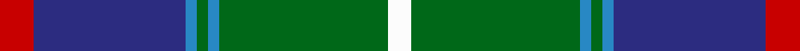
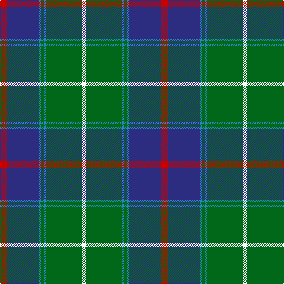

**Bands:** [RBBGBGW](/stripes/rbbgbgw/) · **Stripes:** [R DB T G T G W](/stripes/stripes7/) R DB T G T G W

This was sourced from register-of-tartans.  It is a [7 band tartan](/bands/bands7/).

Original link https://www.tartanregister.gov.uk/tartanDetails.aspx?ref=5070

## Attestations

This cloth appears in 2 source records; the oldest owns this page.

- 01/01/2004 — MX-5 Owners' Club (register-of-tartans, [record](https://www.tartanregister.gov.uk/tartanDetails.aspx?ref=5070))
- pre 2004 — MX-5 Owners' Club (Corporate) (tartans-authority, [record](http://www.tartansauthority.com/tartan-ferret/display/6208/))

## Register references

External register numbers recorded for this tartan.

- Scottish Register of Tartans: [5070](https://www.tartanregister.gov.uk/tartanDetails.aspx?ref=5070)
- Scottish Tartans Authority (ITI): 6208
- Scottish Tartans World Register: 2950

## Thread count
R/12 DB54 B4 G4 B4 G60 W/8

## Palette
Each colour and its ΔE from the base-6 reference it is a variant of.

| Colour | Shade | Base | ΔE (OKLab) |
|---|---|---|---|
| B | <code style="background-color:#2888C4;">#2888C4</code> `#2888C4` | B <code style="background-color:#2A418A;">#2A418A</code> | 0.21 |
| DB | <code style="background-color:#2C2C80;">#2C2C80</code> `#2C2C80` | B <code style="background-color:#2A418A;">#2A418A</code> | 0.06 |
| G | <code style="background-color:#006818;">#006818</code> `#006818` | G <code style="background-color:#006100;">#006100</code> | 0.02 |
| R | <code style="background-color:#C80000;">#C80000</code> `#C80000` | R <code style="background-color:#CC0000;">#CC0000</code> | 0.01 |
| W | <code style="background-color:#FCFCFC;">#FCFCFC</code> `#FCFCFC` | W <code style="background-color:#F7F7F7;">#F7F7F7</code> | 0.01 |

# Sample pattern

## Nearest tartans

The nearest existing variants by ΔTartan distance.

1. [Snodgrass](/setts/s8/k3r1ly1db11g13db5r1ly1~x2/) — ΔT 0.69
1. [Heckenberg Htg (Personal)](/setts/s7/db3g13t1r3t1db10ly1~x2/) — ΔT 0.70
1. [State Seal of Washington (Fashion)](/setts/s7/b5dy28lb5k20lo5b47lo4~x2/) — ΔT 0.80
1. [MacCord / McCord (Personal)](/setts/s7/dg6r2db1r3db16g20w2~x2/) — ΔT 0.84
1. [Pride of Yorkland (Fashion)](/setts/s6/g35k3db26k4db4w3~x2/) — ΔT 0.86
1. [Carmichael](/setts/s6/k5g32db32r3db3ly3~x2/) — ΔT 0.91
1. [Wishart Htg (Clan)](/setts/s7/k7db4dg31db3ly2db27lb4~x2/) — ΔT 0.91
1. [Ferguson of Atholl Clan](/setts/s7/b24k8g8r2g8k1w2~x2/) — ΔT 0.96
1. [Canine All Dogs](/setts/s6/r5t3g24db24r4ly2~x2/) — ΔT 0.99
1. [Dunbartonshire](/setts/s9/g11k2g1m4db1m4db13lt2db1~x4/) — ΔT 1.00

## Neighbour map

Every grey dot is one of 14299 variants placed by the first two principal components of the ΔTartan feature space (44% of its variance). Red is this tartan; blue dots are its nearest — click one to open its page.

<svg viewBox="0 0 640 380" role="img" style="max-width:100%;height:auto;border:1px solid #e0e0e0;border-radius:4px;display:block" xmlns="http://www.w3.org/2000/svg"><image href="/nn/cloud.v1.png" width="640" height="380"/><a href="/setts/s8/k3r1ly1db11g13db5r1ly1~x2/"><circle cx="222.0" cy="161.1" r="4" fill="#3465a4"><title>Snodgrass</title></circle></a><a href="/setts/s7/db3g13t1r3t1db10ly1~x2/"><circle cx="236.5" cy="178.7" r="4" fill="#3465a4"><title>Heckenberg Htg (Personal)</title></circle></a><a href="/setts/s7/b5dy28lb5k20lo5b47lo4~x2/"><circle cx="219.0" cy="176.9" r="4" fill="#3465a4"><title>State Seal of Washington (Fashion)</title></circle></a><a href="/setts/s7/dg6r2db1r3db16g20w2~x2/"><circle cx="226.6" cy="157.6" r="4" fill="#3465a4"><title>MacCord / McCord (Personal)</title></circle></a><a href="/setts/s6/g35k3db26k4db4w3~x2/"><circle cx="252.7" cy="188.1" r="4" fill="#3465a4"><title>Pride of Yorkland (Fashion)</title></circle></a><a href="/setts/s6/k5g32db32r3db3ly3~x2/"><circle cx="250.9" cy="188.4" r="4" fill="#3465a4"><title>Carmichael</title></circle></a><a href="/setts/s7/k7db4dg31db3ly2db27lb4~x2/"><circle cx="246.9" cy="169.1" r="4" fill="#3465a4"><title>Wishart Htg (Clan)</title></circle></a><a href="/setts/s7/b24k8g8r2g8k1w2~x2/"><circle cx="253.7" cy="157.0" r="4" fill="#3465a4"><title>Ferguson of Atholl Clan</title></circle></a><a href="/setts/s6/r5t3g24db24r4ly2~x2/"><circle cx="218.8" cy="188.2" r="4" fill="#3465a4"><title>Canine All Dogs</title></circle></a><a href="/setts/s9/g11k2g1m4db1m4db13lt2db1~x4/"><circle cx="195.6" cy="161.6" r="4" fill="#3465a4"><title>Dunbartonshire</title></circle></a><circle cx="242.9" cy="158.5" r="5" fill="#c00000"/></svg>

ID: /setts/s7/r6db27t2g2t2g30w4~x2/
