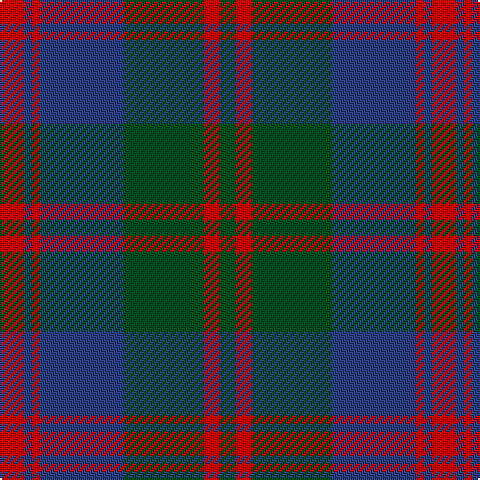

This page is one **sett** — a single exact thread-count. It belongs to the [tartan](/tartans/r6db2r2db21dg20r4dg4/)
(the same proportion at any scale), whose colour order is pattern [GRGBRBR](/stripes/grgbrbr/).

Sourced from register-of-tartans.  It is a [7 stripe tartan](/stripes/stripes7/).

Original link https://www.tartanregister.gov.uk/tartanDetails.aspx?ref=3535

## Register references

External register numbers recorded for this tartan.

- Scottish Register of Tartans: [3535](https://www.tartanregister.gov.uk/tartanDetails.aspx?ref=3535)
- Scottish Tartans World Register: 887

## Thread count
R/12 B4 R4 B42 G40 R8 G/8

## Palette

Palette: <strong>Tartan Register</strong>
<table><thead><tr><th>Colour</th><th>Threads</th><th>Shade</th><th>Base</th><th>OKLCh</th></tr></thead><tbody><tr><td>R/</td><td style="text-align:right;font-variant-numeric:tabular-nums">12</td><td><code style="background-color:#DC0000;">#DC0000</code> <small style="color:#888">#DC0000</small></td><td>R <code style="background-color:#CC0000;">#CC0000</code></td><td><small style="color:#888">oklch(56.2% 0.230 29.2)</small></td></tr><tr><td>B</td><td style="text-align:right;font-variant-numeric:tabular-nums">4</td><td><code style="background-color:#2C4084;">#2C4084</code> <small style="color:#888">#2C4084</small></td><td>B <code style="background-color:#2A418A;">#2A418A</code></td><td><small style="color:#888">oklch(39.4% 0.117 268.3)</small></td></tr><tr><td>R</td><td style="text-align:right;font-variant-numeric:tabular-nums">4</td><td><code style="background-color:#DC0000;">#DC0000</code> <small style="color:#888">#DC0000</small></td><td>R <code style="background-color:#CC0000;">#CC0000</code></td><td><small style="color:#888">oklch(56.2% 0.230 29.2)</small></td></tr><tr><td>B</td><td style="text-align:right;font-variant-numeric:tabular-nums">42</td><td><code style="background-color:#2C4084;">#2C4084</code> <small style="color:#888">#2C4084</small></td><td>B <code style="background-color:#2A418A;">#2A418A</code></td><td><small style="color:#888">oklch(39.4% 0.117 268.3)</small></td></tr><tr><td>G</td><td style="text-align:right;font-variant-numeric:tabular-nums">40</td><td><code style="background-color:#005020;">#005020</code> <small style="color:#888">#005020</small></td><td>G <code style="background-color:#006100;">#006100</code></td><td><small style="color:#888">oklch(37.7% 0.105 149.6)</small></td></tr><tr><td>R</td><td style="text-align:right;font-variant-numeric:tabular-nums">8</td><td><code style="background-color:#DC0000;">#DC0000</code> <small style="color:#888">#DC0000</small></td><td>R <code style="background-color:#CC0000;">#CC0000</code></td><td><small style="color:#888">oklch(56.2% 0.230 29.2)</small></td></tr><tr><td>G/</td><td style="text-align:right;font-variant-numeric:tabular-nums">8</td><td><code style="background-color:#005020;">#005020</code> <small style="color:#888">#005020</small></td><td>G <code style="background-color:#006100;">#006100</code></td><td><small style="color:#888">oklch(37.7% 0.105 149.6)</small></td></tr></tbody></table>

# Sample pattern

## Nearest tartans

The nearest existing variants by ΔTartan distance, with this tartan at the top so the swatches line up against it.

ΔTartan

Tartan

Sett

—

<a href="/ttd/edit/#slug=r6db2r2db21dg20r4dg4~x2">Robertson of Struan</a> <a class="nn-out" href="/setts/s7/r6db2r2db21dg20r4dg4~x2/" title="open its dictionary page">↗</a>

0.75

<a href="/ttd/edit/#slug=db8r3db1r3dg14r3db1~x4">Logan</a> <a class="nn-out" href="/setts/s7/db8r3db1r3dg14r3db1~x4/" title="open its dictionary page">↗</a>

0.82

<a href="/ttd/edit/#slug=db9r3db1g9r3db1~x2">Logan #5</a> <a class="nn-out" href="/setts/s6/db9r3db1g9r3db1~x2/" title="open its dictionary page">↗</a>

0.83

<a href="/ttd/edit/#slug=r3db1r1db11g10r2db2~x4">Robertson of Struan 1816</a> <a class="nn-out" href="/setts/s7/r3db1r1db11g10r2db2~x4/" title="open its dictionary page">↗</a>

0.90

<a href="/ttd/edit/#slug=r6db2r2db21g20r4g4~x2">Robertson of Struan</a> <a class="nn-out" href="/setts/s7/r6db2r2db21g20r4g4~x2/" title="open its dictionary page">↗</a>

0.97

<a href="/ttd/edit/#slug=r17db2r2db13r2db2g17db2~x2">Remony (Red)</a> <a class="nn-out" href="/setts/s8/r17db2r2db13r2db2g17db2~x2/" title="open its dictionary page">↗</a>

1.04

<a href="/ttd/edit/#slug=g18db3g3db3g2db8m23db2m4g2~x2">McGlynn</a> <a class="nn-out" href="/setts/s10/g18db3g3db3g2db8m23db2m4g2~x2/" title="open its dictionary page">↗</a>

1.06

<a href="/ttd/edit/#slug=db9r3db1r3g9r3db1~x2">Logan, or Skene</a> <a class="nn-out" href="/setts/s7/db9r3db1r3g9r3db1~x2/" title="open its dictionary page">↗</a>

1.10

<a href="/ttd/edit/#slug=n32k3n3k3o5k8oi21k4~x2">Speyside Grey (Fashion)</a> <a class="nn-out" href="/setts/s8/n32k3n3k3o5k8oi21k4~x2/" title="open its dictionary page">↗</a>

1.10

<a href="/ttd/edit/#slug=n32k3n3k3b5k8o21k4~x2">Speyside Blue (Fashion)</a> <a class="nn-out" href="/setts/s8/n32k3n3k3b5k8o21k4~x2/" title="open its dictionary page">↗</a>

1.15

<a href="/ttd/edit/#slug=db3y2db30y19lo14y2lo3~x2">Bannockbane Brown #2</a> <a class="nn-out" href="/setts/s7/db3y2db30y19lo14y2lo3~x2/" title="open its dictionary page">↗</a>

## Neighbour map

Every grey dot is one of 14359 variants placed by the first two principal components of the ΔTartan feature space (44% of its variance). Red is this tartan; blue dots are its nearest — click one to open its page.

<svg viewBox="0 0 640 380" role="img" style="max-width:100%;height:auto;border:1px solid #e0e0e0;border-radius:4px;display:block" xmlns="http://www.w3.org/2000/svg"><image href="/nn/cloud.v1.png" width="640" height="380"/><a href="/setts/s7/db8r3db1r3dg14r3db1~x4/"><circle cx="288.6" cy="210.5" r="4" fill="#3465a4"><title>Logan</title></circle></a><a href="/setts/s6/db9r3db1g9r3db1~x2/"><circle cx="260.4" cy="243.7" r="4" fill="#3465a4"><title>Logan #5</title></circle></a><a href="/setts/s7/r3db1r1db11g10r2db2~x4/"><circle cx="295.1" cy="220.2" r="4" fill="#3465a4"><title>Robertson of Struan 1816</title></circle></a><a href="/setts/s7/r6db2r2db21g20r4g4~x2/"><circle cx="269.0" cy="222.3" r="4" fill="#3465a4"><title>Robertson of Struan</title></circle></a><a href="/setts/s8/r17db2r2db13r2db2g17db2~x2/"><circle cx="248.0" cy="223.1" r="4" fill="#3465a4"><title>Remony (Red)</title></circle></a><a href="/setts/s10/g18db3g3db3g2db8m23db2m4g2~x2/"><circle cx="287.9" cy="198.6" r="4" fill="#3465a4"><title>McGlynn</title></circle></a><a href="/setts/s7/db9r3db1r3g9r3db1~x2/"><circle cx="235.4" cy="234.0" r="4" fill="#3465a4"><title>Logan, or Skene</title></circle></a><a href="/setts/s8/n32k3n3k3o5k8oi21k4~x2/"><circle cx="270.0" cy="197.9" r="4" fill="#3465a4"><title>Speyside Grey (Fashion)</title></circle></a><a href="/setts/s8/n32k3n3k3b5k8o21k4~x2/"><circle cx="266.9" cy="198.4" r="4" fill="#3465a4"><title>Speyside Blue (Fashion)</title></circle></a><a href="/setts/s7/db3y2db30y19lo14y2lo3~x2/"><circle cx="297.7" cy="202.6" r="4" fill="#3465a4"><title>Bannockbane Brown #2</title></circle></a><circle cx="284.4" cy="229.6" r="5" fill="#c00000"/></svg>

ID: /setts/s7/r6db2r2db21dg20r4dg4~x2/
