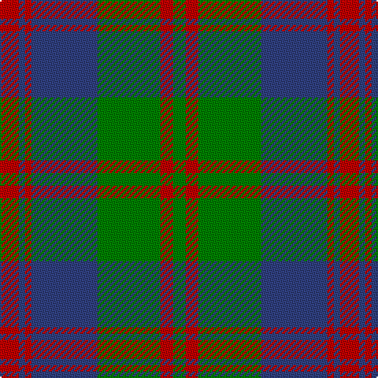

In pattern [GRGBRBR](/stripes/grgbrbr/).

This was sourced from weddslist.  It is a [7 stripe tartan](/stripes/stripes7/).

Original link http://www.weddslist.com/cgi-bin/tartans/pg.pl?source=sts

## Thread count
R/12 B4 R4 B42 G40 R8 G/8

## Palette
Each colour and the base-6 reference it is a variant of.

| Colour | Shade | Base |
|---|---|---|
| B | <code style="background-color:#304080;">#304080</code> `oklch(39.4% 0.109 270.2)` <small>#304080</small> | B <code style="background-color:#2A418A;">#2A418A</code> |
| G | <code style="background-color:#008000;">#008000</code> `oklch(52.0% 0.177 142.5)` <small>#008000</small> | G <code style="background-color:#006100;">#006100</code> |
| R | <code style="background-color:#C00000;">#C00000</code> `oklch(50.7% 0.208 29.2)` <small>#C00000</small> | R <code style="background-color:#CC0000;">#CC0000</code> |

# Sample pattern

## Nearest tartans

The nearest existing variants by ΔTartan distance, with this tartan at the top so the swatches line up against it.

ΔTartan

Tartan

Sett

—

<a href="/ttd/edit/#slug=r6db2r2db21g20r4g4~x2">Robertson of Struan</a> <a class="nn-out" href="/setts/s7/r6db2r2db21g20r4g4~x2/" title="open its dictionary page">↗</a>

0.65

<a href="/ttd/edit/#slug=db8r3db1r3g14r3db1~x4">Logan</a> <a class="nn-out" href="/setts/s7/db8r3db1r3g14r3db1~x4/" title="open its dictionary page">↗</a>

0.90

<a href="/ttd/edit/#slug=r6db2r2db21dg20r4dg4~x2">Robertson of Struan</a> <a class="nn-out" href="/setts/s7/r6db2r2db21dg20r4dg4~x2/" title="open its dictionary page">↗</a>

0.96

<a href="/ttd/edit/#slug=db9r3db1r3g9r3db1~x2">Logan, or Skene</a> <a class="nn-out" href="/setts/s7/db9r3db1r3g9r3db1~x2/" title="open its dictionary page">↗</a>

0.96

<a href="/ttd/edit/#slug=db8r3db1r3dg14r3db1~x4">Logan</a> <a class="nn-out" href="/setts/s7/db8r3db1r3dg14r3db1~x4/" title="open its dictionary page">↗</a>

1.07

<a href="/ttd/edit/#slug=lo7db4lo2db4lo23n19db19n4~x2">Chindecella Gorse (Personal)</a> <a class="nn-out" href="/setts/s8/lo7db4lo2db4lo23n19db19n4~x2/" title="open its dictionary page">↗</a>

1.07

<a href="/ttd/edit/#slug=db6r3g1r3g12r3g1~x4">Skene - 1831 (Clan)</a> <a class="nn-out" href="/setts/s7/db6r3g1r3g12r3g1~x4/" title="open its dictionary page">↗</a>

1.08

<a href="/ttd/edit/#slug=db6r3g1r3g12r3g1~x2">Skene</a> <a class="nn-out" href="/setts/s7/db6r3g1r3g12r3g1~x2/" title="open its dictionary page">↗</a>

1.09

<a href="/ttd/edit/#slug=lo6n2lo2n2lo18n13dt13n2~x2">Heil, Rudiger (Personal)</a> <a class="nn-out" href="/setts/s8/lo6n2lo2n2lo18n13dt13n2~x2/" title="open its dictionary page">↗</a>

1.12

<a href="/ttd/edit/#slug=db9r3db1g9r3db1~x2">Logan #5</a> <a class="nn-out" href="/setts/s6/db9r3db1g9r3db1~x2/" title="open its dictionary page">↗</a>

1.13

<a href="/ttd/edit/#slug=r3db1r1db11g10r2db2~x4">Robertson of Struan 1816</a> <a class="nn-out" href="/setts/s7/r3db1r1db11g10r2db2~x4/" title="open its dictionary page">↗</a>

## Neighbour map

Every grey dot is one of 14299 variants placed by the first two principal components of the ΔTartan feature space (44% of its variance). Red is this tartan; blue dots are its nearest — click one to open its page.

<svg viewBox="0 0 640 380" role="img" style="max-width:100%;height:auto;border:1px solid #e0e0e0;border-radius:4px;display:block" xmlns="http://www.w3.org/2000/svg"><image href="/nn/cloud.v1.png" width="640" height="380"/><a href="/setts/s7/db8r3db1r3g14r3db1~x4/"><circle cx="280.0" cy="206.4" r="4" fill="#3465a4"><title>Logan</title></circle></a><a href="/setts/s7/r6db2r2db21dg20r4dg4~x2/"><circle cx="284.7" cy="228.7" r="4" fill="#3465a4"><title>Robertson of Struan</title></circle></a><a href="/setts/s7/db9r3db1r3g9r3db1~x2/"><circle cx="235.8" cy="232.9" r="4" fill="#3465a4"><title>Logan, or Skene</title></circle></a><a href="/setts/s7/db8r3db1r3dg14r3db1~x4/"><circle cx="289.0" cy="209.7" r="4" fill="#3465a4"><title>Logan</title></circle></a><a href="/setts/s8/lo7db4lo2db4lo23n19db19n4~x2/"><circle cx="232.2" cy="210.3" r="4" fill="#3465a4"><title>Chindecella Gorse (Personal)</title></circle></a><a href="/setts/s7/db6r3g1r3g12r3g1~x4/"><circle cx="298.8" cy="216.7" r="4" fill="#3465a4"><title>Skene - 1831 (Clan)</title></circle></a><a href="/setts/s7/db6r3g1r3g12r3g1~x2/"><circle cx="297.8" cy="216.5" r="4" fill="#3465a4"><title>Skene</title></circle></a><a href="/setts/s8/lo6n2lo2n2lo18n13dt13n2~x2/"><circle cx="279.5" cy="227.5" r="4" fill="#3465a4"><title>Heil, Rudiger (Personal)</title></circle></a><a href="/setts/s6/db9r3db1g9r3db1~x2/"><circle cx="260.7" cy="242.6" r="4" fill="#3465a4"><title>Logan #5</title></circle></a><a href="/setts/s7/r3db1r1db11g10r2db2~x4/"><circle cx="295.5" cy="219.2" r="4" fill="#3465a4"><title>Robertson of Struan 1816</title></circle></a><circle cx="269.3" cy="221.4" r="5" fill="#c00000"/></svg>

ID: /setts/s7/r6db2r2db21g20r4g4~x2/
