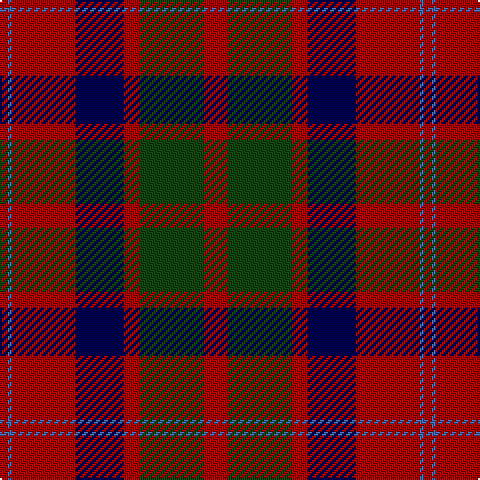

**Bands:** [RBRBRGR](/stripes/rbrbrgr/) · **Stripes:** [R B R DB R DG R](/stripes/stripes7/) R B R DB R DG R

This was sourced from weddslist.  It is a [7 band tartan](/bands/bands7/).

Original link http://www.weddslist.com/cgi-bin/tartans/pg.pl?source=tinsel

## Register references

External register numbers recorded for this tartan.

- Scottish Register of Tartans: [1166](https://www.tartanregister.gov.uk/tartanDetails.aspx?ref=1166)
- Scottish Register of Tartans: [1510](https://www.tartanregister.gov.uk/tartanDetails.aspx?ref=1510)
- Scottish Register of Tartans: [1758](https://www.tartanregister.gov.uk/tartanDetails.aspx?ref=1758)
- Scottish Register of Tartans: [2307](https://www.tartanregister.gov.uk/tartanDetails.aspx?ref=2307)
- Scottish Register of Tartans: [2349](https://www.tartanregister.gov.uk/tartanDetails.aspx?ref=2349)
- Scottish Register of Tartans: [2540](https://www.tartanregister.gov.uk/tartanDetails.aspx?ref=2540)
- Scottish Register of Tartans: [2582](https://www.tartanregister.gov.uk/tartanDetails.aspx?ref=2582)
- Scottish Register of Tartans: [2585](https://www.tartanregister.gov.uk/tartanDetails.aspx?ref=2585)
- Scottish Register of Tartans: [2625](https://www.tartanregister.gov.uk/tartanDetails.aspx?ref=2625)
- Scottish Register of Tartans: [2730](https://www.tartanregister.gov.uk/tartanDetails.aspx?ref=2730)
- Scottish Register of Tartans: [2862](https://www.tartanregister.gov.uk/tartanDetails.aspx?ref=2862)
- Scottish Register of Tartans: [3072](https://www.tartanregister.gov.uk/tartanDetails.aspx?ref=3072)
- Scottish Register of Tartans: [3555](https://www.tartanregister.gov.uk/tartanDetails.aspx?ref=3555)
- Scottish Register of Tartans: [4925](https://www.tartanregister.gov.uk/tartanDetails.aspx?ref=4925)
- Scottish Register of Tartans: [696](https://www.tartanregister.gov.uk/tartanDetails.aspx?ref=696)
- Scottish Register of Tartans: [697](https://www.tartanregister.gov.uk/tartanDetails.aspx?ref=697)
- Scottish Register of Tartans: [982](https://www.tartanregister.gov.uk/tartanDetails.aspx?ref=982)
- Scottish Tartans Authority (ITI): 1277
- Scottish Tartans Authority (ITI): 1429
- Scottish Tartans Authority (ITI): 218
- Scottish Tartans Authority (ITI): 977
- Scottish Tartans World Register: 1042
- Scottish Tartans World Register: 127
- Scottish Tartans World Register: 1277
- Scottish Tartans World Register: 1399
- Scottish Tartans World Register: 1429
- Scottish Tartans World Register: 1593
- Scottish Tartans World Register: 218
- Scottish Tartans World Register: 2218
- Scottish Tartans World Register: 3061
- Scottish Tartans World Register: 441
- Scottish Tartans World Register: 737
- Scottish Tartans World Register: 858
- Scottish Tartans World Register: 864
- Scottish Tartans World Register: 873
- Scottish Tartans World Register: 897
- Scottish Tartans World Register: 977
- Scottish Tartans World Register: 978

## Variants

Other setts woven to the same stripe pattern.

- [MacQuarrie LO](/setts/s7/r6dg16r4db12r16b1r2/)

## Thread count
DR/4 B2 DR32 DB24 DR8 DG32 DR/12

## Palette
Each colour and its ΔE from the base-6 reference it is a variant of.

| Colour | Shade | Base | ΔE (OKLab) |
|---|---|---|---|
| B | <code style="background-color:#4367AE;">#4367AE</code> `#4367AE` | B <code style="background-color:#2A418A;">#2A418A</code> | 0.12 |
| DB | <code style="background-color:#000052;">#000052</code> `#000052` | B <code style="background-color:#2A418A;">#2A418A</code> | 0.20 |
| DG | <code style="background-color:#11450D;">#11450D</code> `#11450D` | G <code style="background-color:#006100;">#006100</code> | 0.09 |
| DR | <code style="background-color:#AA0000;">#AA0000</code> `#AA0000` | R <code style="background-color:#CC0000;">#CC0000</code> | 0.07 |

# Sample pattern

## Nearest tartans

The nearest existing variants by ΔTartan distance.

1. [MacQuarrie LO](/setts/s7/r6dg16r4db12r16b1r2/) — ΔT 0.00
1. [Finlaggan](/setts/s6/dg7w1dg18db6r18dg2~x2/) — ΔT 0.82
1. [MacQuarrie LO](/setts/s7/r6dg16r4db12r16lb1r2~x2/) — ΔT 0.83
1. [Fraser VS](/setts/s6/lr1r12dg6r1db6r1~x2/) — ΔT 0.89
1. [Carrick (Strathmore) District Tartan Tartan Number: 3216. Earliest known date: c.1999 Sales help Princess Diana Memorial Trust See products available Copyright © Blair Urquhart, Comrie, 2015](/setts/s7/r28db12r3dg20t2dg2r7~x2/) — ΔT 0.90
1. [MacQuarrie #6](/setts/s7/r6dg16r4db12r16t1r2~x2/) — ΔT 0.95
1. [Wyeth (Personal)](/setts/s8/db18r18dp2g12db1g12dp2r18~x4/) — ΔT 0.97
1. [Fraser Green](/setts/s6/lb2dr12g6dr1n6dr1~x4/) — ΔT 0.97
1. [MacBean/MacElvain](/setts/s7/k2r12db6r3dg12r4db1~x2/) — ΔT 0.98
1. [Cook (Name)](/setts/s7/dg12g6dg6r15k1r1k2~x2/) — ΔT 1.03

## Neighbour map

Every grey dot is one of 14313 variants placed by the first two principal components of the ΔTartan feature space (44% of its variance). Red is this tartan; blue dots are its nearest — click one to open its page.

<svg viewBox="0 0 640 380" role="img" style="max-width:100%;height:auto;border:1px solid #e0e0e0;border-radius:4px;display:block" xmlns="http://www.w3.org/2000/svg"><image href="/nn/cloud.v1.png" width="640" height="380"/><a href="/setts/s7/r6dg16r4db12r16b1r2/"><circle cx="289.8" cy="200.6" r="4" fill="#3465a4"><title>MacQuarrie LO</title></circle></a><a href="/setts/s6/dg7w1dg18db6r18dg2~x2/"><circle cx="317.7" cy="197.2" r="4" fill="#3465a4"><title>Finlaggan</title></circle></a><a href="/setts/s7/r6dg16r4db12r16lb1r2~x2/"><circle cx="268.5" cy="186.2" r="4" fill="#3465a4"><title>MacQuarrie LO</title></circle></a><a href="/setts/s6/lr1r12dg6r1db6r1~x2/"><circle cx="299.0" cy="197.0" r="4" fill="#3465a4"><title>Fraser VS</title></circle></a><a href="/setts/s7/r28db12r3dg20t2dg2r7~x2/"><circle cx="309.1" cy="185.3" r="4" fill="#3465a4"><title>Carrick (Strathmore) District Tartan Tartan Number: 3216. Earliest known date: c.1999 Sales help Princess Diana Memorial Trust See products available Copyright © Blair Urquhart, Comrie, 2015</title></circle></a><a href="/setts/s7/r6dg16r4db12r16t1r2~x2/"><circle cx="285.5" cy="190.4" r="4" fill="#3465a4"><title>MacQuarrie #6</title></circle></a><a href="/setts/s8/db18r18dp2g12db1g12dp2r18~x4/"><circle cx="252.1" cy="188.6" r="4" fill="#3465a4"><title>Wyeth (Personal)</title></circle></a><a href="/setts/s6/lb2dr12g6dr1n6dr1~x4/"><circle cx="288.5" cy="212.2" r="4" fill="#3465a4"><title>Fraser Green</title></circle></a><a href="/setts/s7/k2r12db6r3dg12r4db1~x2/"><circle cx="260.2" cy="198.2" r="4" fill="#3465a4"><title>MacBean/MacElvain</title></circle></a><a href="/setts/s7/dg12g6dg6r15k1r1k2~x2/"><circle cx="253.3" cy="191.0" r="4" fill="#3465a4"><title>Cook (Name)</title></circle></a><circle cx="289.8" cy="200.6" r="5" fill="#c00000"/></svg>

ID: /setts/s7/r6dg16r4db12r16b1r2~x2/
