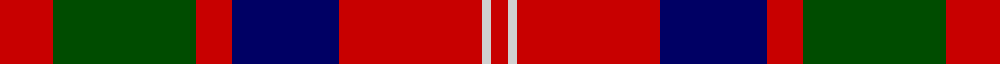

**Bands:** [RGRBRWR](/stripes/rgrbrwr/) · **Stripes:** [R DG R DB R LB R](/stripes/stripes7/) R DG R DB R LB R

This was sourced from weddslist.  It is a [7 band tartan](/bands/bands7/).

Original link http://www.weddslist.com/cgi-bin/tartans/pg.pl?source=rb

## Register references

External register numbers recorded for this tartan.

- Scottish Register of Tartans: [1166](https://www.tartanregister.gov.uk/tartanDetails.aspx?ref=1166)
- Scottish Register of Tartans: [1758](https://www.tartanregister.gov.uk/tartanDetails.aspx?ref=1758)
- Scottish Register of Tartans: [2307](https://www.tartanregister.gov.uk/tartanDetails.aspx?ref=2307)
- Scottish Register of Tartans: [2540](https://www.tartanregister.gov.uk/tartanDetails.aspx?ref=2540)
- Scottish Register of Tartans: [2666](https://www.tartanregister.gov.uk/tartanDetails.aspx?ref=2666)
- Scottish Register of Tartans: [2862](https://www.tartanregister.gov.uk/tartanDetails.aspx?ref=2862)
- Scottish Register of Tartans: [3808](https://www.tartanregister.gov.uk/tartanDetails.aspx?ref=3808)
- Scottish Register of Tartans: [982](https://www.tartanregister.gov.uk/tartanDetails.aspx?ref=982)
- Scottish Tartans Authority (ITI): 218
- Scottish Tartans World Register: 1010
- Scottish Tartans World Register: 1042
- Scottish Tartans World Register: 127
- Scottish Tartans World Register: 1585
- Scottish Tartans World Register: 218
- Scottish Tartans World Register: 2218
- Scottish Tartans World Register: 737
- Scottish Tartans World Register: 897

## Thread count
R/12 G32 R8 DB24 R32 N2 R/4

## Palette
Each colour and its ΔE from the base-6 reference it is a variant of.

| Colour | Shade | Base | ΔE (OKLab) |
|---|---|---|---|
| DB | <code style="background-color:#000064;">#000064</code> `#000064` | B <code style="background-color:#2A418A;">#2A418A</code> | 0.18 |
| G | <code style="background-color:#004C00;">#004C00</code> `#004C00` | G <code style="background-color:#006100;">#006100</code> | 0.07 |
| N | <code style="background-color:#D0D0D0;">#D0D0D0</code> `#D0D0D0` | W <code style="background-color:#F7F7F7;">#F7F7F7</code> | 0.12 |
| R | <code style="background-color:#C80000;">#C80000</code> `#C80000` | R <code style="background-color:#CC0000;">#CC0000</code> | 0.01 |

# Sample pattern

## Nearest tartans

The nearest existing variants by ΔTartan distance.

1. [MacBean/MacElvain](/setts/s7/k2r12db6r3dg12r4db1~x2/) — ΔT 0.77
1. [MacQuarrie #6](/setts/s7/r6dg16r4db12r16t1r2~x2/) — ΔT 0.81
1. [MacQuarrie LO](/setts/s7/r6dg16r4db12r16b1r2~x2/) — ΔT 0.83
1. [James of Glencarr (Personal)](/setts/s8/db8r8dg17w3r35db10dg15w3~x2/) — ΔT 0.86
1. [Fraser VS](/setts/s6/r1db6r1dg6r12lb1/) — ΔT 0.86
1. [New Glasgow (Canada)](/setts/s8/dg28r4dp25w5r22dg27r4dp2~x2/) — ΔT 0.87
1. [MacBean, MacElvain](/setts/s7/k2r12db6r3g12r4db1~x2/) — ΔT 0.88
1. [Ruthven (V.S.)](/setts/s6/w6g15db18r30g2r4~x2/) — ΔT 0.90
1. [Geddes](/setts/s7/dp1r5g15r3dp9r10w1~x4/) — ΔT 0.93
1. [MacDuff #4](/setts/s7/r4k2r24k6db6dg16r3~x2/) — ΔT 0.93

## Neighbour map

Every grey dot is one of 14299 variants placed by the first two principal components of the ΔTartan feature space (44% of its variance). Red is this tartan; blue dots are its nearest — click one to open its page.

<svg viewBox="0 0 640 380" role="img" style="max-width:100%;height:auto;border:1px solid #e0e0e0;border-radius:4px;display:block" xmlns="http://www.w3.org/2000/svg"><image href="/nn/cloud.v1.png" width="640" height="380"/><a href="/setts/s7/k2r12db6r3dg12r4db1~x2/"><circle cx="260.0" cy="198.1" r="4" fill="#3465a4"><title>MacBean/MacElvain</title></circle></a><a href="/setts/s7/r6dg16r4db12r16t1r2~x2/"><circle cx="285.2" cy="190.3" r="4" fill="#3465a4"><title>MacQuarrie #6</title></circle></a><a href="/setts/s7/r6dg16r4db12r16b1r2~x2/"><circle cx="289.7" cy="200.6" r="4" fill="#3465a4"><title>MacQuarrie LO</title></circle></a><a href="/setts/s8/db8r8dg17w3r35db10dg15w3~x2/"><circle cx="228.1" cy="185.1" r="4" fill="#3465a4"><title>James of Glencarr (Personal)</title></circle></a><a href="/setts/s6/r1db6r1dg6r12lb1/"><circle cx="281.5" cy="184.5" r="4" fill="#3465a4"><title>Fraser VS</title></circle></a><a href="/setts/s8/dg28r4dp25w5r22dg27r4dp2~x2/"><circle cx="249.7" cy="188.7" r="4" fill="#3465a4"><title>New Glasgow (Canada)</title></circle></a><a href="/setts/s7/k2r12db6r3g12r4db1~x2/"><circle cx="250.2" cy="196.7" r="4" fill="#3465a4"><title>MacBean, MacElvain</title></circle></a><a href="/setts/s6/w6g15db18r30g2r4~x2/"><circle cx="241.9" cy="184.8" r="4" fill="#3465a4"><title>Ruthven (V.S.)</title></circle></a><a href="/setts/s7/dp1r5g15r3dp9r10w1~x4/"><circle cx="243.5" cy="187.3" r="4" fill="#3465a4"><title>Geddes</title></circle></a><a href="/setts/s7/r4k2r24k6db6dg16r3~x2/"><circle cx="279.0" cy="182.9" r="4" fill="#3465a4"><title>MacDuff #4</title></circle></a><circle cx="268.3" cy="186.1" r="5" fill="#c00000"/></svg>

ID: /setts/s7/r6dg16r4db12r16lb1r2~x2/
