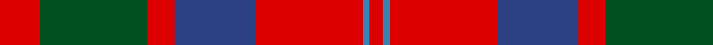
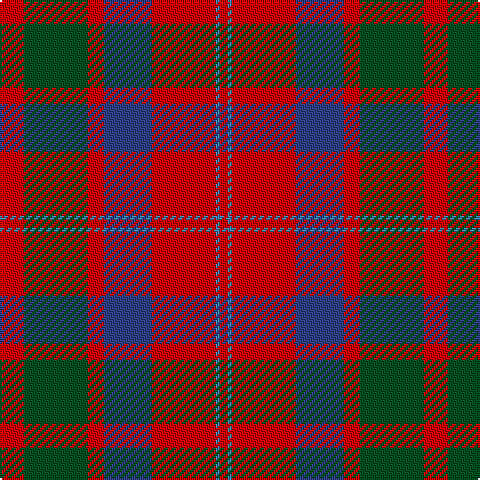

In pattern [RBRBRGR](/stripes/rbrbrgr/).

This was sourced from register-of-tartans.  It is a [7 stripe tartan](/stripes/stripes7/).

Original link https://www.tartanregister.gov.uk/tartanDetails.aspx?ref=2733

## Register references

External register numbers recorded for this tartan.

- Scottish Register of Tartans: [2733](https://www.tartanregister.gov.uk/tartanDetails.aspx?ref=2733)
- Scottish Tartans World Register: 1402

## Thread count
R/12 G32 R8 Ba24 R32 B2 R/4

## Palette
Each colour and its ΔE from the base-6 reference it is a variant of.

| Colour | Shade | Base | ΔE (OKLab) |
|---|---|---|---|
| B | <code style="background-color:#3C82AF;">#3C82AF</code> `#3C82AF` | B <code style="background-color:#2A418A;">#2A418A</code> | 0.19 |
| Ba | <code style="background-color:#2C4084;">#2C4084</code> `#2C4084` | B <code style="background-color:#2A418A;">#2A418A</code> | 0.01 |
| G | <code style="background-color:#005020;">#005020</code> `#005020` | G <code style="background-color:#006100;">#006100</code> | 0.07 |
| R | <code style="background-color:#DC0000;">#DC0000</code> `#DC0000` | R <code style="background-color:#CC0000;">#CC0000</code> | 0.03 |

# Sample pattern

## Nearest tartans

The nearest existing variants by ΔTartan distance.

1. [MacBean/MacElvain](/setts/s7/k2r12db6r3dg12r4db1~x2/) — ΔT 0.54
1. [MacQuarrie 2](/setts/s7/r6g16r4db12r16t1r2~x2/) — ΔT 0.60
1. [Carrick (Strathmore) District Tartan Tartan Number: 3216. Earliest known date: c.1999 Sales help Princess Diana Memorial Trust See products available Copyright © Blair Urquhart, Comrie, 2015](/setts/s7/r28db12r3dg20t2dg2r7~x2/) — ΔT 0.77
1. [Wyeth (Personal)](/setts/s8/db18r18dp2g12db1~x4/) — ΔT 0.80
1. [MacQuarrie LO](/setts/s7/r6dg16r4db12r16lb1r2~x2/) — ΔT 0.81
1. [Geddes](/setts/s7/dp1r5g15r3dp9r10w1~x4/) — ΔT 0.84
1. [Wasko (Personal)](/setts/s7/r8w2m30g12m3g12m3~x2/) — ΔT 0.88
1. [MacDuff #4](/setts/s7/r4k2r24k6db6dg16r3~x2/) — ΔT 0.88
1. [Ruthven (V.S.)](/setts/s6/w6g15db18r30g2r4~x2/) — ΔT 0.92
1. [MacBean, MacElvain](/setts/s7/k2r12db6r3g12r4db1~x2/) — ΔT 0.93

## Neighbour map

Every grey dot is one of 14299 variants placed by the first two principal components of the ΔTartan feature space (44% of its variance). Red is this tartan; blue dots are its nearest — click one to open its page.

<svg viewBox="0 0 640 380" role="img" style="max-width:100%;height:auto;border:1px solid #e0e0e0;border-radius:4px;display:block" xmlns="http://www.w3.org/2000/svg"><image href="/nn/cloud.v1.png" width="640" height="380"/><a href="/setts/s7/k2r12db6r3dg12r4db1~x2/"><circle cx="260.0" cy="198.1" r="4" fill="#3465a4"><title>MacBean/MacElvain</title></circle></a><a href="/setts/s7/r6g16r4db12r16t1r2~x2/"><circle cx="288.7" cy="195.2" r="4" fill="#3465a4"><title>MacQuarrie 2</title></circle></a><a href="/setts/s7/r28db12r3dg20t2dg2r7~x2/"><circle cx="308.9" cy="185.2" r="4" fill="#3465a4"><title>Carrick (Strathmore) District Tartan Tartan Number: 3216. Earliest known date: c.1999 Sales help Princess Diana Memorial Trust See products available Copyright © Blair Urquhart, Comrie, 2015</title></circle></a><a href="/setts/s8/db18r18dp2g12db1~x4/"><circle cx="251.9" cy="188.6" r="4" fill="#3465a4"><title>Wyeth (Personal)</title></circle></a><a href="/setts/s7/r6dg16r4db12r16lb1r2~x2/"><circle cx="268.3" cy="186.1" r="4" fill="#3465a4"><title>MacQuarrie LO</title></circle></a><a href="/setts/s7/dp1r5g15r3dp9r10w1~x4/"><circle cx="243.5" cy="187.3" r="4" fill="#3465a4"><title>Geddes</title></circle></a><a href="/setts/s7/r8w2m30g12m3g12m3~x2/"><circle cx="331.5" cy="186.3" r="4" fill="#3465a4"><title>Wasko (Personal)</title></circle></a><a href="/setts/s7/r4k2r24k6db6dg16r3~x2/"><circle cx="279.0" cy="182.9" r="4" fill="#3465a4"><title>MacDuff #4</title></circle></a><a href="/setts/s6/w6g15db18r30g2r4~x2/"><circle cx="241.9" cy="184.8" r="4" fill="#3465a4"><title>Ruthven (V.S.)</title></circle></a><a href="/setts/s7/k2r12db6r3g12r4db1~x2/"><circle cx="250.2" cy="196.7" r="4" fill="#3465a4"><title>MacBean, MacElvain</title></circle></a><circle cx="285.2" cy="190.3" r="5" fill="#c00000"/></svg>

ID: /setts/s7/r6dg16r4db12r16t1r2~x2/
