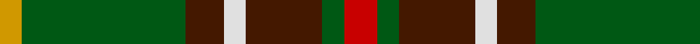

**Bands:** [RGBWBGY](/stripes/rgbwbgy/) · **Stripes:** [R DG DO W DO DG LO](/stripes/stripes7/) R DG DO W DO DG LO

This was sourced from tartans-authority.  It is a [7 band tartan](/bands/bands7/).

Original link http://www.tartansauthority.com/tartan-ferret/display/1543/

## Thread count
DY/8 G60 DR14 LN8 DR28 G8 R/12

## Palette
Each colour and its ΔE from the base-6 reference it is a variant of.

| Colour | Shade | Base | ΔE (OKLab) |
|---|---|---|---|
| DR | <code style="background-color:#441800;">#441800</code> `#441800` | B <code style="background-color:#2A418A;">#2A418A</code> | 0.23 |
| DY | <code style="background-color:#D09800;">#D09800</code> `#D09800` | Y <code style="background-color:#F2BF00;">#F2BF00</code> | 0.12 |
| G | <code style="background-color:#005814;">#005814</code> `#005814` | G <code style="background-color:#006100;">#006100</code> | 0.03 |
| LN | <code style="background-color:#E0E0E0;">#E0E0E0</code> `#E0E0E0` | W <code style="background-color:#F7F7F7;">#F7F7F7</code> | 0.07 |
| R | <code style="background-color:#C80000;">#C80000</code> `#C80000` | R <code style="background-color:#CC0000;">#CC0000</code> | 0.01 |

# Sample pattern

## Nearest tartans

The nearest existing variants by ΔTartan distance.

1. [Newfoundland](/setts/s7/r6g4do14w4do7g30lo4~x2/) — ΔT 0.30
1. [Brown, George](/setts/s9/ly3g24k18r4g22r6k4r3w3~x2/) — ΔT 0.99
1. [Newfoundland District Tartan Tartan Number: 1543. Earliest known date: 1972 The colours of the Newfoundland tartan are related to the 'Ode to Newfoundland', the second anthem of the province. Gold for the sun, green for the pine clad hill, white for the snow, brown for the minerals under the earth and red to denote her British origins. In 1972, the Minute of Provincial Affairs of the Province petitioned the Lord Lyon to record the tartan in the Writs section of the Lyon Court Books. This was done on the 3rd of September, 1973. See products available Copyright © Blair Urquhart, Comrie, 2015](/setts/s7/r4g3dy8w3dy4g18ly3~x2/) — ΔT 0.99
1. [Invertere Corporate Tartan Tartan Number: 1882. Earliest known date: 1988 Overstripes are yellow in warp See products available Copyright © Blair Urquhart, Comrie, 2015](/setts/s8/ly5dg14dy4db4dy27dg3dy4ly5/) — ΔT 1.06
1. [Duchess of York](/setts/s9/db1o9g5o1k5o1g5o9w1~x2/) — ΔT 1.09
1. [Manitoba Red](/setts/s8/ly2r6dg1r2dg12t1dg1t2~x2/) — ΔT 1.12
1. [Asheville Firefighters, The](/setts/s6/k17g48ly4r10db12g4/) — ΔT 1.16
1. [Royal College of Physicians Corporate Tartan Tartan Number: 2350. Earliest known date: September 1996 Full name is Royal College of Physicians, Edinburgh. Designed for the Royal College of Physicians (founded in 1681 for post graduate students), by Donald Fraser Weavers as a corporate tartan. Woven by Lochcarron, May 1997. Silk sample in STA Johnston Collection. See products available Copyright © Blair Urquhart, Comrie, 2015](/setts/s10/g23r3k9r3db18r3k9r3g23ly3~x2/) — ΔT 1.21
1. [Manitoba District Tartan Tartan Number: 146. Earliest known date: 1962 The tartan as it would appear with red in place of green, the 'G' of green having been interpreted as 'Gules'. The designer, Hugh Kirkwood Rankine, clearly intended a green stripe. This version can be found in the shops. See products available Copyright © Blair Urquhart, Comrie, 2015](/setts/s8/ly2m6g1r2g12t1g1t2~x2/) — ΔT 1.22
1. [Harmer (Corporate)](/setts/s7/lo12dg4lo24k9lo8dg36r4/) — ΔT 1.25

## Neighbour map

Every grey dot is one of 14313 variants placed by the first two principal components of the ΔTartan feature space (44% of its variance). Red is this tartan; blue dots are its nearest — click one to open its page.

<svg viewBox="0 0 640 380" role="img" style="max-width:100%;height:auto;border:1px solid #e0e0e0;border-radius:4px;display:block" xmlns="http://www.w3.org/2000/svg"><image href="/nn/cloud.v1.png" width="640" height="380"/><a href="/setts/s7/r6g4do14w4do7g30lo4~x2/"><circle cx="233.1" cy="197.0" r="4" fill="#3465a4"><title>Newfoundland</title></circle></a><a href="/setts/s9/ly3g24k18r4g22r6k4r3w3~x2/"><circle cx="230.5" cy="182.0" r="4" fill="#3465a4"><title>Brown, George</title></circle></a><a href="/setts/s7/r4g3dy8w3dy4g18ly3~x2/"><circle cx="220.2" cy="213.6" r="4" fill="#3465a4"><title>Newfoundland District Tartan Tartan Number: 1543. Earliest known date: 1972 The colours of the Newfoundland tartan are related to the 'Ode to Newfoundland', the second anthem of the province. Gold for the sun, green for the pine clad hill, white for the snow, brown for the minerals under the earth and red to denote her British origins. In 1972, the Minute of Provincial Affairs of the Province petitioned the Lord Lyon to record the tartan in the Writs section of the Lyon Court Books. This was done on the 3rd of September, 1973. See products available Copyright © Blair Urquhart, Comrie, 2015</title></circle></a><a href="/setts/s8/ly5dg14dy4db4dy27dg3dy4ly5/"><circle cx="289.6" cy="201.8" r="4" fill="#3465a4"><title>Invertere Corporate Tartan Tartan Number: 1882. Earliest known date: 1988 Overstripes are yellow in warp See products available Copyright © Blair Urquhart, Comrie, 2015</title></circle></a><a href="/setts/s9/db1o9g5o1k5o1g5o9w1~x2/"><circle cx="248.8" cy="189.2" r="4" fill="#3465a4"><title>Duchess of York</title></circle></a><a href="/setts/s8/ly2r6dg1r2dg12t1dg1t2~x2/"><circle cx="274.3" cy="164.0" r="4" fill="#3465a4"><title>Manitoba Red</title></circle></a><a href="/setts/s6/k17g48ly4r10db12g4/"><circle cx="278.8" cy="189.7" r="4" fill="#3465a4"><title>Asheville Firefighters, The</title></circle></a><a href="/setts/s10/g23r3k9r3db18r3k9r3g23ly3~x2/"><circle cx="201.2" cy="191.0" r="4" fill="#3465a4"><title>Royal College of Physicians Corporate Tartan Tartan Number: 2350. Earliest known date: September 1996 Full name is Royal College of Physicians, Edinburgh. Designed for the Royal College of Physicians (founded in 1681 for post graduate students), by Donald Fraser Weavers as a corporate tartan. Woven by Lochcarron, May 1997. Silk sample in STA Johnston Collection. See products available Copyright © Blair Urquhart, Comrie, 2015</title></circle></a><a href="/setts/s8/ly2m6g1r2g12t1g1t2~x2/"><circle cx="274.6" cy="163.4" r="4" fill="#3465a4"><title>Manitoba District Tartan Tartan Number: 146. Earliest known date: 1962 The tartan as it would appear with red in place of green, the 'G' of green having been interpreted as 'Gules'. The designer, Hugh Kirkwood Rankine, clearly intended a green stripe. This version can be found in the shops. See products available Copyright © Blair Urquhart, Comrie, 2015</title></circle></a><a href="/setts/s7/lo12dg4lo24k9lo8dg36r4/"><circle cx="238.9" cy="207.5" r="4" fill="#3465a4"><title>Harmer (Corporate)</title></circle></a><circle cx="237.5" cy="199.6" r="5" fill="#c00000"/></svg>

ID: /setts/s7/r6dg4do14w4do7dg30lo4~x2/
