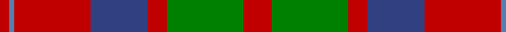
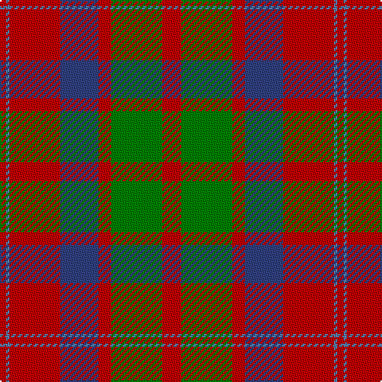

In pattern [RBRBRGR](/patterns/rbrbrgr/).

This was sourced from weddslist.  It is a [7 stripes tartan](/stripes/stripes7/).

Original link http://www.weddslist.com/cgi-bin/tartans/pg.pl?source=sts

## Thread count
R/4 Ba2 R32 B24 R8 G32 R/12

## Palette
Each colour and its ΔE from the base-6 reference it is a variant of.

| Colour | Shade | Base | ΔE (OKLab) |
|---|---|---|---|
| B | <code style="background-color:#304080;">#304080</code> `#304080` | B <code style="background-color:#2A418A;">#2A418A</code> | 0.02 |
| Ba | <code style="background-color:#5480B0;">#5480B0</code> `#5480B0` | B <code style="background-color:#2A418A;">#2A418A</code> | 0.19 |
| G | <code style="background-color:#008000;">#008000</code> `#008000` | G <code style="background-color:#006100;">#006100</code> | 0.10 |
| R | <code style="background-color:#C00000;">#C00000</code> `#C00000` | R <code style="background-color:#CC0000;">#CC0000</code> | 0.03 |

# Sample pattern

## Nearest tartans

The nearest existing variants by ΔTartan distance.

1. [MacQuarrie #6](/setts/s7/r6g16r4b12r16ba1r2~b2c4084-ba3c82af-g005020-rdc0000~x2/) — ΔT 0.60
1. [MacBean/MacElvain](/setts/s7/k2r12b6r3g12r4b1~b2c4084-g005020-k101010-rdc0000~x2/) — ΔT 0.79
1. [MacBean, MacElvain](/setts/s7/k2r12b6r3g12r4b1~b304080-g008000-k000000-rc00000~x2/) — ΔT 0.82
1. [Wyeth (Personal)](/setts/s8/b18r18ba2g12b1g12ba2r18~b2c2c80-ba780078-g006818-rc80000~x4/) — ΔT 0.90
1. [Geddes](/setts/s7/b1r5g15r3b9r10w1~b440044-g006818-rc80000-we0e0e0~x4/) — ΔT 0.94
1. [Wasko (Personal)](/setts/s7/r8w2ra30g12ra3g12ra3~g006818-rc80000-raa00048-we0e0e0~x2/) — ΔT 0.96
1. [New Glasgow (Canada)](/setts/s8/g28r4b25w5r22g27r4b2~b440044-g285800-rc80000-wfcfcfc~x2/) — ΔT 0.97
1. [MacKillop](/setts/s10/g3r2b2r13ba1b4r2g7r2b2~b304080-ba5480b0-g008000-rc00000~x2/) — ΔT 1.01
1. [MacKintosh Geddes](/setts/s7/b1r5g18r4b9r10w1~b2c4084-g005020-rdc0000-we0e0e0~x4/) — ΔT 1.02
1. [Glasgow, City of](/setts/s7/g28r4b25r22g27r4b2~b780078-g006818-rc80000~x2/) — ΔT 1.02

## Neighbour map

Every grey dot is one of 15726 variants placed by the first two principal components of the ΔTartan feature space (44% of its variance). Red is this tartan; blue dots are its nearest — click one to open its page.

<svg viewBox="0 0 640 380" role="img" style="max-width:100%;height:auto;border:1px solid #e0e0e0;border-radius:4px;display:block" xmlns="http://www.w3.org/2000/svg"><image href="/nn/cloud.v1.png" width="640" height="380"/><a href="/setts/s7/r6g16r4b12r16ba1r2~b2c4084-ba3c82af-g005020-rdc0000~x2/"><circle cx="284.7" cy="191.4" r="4" fill="#3465a4"><title>MacQuarrie #6</title></circle></a><a href="/setts/s7/k2r12b6r3g12r4b1~b2c4084-g005020-k101010-rdc0000~x2/"><circle cx="259.3" cy="199.4" r="4" fill="#3465a4"><title>MacBean/MacElvain</title></circle></a><a href="/setts/s7/k2r12b6r3g12r4b1~b304080-g008000-k000000-rc00000~x2/"><circle cx="249.2" cy="198.3" r="4" fill="#3465a4"><title>MacBean, MacElvain</title></circle></a><a href="/setts/s8/b18r18ba2g12b1g12ba2r18~b2c2c80-ba780078-g006818-rc80000~x4/"><circle cx="250.9" cy="187.8" r="4" fill="#3465a4"><title>Wyeth (Personal)</title></circle></a><a href="/setts/s7/b1r5g15r3b9r10w1~b440044-g006818-rc80000-we0e0e0~x4/"><circle cx="242.6" cy="188.0" r="4" fill="#3465a4"><title>Geddes</title></circle></a><a href="/setts/s7/r8w2ra30g12ra3g12ra3~g006818-rc80000-raa00048-we0e0e0~x2/"><circle cx="331.3" cy="186.2" r="4" fill="#3465a4"><title>Wasko (Personal)</title></circle></a><a href="/setts/s8/g28r4b25w5r22g27r4b2~b440044-g285800-rc80000-wfcfcfc~x2/"><circle cx="248.3" cy="189.4" r="4" fill="#3465a4"><title>New Glasgow (Canada)</title></circle></a><a href="/setts/s10/g3r2b2r13ba1b4r2g7r2b2~b304080-ba5480b0-g008000-rc00000~x2/"><circle cx="291.5" cy="171.9" r="4" fill="#3465a4"><title>MacKillop</title></circle></a><a href="/setts/s7/b1r5g18r4b9r10w1~b2c4084-g005020-rdc0000-we0e0e0~x4/"><circle cx="248.5" cy="180.0" r="4" fill="#3465a4"><title>MacKintosh Geddes</title></circle></a><a href="/setts/s7/g28r4b25r22g27r4b2~b780078-g006818-rc80000~x2/"><circle cx="297.7" cy="223.8" r="4" fill="#3465a4"><title>Glasgow, City of</title></circle></a><circle cx="288.0" cy="195.2" r="5" fill="#c00000"/></svg>

ID: /setts/s7/r6g16r4b12r16ba1r2~b304080-ba5480b0-g008000-rc00000~x2/
