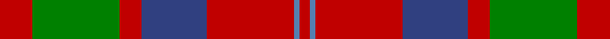

In pattern [RBRBRGR](/stripes/rbrbrgr/).

This was sourced from weddslist.  It is a [7 stripe tartan](/stripes/stripes7/).

Original link http://www.weddslist.com/cgi-bin/tartans/pg.pl?source=sts

## Thread count
R/12 G32 R8 B24 R32 Ba2 R/4

## Palette
Each colour and the base-6 reference it is a variant of.

| Colour | Shade | Base |
|---|---|---|
| B | <code style="background-color:#304080;">#304080</code> `oklch(39.4% 0.109 270.2)` <small>#304080</small> | B <code style="background-color:#2A418A;">#2A418A</code> |
| Ba | <code style="background-color:#5480B0;">#5480B0</code> `oklch(58.8% 0.089 251.5)` <small>#5480B0</small> | B <code style="background-color:#2A418A;">#2A418A</code> |
| G | <code style="background-color:#008000;">#008000</code> `oklch(52.0% 0.177 142.5)` <small>#008000</small> | G <code style="background-color:#006100;">#006100</code> |
| R | <code style="background-color:#C00000;">#C00000</code> `oklch(50.7% 0.208 29.2)` <small>#C00000</small> | R <code style="background-color:#CC0000;">#CC0000</code> |

# Sample pattern

## Nearest tartans

The nearest existing variants by ΔTartan distance.

1. [MacQuarrie #6](/setts/s7/r6dg16r4db12r16t1r2~x2/) — ΔT 0.60
1. [MacBean/MacElvain](/setts/s7/k2r12db6r3dg12r4db1~x2/) — ΔT 0.79
1. [MacBean, MacElvain](/setts/s7/k2r12db6r3g12r4db1~x2/) — ΔT 0.81
1. [Wyeth (Personal)](/setts/s8/db18r18dp2g12db1~x4/) — ΔT 0.90
1. [Geddes](/setts/s7/dp1r5g15r3dp9r10w1~x4/) — ΔT 0.94
1. [Wasko (Personal)](/setts/s7/r8w2m30g12m3g12m3~x2/) — ΔT 0.96
1. [New Glasgow (Canada)](/setts/s8/dg28r4dp25w5r22dg27r4dp2~x2/) — ΔT 0.97
1. [MacKillop](/setts/s10/g3r2db2r13t1db4r2g7r2db2~x2/) — ΔT 1.01
1. [MacKintosh Geddes](/setts/s7/db1r5dg18r4db9r10w1~x4/) — ΔT 1.01
1. [Glasgow, City of](/setts/s7/g28r4dp25r22g27r4dp2~x2/) — ΔT 1.03

## Neighbour map

Every grey dot is one of 14299 variants placed by the first two principal components of the ΔTartan feature space (44% of its variance). Red is this tartan; blue dots are its nearest — click one to open its page.

<svg viewBox="0 0 640 380" role="img" style="max-width:100%;height:auto;border:1px solid #e0e0e0;border-radius:4px;display:block" xmlns="http://www.w3.org/2000/svg"><image href="/nn/cloud.v1.png" width="640" height="380"/><a href="/setts/s7/r6dg16r4db12r16t1r2~x2/"><circle cx="285.2" cy="190.3" r="4" fill="#3465a4"><title>MacQuarrie #6</title></circle></a><a href="/setts/s7/k2r12db6r3dg12r4db1~x2/"><circle cx="260.0" cy="198.1" r="4" fill="#3465a4"><title>MacBean/MacElvain</title></circle></a><a href="/setts/s7/k2r12db6r3g12r4db1~x2/"><circle cx="250.2" cy="196.7" r="4" fill="#3465a4"><title>MacBean, MacElvain</title></circle></a><a href="/setts/s8/db18r18dp2g12db1~x4/"><circle cx="251.9" cy="188.6" r="4" fill="#3465a4"><title>Wyeth (Personal)</title></circle></a><a href="/setts/s7/dp1r5g15r3dp9r10w1~x4/"><circle cx="243.5" cy="187.3" r="4" fill="#3465a4"><title>Geddes</title></circle></a><a href="/setts/s7/r8w2m30g12m3g12m3~x2/"><circle cx="331.5" cy="186.3" r="4" fill="#3465a4"><title>Wasko (Personal)</title></circle></a><a href="/setts/s8/dg28r4dp25w5r22dg27r4dp2~x2/"><circle cx="249.7" cy="188.7" r="4" fill="#3465a4"><title>New Glasgow (Canada)</title></circle></a><a href="/setts/s10/g3r2db2r13t1db4r2g7r2db2~x2/"><circle cx="292.2" cy="172.3" r="4" fill="#3465a4"><title>MacKillop</title></circle></a><a href="/setts/s7/db1r5dg18r4db9r10w1~x4/"><circle cx="249.9" cy="180.0" r="4" fill="#3465a4"><title>MacKintosh Geddes</title></circle></a><a href="/setts/s7/g28r4dp25r22g27r4dp2~x2/"><circle cx="298.8" cy="223.8" r="4" fill="#3465a4"><title>Glasgow, City of</title></circle></a><circle cx="288.7" cy="195.2" r="5" fill="#c00000"/></svg>

ID: /setts/s7/r6g16r4db12r16t1r2~x2/
