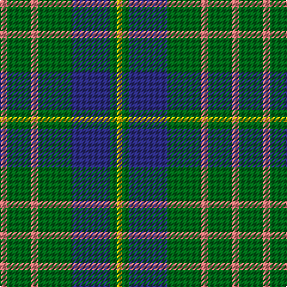

In pattern [RGRGBGY](/patterns/rgrgbgy/).

This was sourced from house-of-tartan.  It is a [7 stripes tartan](/stripes/stripes7/).

Original link http://www.house-of-tartan.scotland.net/house/TartanViewjs.asp?colr=Def&tnam=1535

## Thread count
LR/6 G20 LR6 G28 DB32 G6 Y/4

## Palette
Each colour and its ΔE from the base-6 reference it is a variant of.

| Colour | Shade | Base | ΔE (OKLab) |
|---|---|---|---|
| DB | <code style="background-color:#2C2C80;">#2C2C80</code> `#2C2C80` | B <code style="background-color:#2A418A;">#2A418A</code> | 0.06 |
| G | <code style="background-color:#006818;">#006818</code> `#006818` | G <code style="background-color:#006100;">#006100</code> | 0.02 |
| LR | <code style="background-color:#E87878;">#E87878</code> `#E87878` | R <code style="background-color:#CC0000;">#CC0000</code> | 0.19 |
| Y | <code style="background-color:#E8C000;">#E8C000</code> `#E8C000` | Y <code style="background-color:#F2BF00;">#F2BF00</code> | 0.02 |

# Sample pattern

## Nearest tartans

The nearest existing variants by ΔTartan distance.

1. [Cameron of Lochiel (Hunting)](/setts/s7/r6g20r6g28b32g6y4-b1c0070-g006818-rc80000-ye8c000/) — ΔT 0.57
1. [Cameron of Lochiel (Hunting) Clan/Family Tartan Tartan Number: 5351. Earliest known date: 01/01/1940 Design close to Cameron Hunting which has two red lines shown in Vestiarium Scoticum. This design evolved in the 1940s by J G MacKay of Portree and was first put on show at the Cameron Gathering at Achnacarry in 1956. (original STA ref: 1535) See products available Copyright © Blair Urquhart, Comrie, 2015](/setts/s7/r5g20r5g20b24g6y4-b2c2c80-g006818-rc80000-ye8c000/) — ΔT 0.64
1. [Cameron, hunting](/setts/s7/r6g20r6g28b32g6y4-b304080-g008000-rc00000-yf0c000/) — ΔT 0.73
1. [MacIntyre Hunting Clan Tartan Tartan Number: 743. Earliest known date: 1800 There is a doublet in Kingussie Museum dated 1800 in this tartan. It also appeared in the Vestiarium Scoticum (1842). See products available Copyright © Blair Urquhart, Comrie, 2015](/setts/s6/g8b24r6b24g64w8-b2c2c80-g006818-rc80000-we0e0e0/) — ΔT 0.85
1. [Davidson, Half..](/setts/s6/k6g44b6g6b38r6-b304080-g008000-k000000-rc00000/) — ΔT 0.92
1. [Trafalgar (Fashion)](/setts/s6/g6b2g16b14k6y2-b2c2c80-g006818-k101010-ye8c000/) — ΔT 0.92
1. [MacIntyre Hunting (VS)](/setts/s6/g8b24r6b24g64w8-b202060-g006818-rc80000-wfcfcfc/) — ΔT 0.94
1. [Cameron Hunting](/setts/s7/r3g10r3g14b16g3y2-b000064-g004c00-rc80000-yffc800/) — ΔT 0.95
1. [MacHardy](/setts/s8/b2r2g12b12y2b12r2g2-b304080-g008000-rc00000-yf0c000/) — ΔT 0.96
1. [Ayrton 1979 No. 2 (Personal)](/setts/s8/b10k2g6k2b6k2g20r6-b1474b4-g006818-k101010-rc80000/) — ΔT 0.97

## Neighbour map

Every grey dot is one of 15726 variants placed by the first two principal components of the ΔTartan feature space (44% of its variance). Red is this tartan; blue dots are its nearest — click one to open its page.

<svg viewBox="0 0 640 380" role="img" style="max-width:100%;height:auto;border:1px solid #e0e0e0;border-radius:4px;display:block" xmlns="http://www.w3.org/2000/svg"><image href="/nn/cloud.v1.png" width="640" height="380"/><a href="/setts/s7/r6g20r6g28b32g6y4-b1c0070-g006818-rc80000-ye8c000/"><circle cx="257.9" cy="223.3" r="4" fill="#3465a4"><title>Cameron of Lochiel (Hunting)</title></circle></a><a href="/setts/s7/r5g20r5g20b24g6y4-b2c2c80-g006818-rc80000-ye8c000/"><circle cx="262.7" cy="245.5" r="4" fill="#3465a4"><title>Cameron of Lochiel (Hunting) Clan/Family Tartan Tartan Number: 5351. Earliest known date: 01/01/1940 Design close to Cameron Hunting which has two red lines shown in Vestiarium Scoticum. This design evolved in the 1940s by J G MacKay of Portree and was first put on show at the Cameron Gathering at Achnacarry in 1956. (original STA ref: 1535) See products available Copyright © Blair Urquhart, Comrie, 2015</title></circle></a><a href="/setts/s7/r6g20r6g28b32g6y4-b304080-g008000-rc00000-yf0c000/"><circle cx="271.3" cy="228.1" r="4" fill="#3465a4"><title>Cameron, hunting</title></circle></a><a href="/setts/s6/g8b24r6b24g64w8-b2c2c80-g006818-rc80000-we0e0e0/"><circle cx="303.6" cy="213.4" r="4" fill="#3465a4"><title>MacIntyre Hunting Clan Tartan Tartan Number: 743. Earliest known date: 1800 There is a doublet in Kingussie Museum dated 1800 in this tartan. It also appeared in the Vestiarium Scoticum (1842). See products available Copyright © Blair Urquhart, Comrie, 2015</title></circle></a><a href="/setts/s6/k6g44b6g6b38r6-b304080-g008000-k000000-rc00000/"><circle cx="262.5" cy="223.2" r="4" fill="#3465a4"><title>Davidson, Half..</title></circle></a><a href="/setts/s6/g6b2g16b14k6y2-b2c2c80-g006818-k101010-ye8c000/"><circle cx="246.1" cy="243.8" r="4" fill="#3465a4"><title>Trafalgar (Fashion)</title></circle></a><a href="/setts/s6/g8b24r6b24g64w8-b202060-g006818-rc80000-wfcfcfc/"><circle cx="292.6" cy="209.1" r="4" fill="#3465a4"><title>MacIntyre Hunting (VS)</title></circle></a><a href="/setts/s7/r3g10r3g14b16g3y2-b000064-g004c00-rc80000-yffc800/"><circle cx="261.3" cy="227.6" r="4" fill="#3465a4"><title>Cameron Hunting</title></circle></a><a href="/setts/s8/b2r2g12b12y2b12r2g2-b304080-g008000-rc00000-yf0c000/"><circle cx="289.6" cy="226.0" r="4" fill="#3465a4"><title>MacHardy</title></circle></a><a href="/setts/s8/b10k2g6k2b6k2g20r6-b1474b4-g006818-k101010-rc80000/"><circle cx="255.4" cy="210.9" r="4" fill="#3465a4"><title>Ayrton 1979 No. 2 (Personal)</title></circle></a><circle cx="265.4" cy="226.0" r="5" fill="#c00000"/></svg>

ID: /setts/s7/r6g20r6g28b32g6y4-b2c2c80-g006818-re87878-ye8c000/
