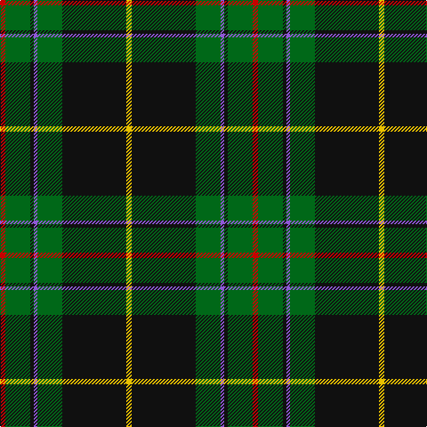

In pattern [RGKBGKY](/patterns/rgkbgky/).

This was sourced from register-of-tartans.  It is a [7 stripes tartan](/stripes/stripes7/).

Original link https://www.tartanregister.gov.uk/tartanDetails.aspx?ref=4464

## Attestations

This cloth appears in 2 source records; the oldest owns this page.

- 01/01/1930 — Vipont (Yellow line) (register-of-tartans, [record](https://www.tartanregister.gov.uk/tartanDetails.aspx?ref=4464))
- 1930 — Vipont (Yellow line) (Name) (tartans-authority, [record](http://www.tartansauthority.com/tartan-ferret/display/1491/))

## Thread count
R/6 G28 K4 P4 G28 K72 Y/6

## Palette
Each colour and its ΔE from the base-6 reference it is a variant of.

| Colour | Shade | Base | ΔE (OKLab) |
|---|---|---|---|
| G | <code style="background-color:#006818;">#006818</code> `#006818` | G <code style="background-color:#006400;">#006400</code> | 0.02 |
| K | <code style="background-color:#101010;">#101010</code> `#101010` | K <code style="background-color:#000000;">#000000</code> | 0.17 |
| P | <code style="background-color:#9058D8;">#9058D8</code> `#9058D8` | B <code style="background-color:#2C4084;">#2C4084</code> | 0.22 |
| R | <code style="background-color:#C80000;">#C80000</code> `#C80000` | R <code style="background-color:#C80000;">#C80000</code> | 0.00 |
| Y | <code style="background-color:#E8C000;">#E8C000</code> `#E8C000` | Y <code style="background-color:#E8C000;">#E8C000</code> | 0.00 |

# Sample pattern

ID: /setts/s7/r6g28k4b4g28k72y6-b9058d8-g006818-k101010-rc80000-ye8c000/
