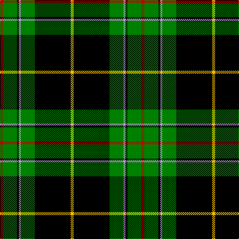

In pattern [RGKWGKY](/patterns/rgkwgky/).

This was sourced from weddslist.  It is a [7 stripes tartan](/stripes/stripes7/).

Original link http://www.weddslist.com/cgi-bin/tartans/pg.pl?source=sts

## Thread count
R/6 G28 K4 LP4 G28 K72 Y/6

## Palette
Each colour and its ΔE from the base-6 reference it is a variant of.

| Colour | Shade | Base | ΔE (OKLab) |
|---|---|---|---|
| G | <code style="background-color:#008000;">#008000</code> `#008000` | G <code style="background-color:#006400;">#006400</code> | 0.09 |
| K | <code style="background-color:#000000;">#000000</code> `#000000` | K <code style="background-color:#000000;">#000000</code> | 0.00 |
| LP | <code style="background-color:#C0A0E0;">#C0A0E0</code> `#C0A0E0` | W <code style="background-color:#F4F4F0;">#F4F4F0</code> | 0.23 |
| R | <code style="background-color:#C00000;">#C00000</code> `#C00000` | R <code style="background-color:#C80000;">#C80000</code> | 0.02 |
| Y | <code style="background-color:#F0C000;">#F0C000</code> `#F0C000` | Y <code style="background-color:#E8C000;">#E8C000</code> | 0.01 |

# Sample pattern

## Nearest tartans

The nearest existing variants by ΔTartan distance.

1. [Vipont (Yellow line)](/setts/s7/r6g28k4b4g28k72y6-b9058d8-g006818-k101010-rc80000-ye8c000/) — ΔT 1.34
1. [MacDiarmid](/setts/s9/k24r4k56g24k2w6k2g24r8-g008000-k000000-rc00000-we0e0e0/) — ΔT 1.34
1. [Cleghorn (Personal)](/setts/s7/g16r6g60k16w6k72w16-g007800-k000000-r8c0000-wf0f0f0/) — ΔT 1.35
1. [Cornish Brewery, Green](/setts/s7/y6g48k22g6ka20g6w4-g004800-k000030-ka000000-we0e0e0-y9c9c00/) — ΔT 1.39
1. [MacArthur, ?](/setts/s6/r6g60k24g12k32y4-g008000-k000000-rc00000-yf0c000/) — ΔT 1.41
1. [MacDonnald of ye Ylis](/setts/s9/w4g30k1g1k1g3k12b10r3-b00004c-g004c00-k000000-rc80000-wd0d0d0/) — ΔT 1.45
1. [Forbes VS](/setts/s6/r1g16k8g3k4y1-g004c00-k000000-rc80000-yffc800/) — ΔT 1.47
1. [Derick Wardrope (Portobello) (Personal)](/setts/s9/b3g32k4g4k11ba3k7b4w3-b4c1329-ba051956-g004810-k000000-we0e0e0/) — ΔT 1.49
1. [Henderson](/setts/s9/w2b12g8b2g32k2g8k12y2-b00004c-g004c00-k000000-wd0d0d0-yffc800/) — ΔT 1.50
1. [Abercrombie](/setts/s9/k24r2g28w2g28k28r2b16k4-b304080-g008000-k000000-rc00000-we0e0e0/) — ΔT 1.50

## Neighbour map

Every grey dot is one of 15726 variants placed by the first two principal components of the ΔTartan feature space (44% of its variance). Red is this tartan; blue dots are its nearest — click one to open its page.

<svg viewBox="0 0 640 380" role="img" style="max-width:100%;height:auto;border:1px solid #e0e0e0;border-radius:4px;display:block" xmlns="http://www.w3.org/2000/svg"><image href="/nn/cloud.v1.png" width="640" height="380"/><a href="/setts/s7/r6g28k4b4g28k72y6-b9058d8-g006818-k101010-rc80000-ye8c000/"><circle cx="300.1" cy="158.4" r="4" fill="#3465a4"><title>Vipont (Yellow line)</title></circle></a><a href="/setts/s9/k24r4k56g24k2w6k2g24r8-g008000-k000000-rc00000-we0e0e0/"><circle cx="311.3" cy="144.2" r="4" fill="#3465a4"><title>MacDiarmid</title></circle></a><a href="/setts/s7/g16r6g60k16w6k72w16-g007800-k000000-r8c0000-wf0f0f0/"><circle cx="219.9" cy="185.0" r="4" fill="#3465a4"><title>Cleghorn (Personal)</title></circle></a><a href="/setts/s7/y6g48k22g6ka20g6w4-g004800-k000030-ka000000-we0e0e0-y9c9c00/"><circle cx="251.2" cy="184.3" r="4" fill="#3465a4"><title>Cornish Brewery, Green</title></circle></a><a href="/setts/s6/r6g60k24g12k32y4-g008000-k000000-rc00000-yf0c000/"><circle cx="275.2" cy="196.4" r="4" fill="#3465a4"><title>MacArthur, ?</title></circle></a><a href="/setts/s9/w4g30k1g1k1g3k12b10r3-b00004c-g004c00-k000000-rc80000-wd0d0d0/"><circle cx="285.1" cy="116.1" r="4" fill="#3465a4"><title>MacDonnald of ye Ylis</title></circle></a><a href="/setts/s6/r1g16k8g3k4y1-g004c00-k000000-rc80000-yffc800/"><circle cx="337.9" cy="196.7" r="4" fill="#3465a4"><title>Forbes VS</title></circle></a><a href="/setts/s9/b3g32k4g4k11ba3k7b4w3-b4c1329-ba051956-g004810-k000000-we0e0e0/"><circle cx="253.0" cy="164.3" r="4" fill="#3465a4"><title>Derick Wardrope (Portobello) (Personal)</title></circle></a><a href="/setts/s9/w2b12g8b2g32k2g8k12y2-b00004c-g004c00-k000000-wd0d0d0-yffc800/"><circle cx="310.5" cy="160.2" r="4" fill="#3465a4"><title>Henderson</title></circle></a><a href="/setts/s9/k24r2g28w2g28k28r2b16k4-b304080-g008000-k000000-rc00000-we0e0e0/"><circle cx="183.8" cy="170.2" r="4" fill="#3465a4"><title>Abercrombie</title></circle></a><circle cx="266.1" cy="147.7" r="5" fill="#c00000"/></svg>

ID: /setts/s7/r6g28k4w4g28k72y6-g008000-k000000-rc00000-wc0a0e0-yf0c000/
