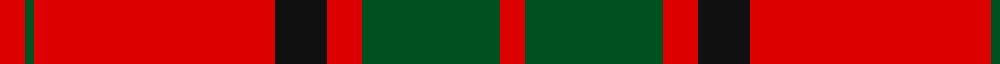
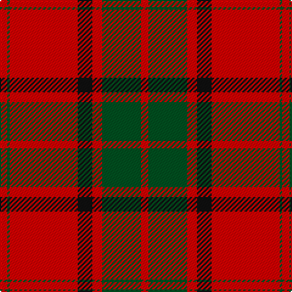

In pattern [RGRKRGR](/patterns/rgrkrgr/).

This was sourced from register-of-tartans.  It is a [7 stripes tartan](/stripes/stripes7/).

Original link https://www.tartanregister.gov.uk/tartanDetails.aspx?ref=2862

## Thread count
R/6 G2 R56 K12 R8 G32 R/6

## Palette
Each colour and its ΔE from the base-6 reference it is a variant of.

| Colour | Shade | Base | ΔE (OKLab) |
|---|---|---|---|
| G | <code style="background-color:#005020;">#005020</code> `#005020` | G <code style="background-color:#006400;">#006400</code> | 0.08 |
| K | <code style="background-color:#101010;">#101010</code> `#101010` | K <code style="background-color:#000000;">#000000</code> | 0.17 |
| R | <code style="background-color:#DC0000;">#DC0000</code> `#DC0000` | R <code style="background-color:#C80000;">#C80000</code> | 0.04 |

# Sample pattern

## Nearest tartans

The nearest existing variants by ΔTartan distance.

1. [Maxwell](/setts/s7/r6g32r8k12r56g2r6-g006818-k101010-rc80000/) — ΔT 0.49
1. [Maxwell](/setts/s7/r3g16r4k6r28g1r3-g004c00-k000000-rc80000/) — ΔT 0.56
1. [Maxwell; Maxwell Ancient](/setts/s7/r6g32r8k12r56g2r6-g008000-k000000-rc00000/) — ΔT 0.74
1. [MacKintosh #3](/setts/s6/r96b4r6g56r8b4-b2c4084-g005020-rdc0000/) — ΔT 0.77
1. [MacKintosh](/setts/s6/r48b12r6g24r8b2-b000064-g004c00-rc80000/) — ΔT 0.78
1. [MacKintosh D](/setts/s6/r44b10r4g22r6b2-b000064-g004c00-rc80000/) — ΔT 0.80
1. [MacKintosh #2](/setts/s6/r136b36r18g68r18b6-b2c4084-g005020-rdc0000/) — ΔT 0.82
1. [Robertson](/setts/s6/r4g40r4b16r72g2-b2c4084-g005020-rdc0000/) — ΔT 0.88
1. [Maxwell](/setts/s7/r6g32r8k12r56g2r6-g11450d-k000000-raa0000/) — ΔT 0.90
1. [Maxwell](/setts/s7/r3g16r4k6r28g1r3-g11450d-k000000-raa0000/) — ΔT 0.90

## Neighbour map

Every grey dot is one of 15726 variants placed by the first two principal components of the ΔTartan feature space (44% of its variance). Red is this tartan; blue dots are its nearest — click one to open its page.

<svg viewBox="0 0 640 380" role="img" style="max-width:100%;height:auto;border:1px solid #e0e0e0;border-radius:4px;display:block" xmlns="http://www.w3.org/2000/svg"><image href="/nn/cloud.v1.png" width="640" height="380"/><a href="/setts/s7/r6g32r8k12r56g2r6-g006818-k101010-rc80000/"><circle cx="437.7" cy="163.6" r="4" fill="#3465a4"><title>Maxwell</title></circle></a><a href="/setts/s7/r3g16r4k6r28g1r3-g004c00-k000000-rc80000/"><circle cx="419.9" cy="157.0" r="4" fill="#3465a4"><title>Maxwell</title></circle></a><a href="/setts/s7/r6g32r8k12r56g2r6-g008000-k000000-rc00000/"><circle cx="413.7" cy="155.3" r="4" fill="#3465a4"><title>Maxwell; Maxwell Ancient</title></circle></a><a href="/setts/s6/r96b4r6g56r8b4-b2c4084-g005020-rdc0000/"><circle cx="461.9" cy="163.6" r="4" fill="#3465a4"><title>MacKintosh #3</title></circle></a><a href="/setts/s6/r48b12r6g24r8b2-b000064-g004c00-rc80000/"><circle cx="411.9" cy="179.7" r="4" fill="#3465a4"><title>MacKintosh</title></circle></a><a href="/setts/s6/r44b10r4g22r6b2-b000064-g004c00-rc80000/"><circle cx="409.4" cy="178.4" r="4" fill="#3465a4"><title>MacKintosh D</title></circle></a><a href="/setts/s6/r136b36r18g68r18b6-b2c4084-g005020-rdc0000/"><circle cx="413.9" cy="181.2" r="4" fill="#3465a4"><title>MacKintosh #2</title></circle></a><a href="/setts/s6/r4g40r4b16r72g2-b2c4084-g005020-rdc0000/"><circle cx="425.1" cy="154.2" r="4" fill="#3465a4"><title>Robertson</title></circle></a><a href="/setts/s7/r6g32r8k12r56g2r6-g11450d-k000000-raa0000/"><circle cx="436.7" cy="167.9" r="4" fill="#3465a4"><title>Maxwell</title></circle></a><a href="/setts/s7/r3g16r4k6r28g1r3-g11450d-k000000-raa0000/"><circle cx="436.7" cy="167.9" r="4" fill="#3465a4"><title>Maxwell</title></circle></a><circle cx="429.7" cy="157.5" r="5" fill="#c00000"/></svg>

ID: /setts/s7/r6g32r8k12r56g2r6-g005020-k101010-rdc0000/
