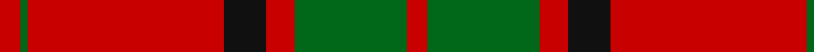
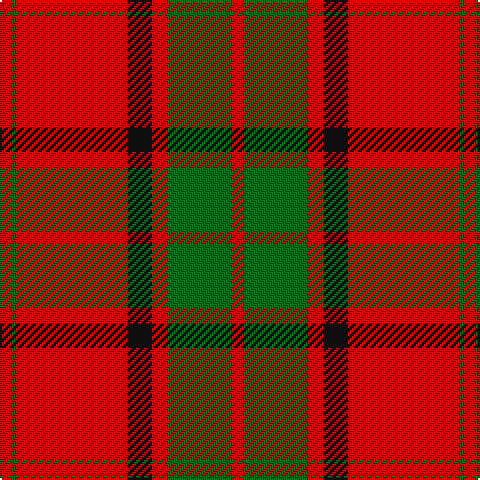

In pattern [RGRKRGR](/patterns/rgrkrgr/).

This was sourced from register-of-tartans.  It is a [7 stripes tartan](/stripes/stripes7/).

Original link https://www.tartanregister.gov.uk/tartanDetails.aspx?ref=2861

## Attestations

This cloth appears in 3 source records; the oldest owns this page.

- 01/01/1842 — Maxwell (register-of-tartans, [record](https://www.tartanregister.gov.uk/tartanDetails.aspx?ref=2861))
- 1842 — Maxwell (Clan) (tartans-authority, [record](http://www.tartansauthority.com/tartan-ferret/display/1500/))
- undated — Maxwell Clan Tartan Tartan Number: 1500. Earliest known date: 1842 Tartans of the Lowland families were not named until the publication the 'Vestiarium Scoticum' in 1842. The authors, the Sobieski Stuart brothers, enjoyed a popular following amongst the Scottish gentry in the early Victorian era, and in the spirit of the times, added mystery, romance and some spurious historical documentation to the subject of tartans. The Maxwells have, nevertheless, a tartan of at least 150 years antiquity, probably designed by persons of great imagination and flair. The Maxwells come from Glasgow and the S.W. of Scotland. See products available Copyright © Blair Urquhart, Comrie, 2015 (house-of-tartan, [record](http://www.house-of-tartan.scotland.net/house/TartanViewjs.asp?colr=Def&tnam=1500))

## Thread count
R/6 G2 R56 K12 R8 G32 R/6

## Palette
Each colour and its ΔE from the base-6 reference it is a variant of.

| Colour | Shade | Base | ΔE (OKLab) |
|---|---|---|---|
| G | <code style="background-color:#006818;">#006818</code> `#006818` | G <code style="background-color:#006100;">#006100</code> | 0.02 |
| K | <code style="background-color:#101010;">#101010</code> `#101010` | K <code style="background-color:#000000;">#000000</code> | 0.17 |
| R | <code style="background-color:#C80000;">#C80000</code> `#C80000` | R <code style="background-color:#CC0000;">#CC0000</code> | 0.01 |

# Sample pattern

## Nearest tartans

The nearest existing variants by ΔTartan distance.

1. [Maxwell Ancient](/setts/s7/r6g32r8k12r56g2r6-g005020-k101010-rdc0000/) — ΔT 0.49
1. [MacKintosh 1](/setts/s6/r44b10r4g22r6b2-b304080-g008000-rc00000/) — ΔT 0.74
1. [MacKintosh Clan Tartan Tartan Number: 521. Earliest known date: 1815 D.C. Stewart wrote, "This is one of the few ancient tartans too well authenticated to admit of doubt or question." The earliest publication is attributed to Logan but he may well have known of the sample, sealed with signature of the chief, which existed in the collection of the Highland Society of London, dating around 1815. The chief of the MacKintoshes is also chief of Clan Chattan. Logan wrote, "The chief also wears a particular tartan of a very showy pattern", which has now been registered with Lord Lyon (1947) as 'Clan Chattan (Chief)'. The clan tartan has likewise been registered as 'Clan Chattan'. See products available Copyright © Blair Urquhart, Comrie, 2015](/setts/s6/r44b10r4g22r6b2-b2c2c80-g006818-rc80000/) — ΔT 0.74
1. [MacKintosh #3](/setts/s6/r96b4r6g56r8b4-b2c4084-g005020-rdc0000/) — ΔT 0.75
1. [Maxwell](/setts/s7/r6g32r8k12r56g2r6-g11450d-k000000-raa0000/) — ΔT 0.76
1. [Maxwell](/setts/s7/r3g16r4k6r28g1r3-g11450d-k000000-raa0000/) — ΔT 0.76
1. [Maxwell](/setts/s7/r3g16r4k6r28g1r3-g004c00-k000000-rc80000/) — ΔT 0.78
1. [MacKintosh 3](/setts/s6/r136b36r18g68r18b6-b304080-g008000-rc00000/) — ΔT 0.79
1. [Maxwell; Maxwell Ancient](/setts/s7/r6g32r8k12r56g2r6-g008000-k000000-rc00000/) — ΔT 0.82
1. [Robertson](/setts/s6/r4g40r4b16r72g2-b2c4084-g005020-rdc0000/) — ΔT 0.83

## Neighbour map

Every grey dot is one of 15726 variants placed by the first two principal components of the ΔTartan feature space (44% of its variance). Red is this tartan; blue dots are its nearest — click one to open its page.

<svg viewBox="0 0 640 380" role="img" style="max-width:100%;height:auto;border:1px solid #e0e0e0;border-radius:4px;display:block" xmlns="http://www.w3.org/2000/svg"><image href="/nn/cloud.v1.png" width="640" height="380"/><a href="/setts/s7/r6g32r8k12r56g2r6-g005020-k101010-rdc0000/"><circle cx="429.7" cy="157.5" r="4" fill="#3465a4"><title>Maxwell Ancient</title></circle></a><a href="/setts/s6/r44b10r4g22r6b2-b304080-g008000-rc00000/"><circle cx="425.9" cy="184.9" r="4" fill="#3465a4"><title>MacKintosh 1</title></circle></a><a href="/setts/s6/r44b10r4g22r6b2-b2c2c80-g006818-rc80000/"><circle cx="425.0" cy="183.4" r="4" fill="#3465a4"><title>MacKintosh Clan Tartan Tartan Number: 521. Earliest known date: 1815 D.C. Stewart wrote, &quot;This is one of the few ancient tartans too well authenticated to admit of doubt or question.&quot; The earliest publication is attributed to Logan but he may well have known of the sample, sealed with signature of the chief, which existed in the collection of the Highland Society of London, dating around 1815. The chief of the MacKintoshes is also chief of Clan Chattan. Logan wrote, &quot;The chief also wears a particular tartan of a very showy pattern&quot;, which has now been registered with Lord Lyon (1947) as 'Clan Chattan (Chief)'. The clan tartan has likewise been registered as 'Clan Chattan'. See products available Copyright © Blair Urquhart, Comrie, 2015</title></circle></a><a href="/setts/s6/r96b4r6g56r8b4-b2c4084-g005020-rdc0000/"><circle cx="461.9" cy="163.6" r="4" fill="#3465a4"><title>MacKintosh #3</title></circle></a><a href="/setts/s7/r6g32r8k12r56g2r6-g11450d-k000000-raa0000/"><circle cx="436.7" cy="167.9" r="4" fill="#3465a4"><title>Maxwell</title></circle></a><a href="/setts/s7/r3g16r4k6r28g1r3-g11450d-k000000-raa0000/"><circle cx="436.7" cy="167.9" r="4" fill="#3465a4"><title>Maxwell</title></circle></a><a href="/setts/s7/r3g16r4k6r28g1r3-g004c00-k000000-rc80000/"><circle cx="419.9" cy="157.0" r="4" fill="#3465a4"><title>Maxwell</title></circle></a><a href="/setts/s6/r136b36r18g68r18b6-b304080-g008000-rc00000/"><circle cx="420.0" cy="187.5" r="4" fill="#3465a4"><title>MacKintosh 3</title></circle></a><a href="/setts/s7/r6g32r8k12r56g2r6-g008000-k000000-rc00000/"><circle cx="413.7" cy="155.3" r="4" fill="#3465a4"><title>Maxwell; Maxwell Ancient</title></circle></a><a href="/setts/s6/r4g40r4b16r72g2-b2c4084-g005020-rdc0000/"><circle cx="425.1" cy="154.2" r="4" fill="#3465a4"><title>Robertson</title></circle></a><circle cx="437.7" cy="163.6" r="5" fill="#c00000"/></svg>

ID: /setts/s7/r6g32r8k12r56g2r6-g006818-k101010-rc80000/
