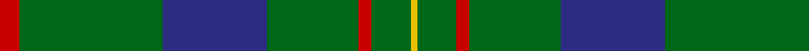

In pattern [RGBGRGY](/patterns/rgbgrgy/).

This was sourced from house-of-tartan.  It is a [7 stripes tartan](/stripes/stripes7/).

Original link http://www.house-of-tartan.scotland.net/house/TartanViewjs.asp?colr=Def&tnam=1463

## Thread count
R/6 G44 DB32 G28 R4 G12 Y/2

## Palette
Each colour and its ΔE from the base-6 reference it is a variant of.

| Colour | Shade | Base | ΔE (OKLab) |
|---|---|---|---|
| DB | <code style="background-color:#2C2C80;">#2C2C80</code> `#2C2C80` | B <code style="background-color:#2C4084;">#2C4084</code> | 0.05 |
| G | <code style="background-color:#006818;">#006818</code> `#006818` | G <code style="background-color:#006400;">#006400</code> | 0.02 |
| R | <code style="background-color:#C80000;">#C80000</code> `#C80000` | R <code style="background-color:#C80000;">#C80000</code> | 0.00 |
| Y | <code style="background-color:#E8C000;">#E8C000</code> `#E8C000` | Y <code style="background-color:#E8C000;">#E8C000</code> | 0.00 |

# Sample pattern

## Nearest tartans

The nearest existing variants by ΔTartan distance.

1. [Scottish Scouts](/setts/s7/r6g44b32g28r4g12y2-b304080-g008000-rc00000-yf0c000/) — ΔT 0.81
1. [Scottish Scouts (1957) (Corporate)](/setts/s7/r6g44b32g28r4g12y4-b1c0070-g006818-r880000-yd09800/) — ΔT 1.19
1. [MacKintosh Hunting Clan Tartan Tartan Number: 544. Earliest known date: 1951 This sett appears in D.C. Stewarts book, The Setts of the Scottish Tartans, with slightly different proportions. The Lyon Court Book No. 1 records the sett in relation to the narrowest stripe. ie Y 1, Vt (Vert meaning green) 10 1/2, Bu 5, etc. The rendering illustrated here multiplies the Lyon count by two. Commercially manufactured cloth may vary from these proportions. D.C. Stewart calls the sett "a modern arrangement". See products available Copyright © Blair Urquhart, Comrie, 2015](/setts/s7/b2r6g22r4b10g22y2-b2c2c80-g006818-rc80000-ye8c000/) — ΔT 1.23
1. [McCall, F W (Personal)](/setts/s9/g12b4r2g30r6b2g30ga12r2-b441800-g003c14-ga289c18-r9c68a4/) — ΔT 1.28
1. [Glenlivet Check (Corporate)](/setts/s8/g18r6g75b6g13y35g12b6-b3850c8-g003820-r880000-ya08858/) — ΔT 1.34
1. [Forbes #6](/setts/s6/r2g32k16g8k8y2-g005020-k101010-rdc0000-ye8c000/) — ΔT 1.34
1. [Lockhart Family Tartan Tartan Number: 2258. Earliest known date: 1996 The clan tartan approved by the chief and the Lockhart Family Association 1996. The tartan was registered in the Lyon Court Book. LCB 100 on 11th June 1996. See products available Copyright © Blair Urquhart, Comrie, 2015](/setts/s9/g26k6g68k12b32r4b32k6g26-b202060-g006818-k101010-rc80000/) — ΔT 1.36
1. [Shaw of Tordarroch Green (Htg) (Clan](/setts/s8/b10k2g60ba30r16g60r16ba4-b5c8ca8-ba2c2c80-g006818-k101010-rc80000/) — ΔT 1.38
1. [Gracie](/setts/s5/g94r6g12b70y6-b304080-g008000-rc00000-yf0c000/) — ΔT 1.41
1. [Marshall Fields Corporate Tartan Tartan Number: 747. Earliest known date: 1986 Long established and famous mail order company based in Chicago. For use in their production launch for the opening of the British production, Augst 1986 - Christmas 1986. See products available Copyright © Blair Urquhart, Comrie, 2015](/setts/s8/g80b4w4b4y4b46g64r4-b202060-g006818-rc80000-we0e0e0-ye8c000/) — ΔT 1.41

## Neighbour map

Every grey dot is one of 15726 variants placed by the first two principal components of the ΔTartan feature space (44% of its variance). Red is this tartan; blue dots are its nearest — click one to open its page.

<svg viewBox="0 0 640 380" role="img" style="max-width:100%;height:auto;border:1px solid #e0e0e0;border-radius:4px;display:block" xmlns="http://www.w3.org/2000/svg"><image href="/nn/cloud.v1.png" width="640" height="380"/><a href="/setts/s7/r6g44b32g28r4g12y2-b304080-g008000-rc00000-yf0c000/"><circle cx="406.8" cy="198.3" r="4" fill="#3465a4"><title>Scottish Scouts</title></circle></a><a href="/setts/s7/r6g44b32g28r4g12y4-b1c0070-g006818-r880000-yd09800/"><circle cx="364.0" cy="223.3" r="4" fill="#3465a4"><title>Scottish Scouts (1957) (Corporate)</title></circle></a><a href="/setts/s7/b2r6g22r4b10g22y2-b2c2c80-g006818-rc80000-ye8c000/"><circle cx="368.1" cy="216.3" r="4" fill="#3465a4"><title>MacKintosh Hunting Clan Tartan Tartan Number: 544. Earliest known date: 1951 This sett appears in D.C. Stewarts book, The Setts of the Scottish Tartans, with slightly different proportions. The Lyon Court Book No. 1 records the sett in relation to the narrowest stripe. ie Y 1, Vt (Vert meaning green) 10 1/2, Bu 5, etc. The rendering illustrated here multiplies the Lyon count by two. Commercially manufactured cloth may vary from these proportions. D.C. Stewart calls the sett &quot;a modern arrangement&quot;. See products available Copyright © Blair Urquhart, Comrie, 2015</title></circle></a><a href="/setts/s9/g12b4r2g30r6b2g30ga12r2-b441800-g003c14-ga289c18-r9c68a4/"><circle cx="451.2" cy="200.9" r="4" fill="#3465a4"><title>McCall, F W (Personal)</title></circle></a><a href="/setts/s8/g18r6g75b6g13y35g12b6-b3850c8-g003820-r880000-ya08858/"><circle cx="422.3" cy="197.8" r="4" fill="#3465a4"><title>Glenlivet Check (Corporate)</title></circle></a><a href="/setts/s6/r2g32k16g8k8y2-g005020-k101010-rdc0000-ye8c000/"><circle cx="386.2" cy="216.9" r="4" fill="#3465a4"><title>Forbes #6</title></circle></a><a href="/setts/s9/g26k6g68k12b32r4b32k6g26-b202060-g006818-k101010-rc80000/"><circle cx="343.6" cy="204.2" r="4" fill="#3465a4"><title>Lockhart Family Tartan Tartan Number: 2258. Earliest known date: 1996 The clan tartan approved by the chief and the Lockhart Family Association 1996. The tartan was registered in the Lyon Court Book. LCB 100 on 11th June 1996. See products available Copyright © Blair Urquhart, Comrie, 2015</title></circle></a><a href="/setts/s8/b10k2g60ba30r16g60r16ba4-b5c8ca8-ba2c2c80-g006818-k101010-rc80000/"><circle cx="362.4" cy="157.1" r="4" fill="#3465a4"><title>Shaw of Tordarroch Green (Htg) (Clan</title></circle></a><a href="/setts/s5/g94r6g12b70y6-b304080-g008000-rc00000-yf0c000/"><circle cx="361.9" cy="208.8" r="4" fill="#3465a4"><title>Gracie</title></circle></a><a href="/setts/s8/g80b4w4b4y4b46g64r4-b202060-g006818-rc80000-we0e0e0-ye8c000/"><circle cx="425.8" cy="161.0" r="4" fill="#3465a4"><title>Marshall Fields Corporate Tartan Tartan Number: 747. Earliest known date: 1986 Long established and famous mail order company based in Chicago. For use in their production launch for the opening of the British production, Augst 1986 - Christmas 1986. See products available Copyright © Blair Urquhart, Comrie, 2015</title></circle></a><circle cx="413.1" cy="201.0" r="5" fill="#c00000"/></svg>

ID: /setts/s7/r6g44b32g28r4g12y2-b2c2c80-g006818-rc80000-ye8c000/
