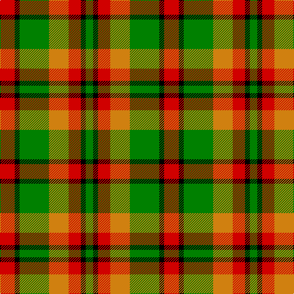

This page is one **sett** — a single exact thread-count. It belongs to the [tartan](/tartans/r6k2g12o8r5k2g3/)
(the same proportion at any scale), whose colour order is pattern [GKRYGKR](/stripes/gkrygkr/).

Sourced from weddslist.  It is a [7 stripe tartan](/stripes/stripes7/).

Original link http://www.weddslist.com/cgi-bin/tartans/pg.pl?source=sts

## Thread count
R/24 K8 G48 O32 R20 K8 G/12

## Palette
Each colour and the base-6 reference it is a variant of.

| Colour | Shade | Base |
|---|---|---|
| G | <code style="background-color:#008000;">#008000</code> `oklch(52.0% 0.177 142.5)` <small>#008000</small> | G <code style="background-color:#006100;">#006100</code> |
| K | <code style="background-color:#000000;">#000000</code> `oklch(0.0% 0.000 0.0)` <small>#000000</small> | K <code style="background-color:#000000;">#000000</code> |
| O | <code style="background-color:#D08010;">#D08010</code> `oklch(67.0% 0.145 66.1)` <small>#D08010</small> | Y <code style="background-color:#F2BF00;">#F2BF00</code> |
| R | <code style="background-color:#D00000;">#D00000</code> `oklch(53.9% 0.221 29.2)` <small>#D00000</small> | R <code style="background-color:#CC0000;">#CC0000</code> |

# Sample pattern

## Nearest tartans

The nearest existing variants by ΔTartan distance, with this tartan at the top so the swatches line up against it.

ΔTartan

Tartan

Sett

—

<a href="/ttd/edit/#slug=r6k2g12lo8r5k2g3~x4">Londonderry</a> <a class="nn-out" href="/setts/s7/r6k2g12lo8r5k2g3~x4/" title="open its dictionary page">↗</a>

1.09

<a href="/ttd/edit/#slug=o6k2dg12lo8o5k2dg3~x4">Londonderry, County</a> <a class="nn-out" href="/setts/s7/o6k2dg12lo8o5k2dg3~x4/" title="open its dictionary page">↗</a>

1.29

<a href="/ttd/edit/#slug=r2g4db8r9g9k2r2~x2">Stewart, Plaid</a> <a class="nn-out" href="/setts/s7/r2g4db8r9g9k2r2~x2/" title="open its dictionary page">↗</a>

1.34

<a href="/ttd/edit/#slug=g9ly2g9w5r9t2r9t2~x2">Blackie</a> <a class="nn-out" href="/setts/s8/g9ly2g9w5r9t2r9t2~x2/" title="open its dictionary page">↗</a>

1.34

<a href="/ttd/edit/#slug=r2ly1r5k4g5w1~x4">Aboyne II (Fashion)</a> <a class="nn-out" href="/setts/s6/r2ly1r5k4g5w1~x4/" title="open its dictionary page">↗</a>

1.35

<a href="/ttd/edit/#slug=k3lo18k12lo18k2lo2k3~x2">Kinloch Anderson Check (Fashion)</a> <a class="nn-out" href="/setts/s7/k3lo18k12lo18k2lo2k3~x2/" title="open its dictionary page">↗</a>

1.35

<a href="/ttd/edit/#slug=dg20r8lr2r8dg5ly8dg2ly8~x2">Unidentified #57</a> <a class="nn-out" href="/setts/s8/dg20r8lr2r8dg5ly8dg2ly8~x2/" title="open its dictionary page">↗</a>

1.37

<a href="/ttd/edit/#slug=g10lo8r5k2g3k2r5lo8g12k2r6k2g2~x4">Londonderry Irish County Tartan Tartan Number: 2279. Earliest known date: 1995 One of a series of Irish District tartans designed by Polly Wittering of the House of Edgar, with colours reminiscent of the Country with soft warm colours dominating. See products available Copyright © Blair Urquhart, Comrie, 2015</a> <a class="nn-out" href="/setts/s13/g10lo8r5k2g3k2r5lo8g12k2r6k2g2~x4/" title="open its dictionary page">↗</a>

1.40

<a href="/ttd/edit/#slug=dy3k7dy2w2lo12k2lo2dy3~x2">Daks (Brown)</a> <a class="nn-out" href="/setts/s8/dy3k7dy2w2lo12k2lo2dy3~x2/" title="open its dictionary page">↗</a>

1.45

<a href="/ttd/edit/#slug=g13ly16w4ly4r4ly4k20ly8r8~x2">Cawte of Middlebanknock (Personal)</a> <a class="nn-out" href="/setts/s9/g13ly16w4ly4r4ly4k20ly8r8~x2/" title="open its dictionary page">↗</a>

1.47

<a href="/ttd/edit/#slug=g6lr2g10k3r1k3lo10lr2lo6~x4">Eire (District?)</a> <a class="nn-out" href="/setts/s9/g6lr2g10k3r1k3lo10lr2lo6~x4/" title="open its dictionary page">↗</a>

## Neighbour map

Every grey dot is one of 14299 variants placed by the first two principal components of the ΔTartan feature space (44% of its variance). Red is this tartan; blue dots are its nearest — click one to open its page.

<svg viewBox="0 0 640 380" role="img" style="max-width:100%;height:auto;border:1px solid #e0e0e0;border-radius:4px;display:block" xmlns="http://www.w3.org/2000/svg"><image href="/nn/cloud.v1.png" width="640" height="380"/><a href="/setts/s7/o6k2dg12lo8o5k2dg3~x4/"><circle cx="170.3" cy="240.6" r="4" fill="#3465a4"><title>Londonderry, County</title></circle></a><a href="/setts/s7/r2g4db8r9g9k2r2~x2/"><circle cx="146.0" cy="246.5" r="4" fill="#3465a4"><title>Stewart, Plaid</title></circle></a><a href="/setts/s8/g9ly2g9w5r9t2r9t2~x2/"><circle cx="114.9" cy="218.2" r="4" fill="#3465a4"><title>Blackie</title></circle></a><a href="/setts/s6/r2ly1r5k4g5w1~x4/"><circle cx="113.6" cy="221.6" r="4" fill="#3465a4"><title>Aboyne II (Fashion)</title></circle></a><a href="/setts/s7/k3lo18k12lo18k2lo2k3~x2/"><circle cx="161.5" cy="181.7" r="4" fill="#3465a4"><title>Kinloch Anderson Check (Fashion)</title></circle></a><a href="/setts/s8/dg20r8lr2r8dg5ly8dg2ly8~x2/"><circle cx="223.9" cy="210.3" r="4" fill="#3465a4"><title>Unidentified #57</title></circle></a><a href="/setts/s13/g10lo8r5k2g3k2r5lo8g12k2r6k2g2~x4/"><circle cx="146.3" cy="202.6" r="4" fill="#3465a4"><title>Londonderry Irish County Tartan Tartan Number: 2279. Earliest known date: 1995 One of a series of Irish District tartans designed by Polly Wittering of the House of Edgar, with colours reminiscent of the Country with soft warm colours dominating. See products available Copyright © Blair Urquhart, Comrie, 2015</title></circle></a><a href="/setts/s8/dy3k7dy2w2lo12k2lo2dy3~x2/"><circle cx="179.3" cy="204.2" r="4" fill="#3465a4"><title>Daks (Brown)</title></circle></a><a href="/setts/s9/g13ly16w4ly4r4ly4k20ly8r8~x2/"><circle cx="87.2" cy="189.2" r="4" fill="#3465a4"><title>Cawte of Middlebanknock (Personal)</title></circle></a><a href="/setts/s9/g6lr2g10k3r1k3lo10lr2lo6~x4/"><circle cx="135.7" cy="175.7" r="4" fill="#3465a4"><title>Eire (District?)</title></circle></a><circle cx="148.9" cy="224.4" r="5" fill="#c00000"/></svg>

ID: /setts/s7/r6k2g12lo8r5k2g3~x4/
