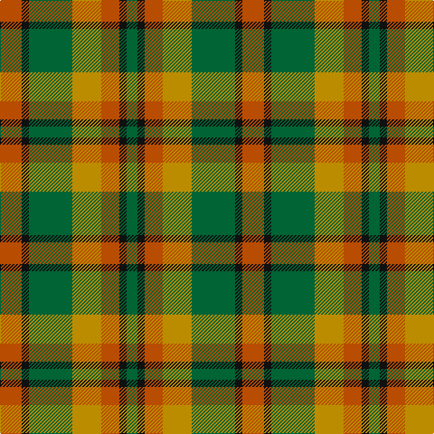

In pattern [GKRYGKR](/patterns/gkrygkr/).

This was sourced from tartans-authority.  It is a [7 stripes tartan](/stripes/stripes7/).

Original link http://www.tartansauthority.com/tartan-ferret/display/2279/

## Thread count
DO/24 K8 G48 DY32 DO20 K8 G/12

## Palette
Each colour and its ΔE from the base-6 reference it is a variant of.

| Colour | Shade | Base | ΔE (OKLab) |
|---|---|---|---|
| DO | <code style="background-color:#B84C00;">#B84C00</code> `#B84C00` | R <code style="background-color:#CC0000;">#CC0000</code> | 0.08 |
| DY | <code style="background-color:#BC8C00;">#BC8C00</code> `#BC8C00` | Y <code style="background-color:#F2BF00;">#F2BF00</code> | 0.16 |
| G | <code style="background-color:#006434;">#006434</code> `#006434` | G <code style="background-color:#006100;">#006100</code> | 0.04 |
| K | <code style="background-color:#101010;">#101010</code> `#101010` | K <code style="background-color:#000000;">#000000</code> | 0.17 |

# Sample pattern

## Nearest tartans

The nearest existing variants by ΔTartan distance.

1. [Londonderry, County](/setts/s7/r6k2g12y8r5k2g3x4~g003820-k101010-rb84c00-ybc8c00/) — ΔT 0.89
1. [Monaghan](/setts/s9/y3b2r14g17b14y8r14b2y3x2~b401000-g008000-r806050-yd08010/) — ΔT 0.92
1. [Alister Grant 'Mohr', the Laird's Champion](/setts/s7/g30k4y10k4r5y5r15x2~g777733-k101010-rb13e0f-ybdbd65/) — ΔT 1.15
1. [Unidentified #57](/setts/s8/g20r8y2r8g5ya8g2ya8x2~g004c00-r8c0000-yb0b0b0-yac89800/) — ΔT 1.24
1. [Wilson's No.179](/setts/s8/g6y1r1b2r2b2r1y1x4~b2888c4-g006818-rc80000-ye8c000/) — ΔT 1.34
1. [Stewart, Plaid](/setts/s7/r2g4b8r9g9k2r2x2~b304080-g008000-k000000-rc00000/) — ΔT 1.39
1. [Quinn (Name?)](/setts/s12/g20r20ga5r5ga30k10g10y8ga30r5ga5r20x2~g408060-ga006818-k101010-rc80000-ye8c000/) — ΔT 1.42
1. [Glen Esk (1993)](/setts/s7/g2r1g8r5ga5r1ga2x4~g005020-ga5c6428-rdc0000/) — ΔT 1.42
1. [Harmony 8](/setts/s5/g2ga10r15g10ga2x4~g2a2303-ga808080-rbe7832/) — ΔT 1.44
1. [Glen Esk (Fashion)](/setts/s7/g2r1g8r5ga5r1ga2x4~g004c00-ga6c6c00-rc80000/) — ΔT 1.46

## Neighbour map

Every grey dot is one of 15726 variants placed by the first two principal components of the ΔTartan feature space (44% of its variance). Red is this tartan; blue dots are its nearest — click one to open its page.

<svg viewBox="0 0 640 380" role="img" style="max-width:100%;height:auto;border:1px solid #e0e0e0;border-radius:4px;display:block" xmlns="http://www.w3.org/2000/svg"><image href="/nn/cloud.v1.png" width="640" height="380"/><a href="/setts/s7/r6k2g12y8r5k2g3x4~g003820-k101010-rb84c00-ybc8c00/"><circle cx="168.6" cy="239.5" r="4" fill="#3465a4"><title>Londonderry, County</title></circle></a><a href="/setts/s9/y3b2r14g17b14y8r14b2y3x2~b401000-g008000-r806050-yd08010/"><circle cx="184.1" cy="216.0" r="4" fill="#3465a4"><title>Monaghan</title></circle></a><a href="/setts/s7/g30k4y10k4r5y5r15x2~g777733-k101010-rb13e0f-ybdbd65/"><circle cx="212.9" cy="208.5" r="4" fill="#3465a4"><title>Alister Grant 'Mohr', the Laird's Champion</title></circle></a><a href="/setts/s8/g20r8y2r8g5ya8g2ya8x2~g004c00-r8c0000-yb0b0b0-yac89800/"><circle cx="222.5" cy="209.7" r="4" fill="#3465a4"><title>Unidentified #57</title></circle></a><a href="/setts/s8/g6y1r1b2r2b2r1y1x4~b2888c4-g006818-rc80000-ye8c000/"><circle cx="159.9" cy="211.6" r="4" fill="#3465a4"><title>Wilson's No.179</title></circle></a><a href="/setts/s7/r2g4b8r9g9k2r2x2~b304080-g008000-k000000-rc00000/"><circle cx="144.0" cy="246.6" r="4" fill="#3465a4"><title>Stewart, Plaid</title></circle></a><a href="/setts/s12/g20r20ga5r5ga30k10g10y8ga30r5ga5r20x2~g408060-ga006818-k101010-rc80000-ye8c000/"><circle cx="161.3" cy="200.7" r="4" fill="#3465a4"><title>Quinn (Name?)</title></circle></a><a href="/setts/s7/g2r1g8r5ga5r1ga2x4~g005020-ga5c6428-rdc0000/"><circle cx="270.1" cy="253.4" r="4" fill="#3465a4"><title>Glen Esk (1993)</title></circle></a><a href="/setts/s5/g2ga10r15g10ga2x4~g2a2303-ga808080-rbe7832/"><circle cx="227.8" cy="261.3" r="4" fill="#3465a4"><title>Harmony 8</title></circle></a><a href="/setts/s7/g2r1g8r5ga5r1ga2x4~g004c00-ga6c6c00-rc80000/"><circle cx="272.5" cy="255.0" r="4" fill="#3465a4"><title>Glen Esk (Fashion)</title></circle></a><circle cx="183.4" cy="245.1" r="5" fill="#c00000"/></svg>

ID: /setts/s7/r6k2g12y8r5k2g3x4~g006434-k101010-rb84c00-ybc8c00/
