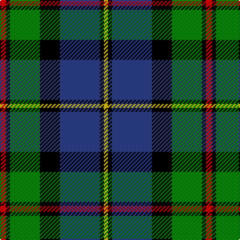

In pattern [RKGKBKY](/patterns/rkgkbky/).

This was sourced from weddslist.  It is a [7 stripes tartan](/stripes/stripes7/).

Original link http://www.weddslist.com/cgi-bin/tartans/pg.pl?source=sts

## Thread count
R/6 K4 G30 K20 B40 K4 Y/4

## Palette
Each colour and its ΔE from the base-6 reference it is a variant of.

| Colour | Shade | Base | ΔE (OKLab) |
|---|---|---|---|
| B | <code style="background-color:#304080;">#304080</code> `#304080` | B <code style="background-color:#2C4084;">#2C4084</code> | 0.01 |
| G | <code style="background-color:#008000;">#008000</code> `#008000` | G <code style="background-color:#006400;">#006400</code> | 0.09 |
| K | <code style="background-color:#000000;">#000000</code> `#000000` | K <code style="background-color:#000000;">#000000</code> | 0.00 |
| R | <code style="background-color:#C00000;">#C00000</code> `#C00000` | R <code style="background-color:#C80000;">#C80000</code> | 0.02 |
| Y | <code style="background-color:#F0C000;">#F0C000</code> `#F0C000` | Y <code style="background-color:#E8C000;">#E8C000</code> | 0.01 |

# Sample pattern

## Nearest tartans

The nearest existing variants by ΔTartan distance.

1. [MacLeod of Assynt](/setts/s6/r6k4g30k20b40y4-b304080-g008000-k000000-rc00000-yf0c000/) — ΔT 0.46
1. [MacPhail, hunting](/setts/s6/r4b46k28g32k4w4-b304080-g008000-k000000-rc00000-we0e0e0/) — ΔT 0.52
1. [MacTaggert](/setts/s7/g18b4g2k12ba12r2ba2-b5480b0-ba304080-g008000-k000000-rc00000/) — ΔT 0.62
1. [Skene](/setts/s7/b48k8r6k8g48k8y8-b304080-g008000-k000000-rc00000-yff8500/) — ΔT 0.64
1. [Colquhoun](/setts/s7/r8g32w4k32b32k4b4-b304080-g008000-k000000-rc00000-we0e0e0/) — ΔT 0.68
1. [MacNeil 4](/setts/s6/w4b32k36g36k4y4-b304080-g008000-k000000-we0e0e0-yf0c000/) — ΔT 0.70
1. [MacDonald, (Flora.. )](/setts/s7/g34y4k28r4b18r4b20-b304080-g008000-k000000-rc00000-yf0c000/) — ΔT 0.72
1. [Argyll / MacCorquodale](/setts/s7/b4k2g16k16ba16k2r4-b5480b0-ba304080-g008000-k000000-rc00000/) — ΔT 0.73
1. [Borrodale](/setts/s8/r10b6r6b58k58g58w8r8-b304080-g008000-k000000-rc00000-we0e0e0/) — ΔT 0.74
1. [Russell, or Mitchell or Hunter or Galbraith](/setts/s6/k4g24k24r2b24w4-b304080-g008000-k000000-rc00000-we0e0e0/) — ΔT 0.74

## Neighbour map

Every grey dot is one of 15726 variants placed by the first two principal components of the ΔTartan feature space (44% of its variance). Red is this tartan; blue dots are its nearest — click one to open its page.

<svg viewBox="0 0 640 380" role="img" style="max-width:100%;height:auto;border:1px solid #e0e0e0;border-radius:4px;display:block" xmlns="http://www.w3.org/2000/svg"><image href="/nn/cloud.v1.png" width="640" height="380"/><a href="/setts/s6/r6k4g30k20b40y4-b304080-g008000-k000000-rc00000-yf0c000/"><circle cx="150.1" cy="192.0" r="4" fill="#3465a4"><title>MacLeod of Assynt</title></circle></a><a href="/setts/s6/r4b46k28g32k4w4-b304080-g008000-k000000-rc00000-we0e0e0/"><circle cx="162.8" cy="185.0" r="4" fill="#3465a4"><title>MacPhail, hunting</title></circle></a><a href="/setts/s7/g18b4g2k12ba12r2ba2-b5480b0-ba304080-g008000-k000000-rc00000/"><circle cx="140.5" cy="191.0" r="4" fill="#3465a4"><title>MacTaggert</title></circle></a><a href="/setts/s7/b48k8r6k8g48k8y8-b304080-g008000-k000000-rc00000-yff8500/"><circle cx="145.2" cy="181.4" r="4" fill="#3465a4"><title>Skene</title></circle></a><a href="/setts/s7/r8g32w4k32b32k4b4-b304080-g008000-k000000-rc00000-we0e0e0/"><circle cx="106.3" cy="191.3" r="4" fill="#3465a4"><title>Colquhoun</title></circle></a><a href="/setts/s6/w4b32k36g36k4y4-b304080-g008000-k000000-we0e0e0-yf0c000/"><circle cx="124.8" cy="195.7" r="4" fill="#3465a4"><title>MacNeil 4</title></circle></a><a href="/setts/s7/g34y4k28r4b18r4b20-b304080-g008000-k000000-rc00000-yf0c000/"><circle cx="112.7" cy="198.1" r="4" fill="#3465a4"><title>MacDonald, (Flora.. )</title></circle></a><a href="/setts/s7/b4k2g16k16ba16k2r4-b5480b0-ba304080-g008000-k000000-rc00000/"><circle cx="107.9" cy="198.1" r="4" fill="#3465a4"><title>Argyll / MacCorquodale</title></circle></a><a href="/setts/s8/r10b6r6b58k58g58w8r8-b304080-g008000-k000000-rc00000-we0e0e0/"><circle cx="109.5" cy="167.0" r="4" fill="#3465a4"><title>Borrodale</title></circle></a><a href="/setts/s6/k4g24k24r2b24w4-b304080-g008000-k000000-rc00000-we0e0e0/"><circle cx="132.3" cy="189.4" r="4" fill="#3465a4"><title>Russell, or Mitchell or Hunter or Galbraith</title></circle></a><circle cx="146.9" cy="178.3" r="5" fill="#c00000"/></svg>

ID: /setts/s7/r6k4g30k20b40k4y4-b304080-g008000-k000000-rc00000-yf0c000/
