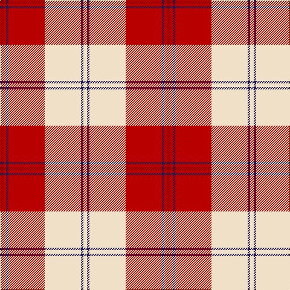

In pattern [RRBRWBW](/patterns/rrbrwbw/).

This was sourced from tartans-authority.  It is a [7 stripes tartan](/stripes/stripes7/).

Original link http://www.tartansauthority.com/tartan-ferret/display/7573/

## Attestations

This cloth appears in 2 source records; the oldest owns this page.

- March 2008 — Torridon, Cherry (Dance) (tartans-authority, [record](http://www.tartansauthority.com/tartan-ferret/display/7573/))
- undated — Torridon Cherry (register-of-tartans, [record](https://www.tartanregister.gov.uk/tartanDetails.aspx?ref=5597))

## Thread count
DR/6 R4 DB4 R60 W60 DB4 W/6

## Palette
Each colour and its ΔE from the base-6 reference it is a variant of.

| Colour | Shade | Base | ΔE (OKLab) |
|---|---|---|---|
| DB | <code style="background-color:#1C1C50;">#1C1C50</code> `#1C1C50` | B <code style="background-color:#2C4084;">#2C4084</code> | 0.14 |
| DR | <code style="background-color:#880000;">#880000</code> `#880000` | R <code style="background-color:#C80000;">#C80000</code> | 0.14 |
| R | <code style="background-color:#B80000;">#B80000</code> `#B80000` | R <code style="background-color:#C80000;">#C80000</code> | 0.03 |
| W | <code style="background-color:#F0E0C8;">#F0E0C8</code> `#F0E0C8` | W <code style="background-color:#F4F4F0;">#F4F4F0</code> | 0.06 |

# Sample pattern

ID: /setts/s7/r6ra4b4ra60w60b4w6-b1c1c50-r880000-rab80000-wf0e0c8/
