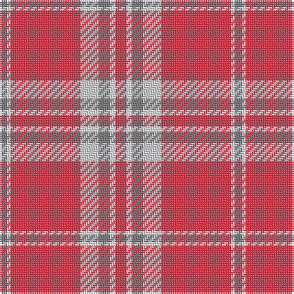

In pattern [GWRWGWR](/patterns/gwrwgwr/).

This was sourced from register-of-tartans.  It is a [7 stripes tartan](/stripes/stripes7/).

Original link https://www.tartanregister.gov.uk/tartanDetails.aspx?ref=10831

## Thread count
N/4 W2 R38 Na10 N6 W3 R/6

## Palette
Each colour and its ΔE from the base-6 reference it is a variant of.

| Colour | Shade | Base | ΔE (OKLab) |
|---|---|---|---|
| N | <code style="background-color:#777478;">#777478</code> `#777478` | G <code style="background-color:#006400;">#006400</code> | 0.20 |
| Na | <code style="background-color:#CFD0D3;">#CFD0D3</code> `#CFD0D3` | W <code style="background-color:#F4F4F0;">#F4F4F0</code> | 0.11 |
| R | <code style="background-color:#D53348;">#D53348</code> `#D53348` | R <code style="background-color:#C80000;">#C80000</code> | 0.07 |
| W | <code style="background-color:#FFFFFF;">#FFFFFF</code> `#FFFFFF` | W <code style="background-color:#F4F4F0;">#F4F4F0</code> | 0.03 |

# Sample pattern

ID: /setts/s7/r6w3g6wa10r38w2g4-g777478-rd53348-wffffff-wacfd0d3/
