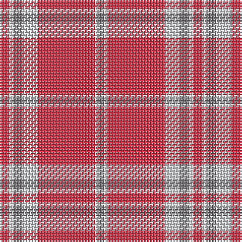

This page is one **sett** — a single exact thread-count. It belongs to the [tartan](/tartans/r6w3n6na10r38w2n4/)
(the same proportion at any scale), whose colour order is pattern [BWRWBWR](/stripes/bwrwbwr/).

Sourced from register-of-tartans.  It is a [7 stripe tartan](/stripes/stripes7/).

Original link https://www.tartanregister.gov.uk/tartanDetails.aspx?ref=10831

## Register references

External register numbers recorded for this tartan.

- Scottish Register of Tartans: [10831](https://www.tartanregister.gov.uk/tartanDetails.aspx?ref=10831)

## Thread count
R/6 W3 N6 Na10 R38 W2 N/4

## Palette
Each colour and the base-6 reference it is a variant of.

| Colour | Shade | Base |
|---|---|---|
| N | <code style="background-color:#777478;">#777478</code> `oklch(56.3% 0.007 317.7)` <small>#777478</small> | B <code style="background-color:#2A418A;">#2A418A</code> |
| Na | <code style="background-color:#CFD0D3;">#CFD0D3</code> `oklch(85.8% 0.004 271.4)` <small>#CFD0D3</small> | W <code style="background-color:#F7F7F7;">#F7F7F7</code> |
| R | <code style="background-color:#D53348;">#D53348</code> `oklch(57.8% 0.197 19.3)` <small>#D53348</small> | R <code style="background-color:#CC0000;">#CC0000</code> |
| W | <code style="background-color:#FFFFFF;">#FFFFFF</code> `oklch(100.0% 0.000 89.9)` <small>#FFFFFF</small> | W <code style="background-color:#F7F7F7;">#F7F7F7</code> |

# Sample pattern

## Nearest tartans

The nearest existing variants by ΔTartan distance, with this tartan at the top so the swatches line up against it.

ΔTartan

Tartan

Sett

—

<a href="/ttd/edit/#slug=r6w3n6lb10r38w2n4">Washington State University Cougar</a> <a class="nn-out" href="/setts/s7/r6w3n6lb10r38w2n4/" title="open its dictionary page">↗</a>

1.51

<a href="/ttd/edit/#slug=k3lo6lb13r2lb2r32lb1r2lb1~x2">Fueglistal</a> <a class="nn-out" href="/setts/s9/k3lo6lb13r2lb2r32lb1r2lb1~x2/" title="open its dictionary page">↗</a>

1.52

<a href="/ttd/edit/#slug=r67ly3n6lb3w25r10n6lb7w3~x2">Drummond of Perth Dress #3</a> <a class="nn-out" href="/setts/s9/r67ly3n6lb3w25r10n6lb7w3~x2/" title="open its dictionary page">↗</a>

1.57

<a href="/ttd/edit/#slug=k3o6lr13r2lr2r32lr1r2lr2~x2">Fueglistal (Aargau) (Personal)</a> <a class="nn-out" href="/setts/s9/k3o6lr13r2lr2r32lr1r2lr2~x2/" title="open its dictionary page">↗</a>

1.57

<a href="/ttd/edit/#slug=m6lb3n6o10m38lb2n4">Washington State University Cougar</a> <a class="nn-out" href="/setts/s7/m6lb3n6o10m38lb2n4/" title="open its dictionary page">↗</a>

1.63

<a href="/ttd/edit/#slug=r7w2r36b6g3b3g3b3g12r4~x2">Chisholm of Strathglass (Clan)</a> <a class="nn-out" href="/setts/s10/r7w2r36b6g3b3g3b3g12r4~x2/" title="open its dictionary page">↗</a>

1.66

<a href="/ttd/edit/#slug=r3r3lb23r3r3r23k2r3~x2">Hose #2</a> <a class="nn-out" href="/setts/s8/r3r3lb23r3r3r23k2r3~x2/" title="open its dictionary page">↗</a>

1.68

<a href="/ttd/edit/#slug=lr42r10n2r2lb2r2lr10lb6r2lb3lr2~x2">Nevis Dress</a> <a class="nn-out" href="/setts/s11/lr42r10n2r2lb2r2lr10lb6r2lb3lr2~x2/" title="open its dictionary page">↗</a>

1.70

<a href="/ttd/edit/#slug=r12y6k1y2k1y1k6r24w2~x4">Stuart of Bute</a> <a class="nn-out" href="/setts/s9/r12y6k1y2k1y1k6r24w2~x4/" title="open its dictionary page">↗</a>

1.72

<a href="/ttd/edit/#slug=r32lb4dt7ly2t2~x5">Sildesalaten</a> <a class="nn-out" href="/setts/s5/r32lb4dt7ly2t2~x5/" title="open its dictionary page">↗</a>

1.77

<a href="/ttd/edit/#slug=r12w2r37b6g3b3r4b3g21r4~x2">Chisholm, The (MacGregor-Hastie)</a> <a class="nn-out" href="/setts/s10/r12w2r37b6g3b3r4b3g21r4~x2/" title="open its dictionary page">↗</a>

## Neighbour map

Every grey dot is one of 14299 variants placed by the first two principal components of the ΔTartan feature space (44% of its variance). Red is this tartan; blue dots are its nearest — click one to open its page.

<svg viewBox="0 0 640 380" role="img" style="max-width:100%;height:auto;border:1px solid #e0e0e0;border-radius:4px;display:block" xmlns="http://www.w3.org/2000/svg"><image href="/nn/cloud.v1.png" width="640" height="380"/><a href="/setts/s9/k3lo6lb13r2lb2r32lb1r2lb1~x2/"><circle cx="395.4" cy="96.3" r="4" fill="#3465a4"><title>Fueglistal</title></circle></a><a href="/setts/s9/r67ly3n6lb3w25r10n6lb7w3~x2/"><circle cx="356.7" cy="87.6" r="4" fill="#3465a4"><title>Drummond of Perth Dress #3</title></circle></a><a href="/setts/s9/k3o6lr13r2lr2r32lr1r2lr2~x2/"><circle cx="413.3" cy="112.3" r="4" fill="#3465a4"><title>Fueglistal (Aargau) (Personal)</title></circle></a><a href="/setts/s7/m6lb3n6o10m38lb2n4/"><circle cx="443.6" cy="165.0" r="4" fill="#3465a4"><title>Washington State University Cougar</title></circle></a><a href="/setts/s10/r7w2r36b6g3b3g3b3g12r4~x2/"><circle cx="380.5" cy="134.9" r="4" fill="#3465a4"><title>Chisholm of Strathglass (Clan)</title></circle></a><a href="/setts/s8/r3r3lb23r3r3r23k2r3~x2/"><circle cx="307.4" cy="149.7" r="4" fill="#3465a4"><title>Hose #2</title></circle></a><a href="/setts/s11/lr42r10n2r2lb2r2lr10lb6r2lb3lr2~x2/"><circle cx="449.8" cy="119.1" r="4" fill="#3465a4"><title>Nevis Dress</title></circle></a><a href="/setts/s9/r12y6k1y2k1y1k6r24w2~x4/"><circle cx="413.8" cy="120.3" r="4" fill="#3465a4"><title>Stuart of Bute</title></circle></a><a href="/setts/s5/r32lb4dt7ly2t2~x5/"><circle cx="417.2" cy="142.4" r="4" fill="#3465a4"><title>Sildesalaten</title></circle></a><a href="/setts/s10/r12w2r37b6g3b3r4b3g21r4~x2/"><circle cx="379.4" cy="140.2" r="4" fill="#3465a4"><title>Chisholm, The (MacGregor-Hastie)</title></circle></a><circle cx="413.2" cy="141.2" r="5" fill="#c00000"/></svg>

ID: /setts/s7/r6w3n6lb10r38w2n4/
