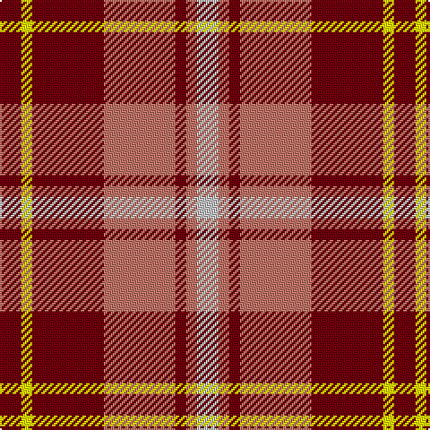

In pattern [RYRRRRW](/patterns/ryrrrrw/).

This was sourced from register-of-tartans.  It is a [7 stripes tartan](/stripes/stripes7/).

Original link https://www.tartanregister.gov.uk/tartanDetails.aspx?ref=5016

## Thread count
DR/12 Y6 DR40 LT40 DR6 LT6 N/12

## Palette
Each colour and its ΔE from the base-6 reference it is a variant of.

| Colour | Shade | Base | ΔE (OKLab) |
|---|---|---|---|
| DR | <code style="background-color:#70000C;">#70000C</code> `#70000C` | R <code style="background-color:#CC0000;">#CC0000</code> | 0.20 |
| LT | <code style="background-color:#C07468;">#C07468</code> `#C07468` | R <code style="background-color:#CC0000;">#CC0000</code> | 0.16 |
| N | <code style="background-color:#C4C4C4;">#C4C4C4</code> `#C4C4C4` | W <code style="background-color:#F7F7F7;">#F7F7F7</code> | 0.16 |
| Y | <code style="background-color:#FCFC00;">#FCFC00</code> `#FCFC00` | Y <code style="background-color:#F2BF00;">#F2BF00</code> | 0.15 |

# Sample pattern

## Nearest tartans

The nearest existing variants by ΔTartan distance.

1. [Sidney (Nova Scotia) Canadian Tartan Tartan Number: 1291. Earliest known date: 1986 The Falkirk Tartan. An ornamental twill weave check of natural light and dark wool was discovered at Falkirk in the neck of a jar containing Roman coins. The find is thought to have been buried about 260 A.D. The black and white check is woven today as the Shepherd tartan. See products available Copyright © Blair Urquhart, Comrie, 2015](/setts/s8/r16k4w2k4r6ra11r2ra16x2~k101010-r888888-rac80000-we0e0e0/) — ΔT 0.74
1. [MacKintosh-Geddes (Personal?)](/setts/s7/b2r4g12r3b6r10w2x2~b780078-g006818-rc80000-wfcfcfc/) — ΔT 0.95
1. [Ballater](/setts/s9/r12w2ra3w2r3k5r2ra18w2x2~k000000-rc00000-ra906030-we0e0e0/) — ΔT 1.15
1. [Mangles, Peter and Annette (Personal](/setts/s7/r20k5g5r5w5ra3g3x4~g285800-k101010-rc80000-ra888888-wfcfcfc/) — ΔT 1.17
1. [Unidentified 34](/setts/s9/w6r1ra4w1b4r1ra8w1ra2x2~b000050-r906030-rac00000-we0e0e0/) — ΔT 1.19
1. [Mangles, Peter and Annette Family/Personal Tartan Tartan Number: 10844. Earliest known date: 02/05/2013 The colours were chosen to represent the organisation and the location where Peter and Annette first met in Liverpool. In addition the red is representative of the city of Aberdeen (Scotland) and the black and grey is representative of the granite used extensively throughout Aberdeen See products available Copyright © Blair Urquhart, Comrie, 2015](/setts/s7/r20k5g5r5w5y3g3x4~g006840-k101010-re01c18-wf8f8f8-ya4a8a8/) — ΔT 1.20
1. [Alexander - 1985 (Name)](/setts/s9/r12b2r4b4k15g4r4g2r12x2~b2888c4-g006818-k101010-rc80000/) — ΔT 1.20
1. [MacKinnon #10](/setts/s11/w2r4g8r16b2r3g16r4b2r4w2x2~b3c82af-g005020-rdc0000-we0e0e0/) — ΔT 1.21
1. [Moray of Abercairney](/setts/s6/r8ra1g4ra1g1b2x2~b3c82af-g005020-rdc0000-rac82828/) — ΔT 1.22
1. [Henkel (Corporate)](/setts/s6/k3g28k3r22k8w3x2~g808080-k101010-rc80000-wfcfcfc/) — ΔT 1.22

## Neighbour map

Every grey dot is one of 15726 variants placed by the first two principal components of the ΔTartan feature space (44% of its variance). Red is this tartan; blue dots are its nearest — click one to open its page.

<svg viewBox="0 0 640 380" role="img" style="max-width:100%;height:auto;border:1px solid #e0e0e0;border-radius:4px;display:block" xmlns="http://www.w3.org/2000/svg"><image href="/nn/cloud.v1.png" width="640" height="380"/><a href="/setts/s8/r16k4w2k4r6ra11r2ra16x2~k101010-r888888-rac80000-we0e0e0/"><circle cx="236.0" cy="204.3" r="4" fill="#3465a4"><title>Sidney (Nova Scotia) Canadian Tartan Tartan Number: 1291. Earliest known date: 1986 The Falkirk Tartan. An ornamental twill weave check of natural light and dark wool was discovered at Falkirk in the neck of a jar containing Roman coins. The find is thought to have been buried about 260 A.D. The black and white check is woven today as the Shepherd tartan. See products available Copyright © Blair Urquhart, Comrie, 2015</title></circle></a><a href="/setts/s7/b2r4g12r3b6r10w2x2~b780078-g006818-rc80000-wfcfcfc/"><circle cx="200.7" cy="224.3" r="4" fill="#3465a4"><title>MacKintosh-Geddes (Personal?)</title></circle></a><a href="/setts/s9/r12w2ra3w2r3k5r2ra18w2x2~k000000-rc00000-ra906030-we0e0e0/"><circle cx="222.4" cy="165.4" r="4" fill="#3465a4"><title>Ballater</title></circle></a><a href="/setts/s7/r20k5g5r5w5ra3g3x4~g285800-k101010-rc80000-ra888888-wfcfcfc/"><circle cx="230.6" cy="179.9" r="4" fill="#3465a4"><title>Mangles, Peter and Annette (Personal</title></circle></a><a href="/setts/s9/w6r1ra4w1b4r1ra8w1ra2x2~b000050-r906030-rac00000-we0e0e0/"><circle cx="218.1" cy="177.2" r="4" fill="#3465a4"><title>Unidentified 34</title></circle></a><a href="/setts/s7/r20k5g5r5w5y3g3x4~g006840-k101010-re01c18-wf8f8f8-ya4a8a8/"><circle cx="227.6" cy="176.5" r="4" fill="#3465a4"><title>Mangles, Peter and Annette Family/Personal Tartan Tartan Number: 10844. Earliest known date: 02/05/2013 The colours were chosen to represent the organisation and the location where Peter and Annette first met in Liverpool. In addition the red is representative of the city of Aberdeen (Scotland) and the black and grey is representative of the granite used extensively throughout Aberdeen See products available Copyright © Blair Urquhart, Comrie, 2015</title></circle></a><a href="/setts/s9/r12b2r4b4k15g4r4g2r12x2~b2888c4-g006818-k101010-rc80000/"><circle cx="258.6" cy="203.6" r="4" fill="#3465a4"><title>Alexander - 1985 (Name)</title></circle></a><a href="/setts/s11/w2r4g8r16b2r3g16r4b2r4w2x2~b3c82af-g005020-rdc0000-we0e0e0/"><circle cx="259.3" cy="176.2" r="4" fill="#3465a4"><title>MacKinnon #10</title></circle></a><a href="/setts/s6/r8ra1g4ra1g1b2x2~b3c82af-g005020-rdc0000-rac82828/"><circle cx="271.4" cy="208.3" r="4" fill="#3465a4"><title>Moray of Abercairney</title></circle></a><a href="/setts/s6/k3g28k3r22k8w3x2~g808080-k101010-rc80000-wfcfcfc/"><circle cx="221.6" cy="192.0" r="4" fill="#3465a4"><title>Henkel (Corporate)</title></circle></a><circle cx="247.9" cy="202.8" r="5" fill="#c00000"/></svg>

ID: /setts/s7/r6y3r20ra20r3ra3w6x2~r70000c-rac07468-wc4c4c4-yfcfc00/
