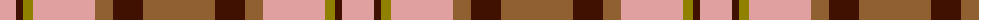
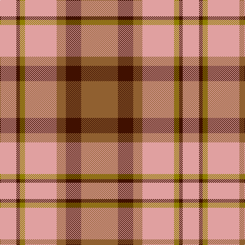

In pattern [RBRYGBY](/patterns/rbrygby/).

This was sourced from weddslist.  It is a [7 stripes tartan](/stripes/stripes7/).

Original link http://www.weddslist.com/cgi-bin/tartans/pg.pl?source=sts

## Thread count
LR/32 DR7 LG10 LR62 LT18 DR30 LT/72

## Palette
Each colour and its ΔE from the base-6 reference it is a variant of.

| Colour | Shade | Base | ΔE (OKLab) |
|---|---|---|---|
| DR | <code style="background-color:#401000;">#401000</code> `#401000` | B <code style="background-color:#2C4084;">#2C4084</code> | 0.23 |
| LG | <code style="background-color:#908000;">#908000</code> `#908000` | G <code style="background-color:#006400;">#006400</code> | 0.19 |
| LR | <code style="background-color:#E0A0A0;">#E0A0A0</code> `#E0A0A0` | Y <code style="background-color:#E8C000;">#E8C000</code> | 0.17 |
| LT | <code style="background-color:#906030;">#906030</code> `#906030` | R <code style="background-color:#C80000;">#C80000</code> | 0.15 |

# Sample pattern

ID: /setts/s7/r72b30r18y62g10b7y32-b401000-g908000-r906030-ye0a0a0/
