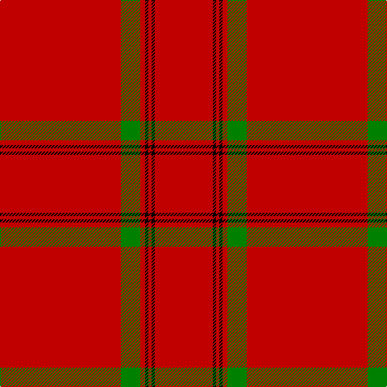

In pattern [RGRKRKR](/patterns/rgrkrkr/).

This was sourced from weddslist.  It is a [7 stripes tartan](/stripes/stripes7/).

Original link http://www.weddslist.com/cgi-bin/tartans/pg.pl?source=sts

## Thread count
R/150 G24 R6 K4 R4 K4 R/72

## Palette
Each colour and its ΔE from the base-6 reference it is a variant of.

| Colour | Shade | Base | ΔE (OKLab) |
|---|---|---|---|
| G | <code style="background-color:#008000;">#008000</code> `#008000` | G <code style="background-color:#006100;">#006100</code> | 0.10 |
| K | <code style="background-color:#000000;">#000000</code> `#000000` | K <code style="background-color:#000000;">#000000</code> | 0.00 |
| R | <code style="background-color:#C00000;">#C00000</code> `#C00000` | R <code style="background-color:#CC0000;">#CC0000</code> | 0.03 |

# Sample pattern

## Nearest tartans

The nearest existing variants by ΔTartan distance.

1. [MacKintosh #5](/setts/s7/r75g12r3k2r2k2r36~g005020-k101010-rdc0000~x2/) — ΔT 0.63
1. [MacKintosh (Moy Hall) Clan Tartan Tartan Number: 1509. Earliest known date: 1821 The Setts No: 253. Of the same pattern as a fragment in the Moy Hall collection claimed to be a part of a kilt worn by Prince Charles at the time of the '45. Author and weaver, James Scarlet, has investigated further and has found at least four other piec See products available Copyright © Blair Urquhart, Comrie, 2015](/setts/s7/r75g12r3k2r2k2r36~g006818-k101010-rc80000~x2/) — ΔT 0.77
1. [MacGregor #2](/setts/s5/r39g6r2g3w1~g005020-rdc0000-we0e0e0~x2/) — ΔT 1.45
1. [Taplin (Name)](/setts/s11/r52k2r5g3r5k5r5y3r5k2r52~g006818-k101010-rc80000-yfccc00~x2/) — ΔT 1.46
1. [MacGregor](/setts/s5/r39g6r2g3w1~g008000-rc00000-we0e0e0~x2/) — ΔT 1.49
1. [Taplin](/setts/s11/r52k2r5g3r5k5r5y3r5k2r52~g005020-k101010-rdc0000-ye8c000~x2/) — ΔT 1.59
1. [Gudbrandsdalen, Rondastakken #2](/setts/s8/r65w1r6k8g8r6k3r11~g006818-k101010-rc80000-wfcfcfc~x2/) — ΔT 1.62
1. [Gudbrandsdalen, Rondastakken](/setts/s8/r65w2r3ra4g11r3g3r11~g003000-rc00000-ra800000-we0e0e0/) — ΔT 1.66
1. [Scania 1658](/setts/s4/r60y7r5y2~rc80000-ye8c000~x2/) — ΔT 1.69
1. [Gudbrandsdalen, Rondastakken](/setts/s8/r65w2r3ra4g11r3g3r11~g006818-rc80000-ra880000-wfcfcfc~x2/) — ΔT 1.71

## Neighbour map

Every grey dot is one of 15726 variants placed by the first two principal components of the ΔTartan feature space (44% of its variance). Red is this tartan; blue dots are its nearest — click one to open its page.

<svg viewBox="0 0 640 380" role="img" style="max-width:100%;height:auto;border:1px solid #e0e0e0;border-radius:4px;display:block" xmlns="http://www.w3.org/2000/svg"><image href="/nn/cloud.v1.png" width="640" height="380"/><a href="/setts/s7/r75g12r3k2r2k2r36~g005020-k101010-rdc0000~x2/"><circle cx="626.0" cy="152.9" r="4" fill="#3465a4"><title>MacKintosh #5</title></circle></a><a href="/setts/s7/r75g12r3k2r2k2r36~g006818-k101010-rc80000~x2/"><circle cx="626.0" cy="161.8" r="4" fill="#3465a4"><title>MacKintosh (Moy Hall) Clan Tartan Tartan Number: 1509. Earliest known date: 1821 The Setts No: 253. Of the same pattern as a fragment in the Moy Hall collection claimed to be a part of a kilt worn by Prince Charles at the time of the '45. Author and weaver, James Scarlet, has investigated further and has found at least four other piec See products available Copyright © Blair Urquhart, Comrie, 2015</title></circle></a><a href="/setts/s5/r39g6r2g3w1~g005020-rdc0000-we0e0e0~x2/"><circle cx="626.0" cy="154.1" r="4" fill="#3465a4"><title>MacGregor #2</title></circle></a><a href="/setts/s11/r52k2r5g3r5k5r5y3r5k2r52~g006818-k101010-rc80000-yfccc00~x2/"><circle cx="626.0" cy="127.2" r="4" fill="#3465a4"><title>Taplin (Name)</title></circle></a><a href="/setts/s5/r39g6r2g3w1~g008000-rc00000-we0e0e0~x2/"><circle cx="626.0" cy="161.3" r="4" fill="#3465a4"><title>MacGregor</title></circle></a><a href="/setts/s11/r52k2r5g3r5k5r5y3r5k2r52~g005020-k101010-rdc0000-ye8c000~x2/"><circle cx="626.0" cy="121.5" r="4" fill="#3465a4"><title>Taplin</title></circle></a><a href="/setts/s8/r65w1r6k8g8r6k3r11~g006818-k101010-rc80000-wfcfcfc~x2/"><circle cx="619.2" cy="108.6" r="4" fill="#3465a4"><title>Gudbrandsdalen, Rondastakken #2</title></circle></a><a href="/setts/s8/r65w2r3ra4g11r3g3r11~g003000-rc00000-ra800000-we0e0e0/"><circle cx="616.0" cy="125.2" r="4" fill="#3465a4"><title>Gudbrandsdalen, Rondastakken</title></circle></a><a href="/setts/s4/r60y7r5y2~rc80000-ye8c000~x2/"><circle cx="626.0" cy="205.1" r="4" fill="#3465a4"><title>Scania 1658</title></circle></a><a href="/setts/s8/r65w2r3ra4g11r3g3r11~g006818-rc80000-ra880000-wfcfcfc~x2/"><circle cx="623.5" cy="126.4" r="4" fill="#3465a4"><title>Gudbrandsdalen, Rondastakken</title></circle></a><circle cx="626.0" cy="155.1" r="5" fill="#c00000"/></svg>

ID: /setts/s7/r75g12r3k2r2k2r36~g008000-k000000-rc00000~x2/
