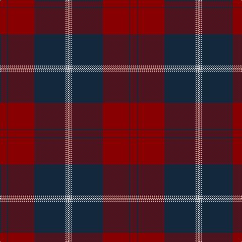

In pattern [RBRBWBW](/patterns/rbrbwbw/).

This was sourced from tartans-authority.  It is a [7 stripes tartan](/stripes/stripes7/).

Original link http://www.tartansauthority.com/tartan-ferret/display/6429/

## Thread count
DR/14 DN2 DR52 DN62 LN2 DN2 LN/4

## Palette
Each colour and its ΔE from the base-6 reference it is a variant of.

| Colour | Shade | Base | ΔE (OKLab) |
|---|---|---|---|
| DN | <code style="background-color:#14283C;">#14283C</code> `#14283C` | B <code style="background-color:#2A418A;">#2A418A</code> | 0.15 |
| DR | <code style="background-color:#880000;">#880000</code> `#880000` | R <code style="background-color:#CC0000;">#CC0000</code> | 0.15 |
| LN | <code style="background-color:#E0E0E0;">#E0E0E0</code> `#E0E0E0` | W <code style="background-color:#F7F7F7;">#F7F7F7</code> | 0.07 |

# Sample pattern

## Nearest tartans

The nearest existing variants by ΔTartan distance.

1. [Greater Victoria Police PB](/setts/s12/r7b1r26b31w1b1w2b1w1b31r26b1x2~b14283c-r880000-we0e0e0/) — ΔT 1.19
1. [Maciver of Strathendry Castle Dress (Personal)](/setts/s9/w1k3r3k24r3k3r24k3y1x2~k101010-r800028-wffffff-yffff00/) — ΔT 1.30
1. [Fraser, Isabella](/setts/s7/g2r21b60r48b2r3g2x2~b202060-g00643c-rc80000/) — ΔT 1.32
1. [Wcwm 9275 5471-1](/setts/s6/r4k2g28r38k1y4x2~g004c00-k000000-r780028-yc89800/) — ΔT 1.40
1. [Rosser of Wales](/setts/s6/g16k57r36k2r4g2~g285800-k101010-rc80000/) — ΔT 1.44
1. [MacAlister of Skye (Clan?)](/setts/s9/r4k5y1r26w1k30y1k1y4x2~k101010-r880000-wc0c0c0-yd09800/) — ΔT 1.46
1. [St. Mildreds Check (School)](/setts/s7/b4r1b18r18b1r1w1x2~b1c1c50-r901c38-we0e0e0/) — ΔT 1.46
1. [Bell's](/setts/s11/y3b4r12b27y2r65y2b27r12b4y3x2~b3c3c60-r880000-ye8c000/) — ΔT 1.53
1. [Hungerford RFC](/setts/s6/k50b3y3r50y3b3x2~b003c64-k101010-r880000-ye8c000/) — ΔT 1.62
1. [Rosser (Welsh Name)](/setts/s6/r16k57r36k2r4r2~k101010-rc80000/) — ΔT 1.62

## Neighbour map

Every grey dot is one of 15726 variants placed by the first two principal components of the ΔTartan feature space (44% of its variance). Red is this tartan; blue dots are its nearest — click one to open its page.

<svg viewBox="0 0 640 380" role="img" style="max-width:100%;height:auto;border:1px solid #e0e0e0;border-radius:4px;display:block" xmlns="http://www.w3.org/2000/svg"><image href="/nn/cloud.v1.png" width="640" height="380"/><a href="/setts/s12/r7b1r26b31w1b1w2b1w1b31r26b1x2~b14283c-r880000-we0e0e0/"><circle cx="422.1" cy="152.6" r="4" fill="#3465a4"><title>Greater Victoria Police PB</title></circle></a><a href="/setts/s9/w1k3r3k24r3k3r24k3y1x2~k101010-r800028-wffffff-yffff00/"><circle cx="385.0" cy="147.3" r="4" fill="#3465a4"><title>Maciver of Strathendry Castle Dress (Personal)</title></circle></a><a href="/setts/s7/g2r21b60r48b2r3g2x2~b202060-g00643c-rc80000/"><circle cx="410.1" cy="158.4" r="4" fill="#3465a4"><title>Fraser, Isabella</title></circle></a><a href="/setts/s6/r4k2g28r38k1y4x2~g004c00-k000000-r780028-yc89800/"><circle cx="412.8" cy="157.2" r="4" fill="#3465a4"><title>Wcwm 9275 5471-1</title></circle></a><a href="/setts/s6/g16k57r36k2r4g2~g285800-k101010-rc80000/"><circle cx="357.8" cy="175.4" r="4" fill="#3465a4"><title>Rosser of Wales</title></circle></a><a href="/setts/s9/r4k5y1r26w1k30y1k1y4x2~k101010-r880000-wc0c0c0-yd09800/"><circle cx="363.7" cy="128.0" r="4" fill="#3465a4"><title>MacAlister of Skye (Clan?)</title></circle></a><a href="/setts/s7/b4r1b18r18b1r1w1x2~b1c1c50-r901c38-we0e0e0/"><circle cx="421.7" cy="194.2" r="4" fill="#3465a4"><title>St. Mildreds Check (School)</title></circle></a><a href="/setts/s11/y3b4r12b27y2r65y2b27r12b4y3x2~b3c3c60-r880000-ye8c000/"><circle cx="449.8" cy="148.4" r="4" fill="#3465a4"><title>Bell's</title></circle></a><a href="/setts/s6/k50b3y3r50y3b3x2~b003c64-k101010-r880000-ye8c000/"><circle cx="327.4" cy="175.3" r="4" fill="#3465a4"><title>Hungerford RFC</title></circle></a><a href="/setts/s6/r16k57r36k2r4r2~k101010-rc80000/"><circle cx="361.9" cy="169.9" r="4" fill="#3465a4"><title>Rosser (Welsh Name)</title></circle></a><circle cx="409.7" cy="167.9" r="5" fill="#c00000"/></svg>

ID: /setts/s7/r7b1r26b31w1b1w2x2~b14283c-r880000-we0e0e0/
